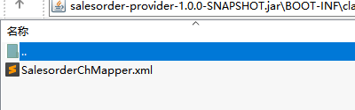
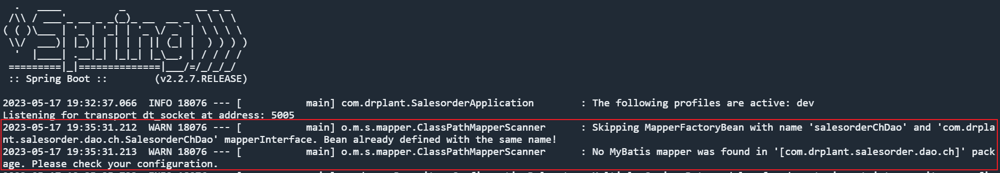
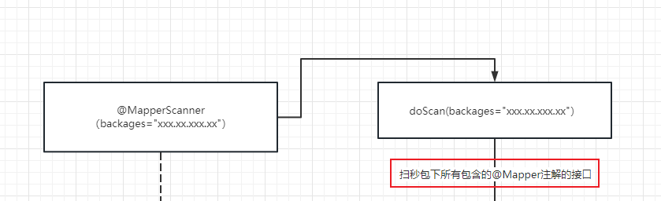

### 本次碰到的问题是由多数据源配置引起的


#### <font color=green>问题是：org.apache.ibatis.binding.BindingException: Invalid bound statement (not found)，诡异的是本地启动可以的</font>
1. <font color=red>猜测未解析对应的xml文件，对应的mybatis的xml文件没有打包到项目里</font>，`但是很遗憾不是这样的，包是存在的`

2. 因为是jar包启动，所以无法debug，但是，java强大的参数，可以配合idea，debug对应的jar包[idea调试jar包](../Skills/Java%E7%9A%84Jar%E5%8C%85debug.md)

3. 通过debug发现，异常org.apache.ibatis.binding.BindingException: Invalid bound statement (not found)是因为在mybatis中的`org.apache.ibatis.session.Configuration`的中央配置文件中有Map<String, MappedStatement> mappedStatements的map中没有对应的方法id匹配上
4. <font color=red>猜测解析xml文件出问题，mappedStatements的map并没有放入对应的方法和MappedStatement</font>，但通过对上述mappedStatements.put方法的监测，发现put动作仅在创建SqlSessionFactory的Bean时候解析
5. 通过debug下述代码，发现对应的方法有放入mappedStatements中，所以猜测失败
```java
    public SqlSessionFactory clickHouseDataSqlSessionFactory(@Qualifier("clickHouseDataDataSource") DataSource dataSource) throws Exception {
        SqlSessionFactoryBean bean = new SqlSessionFactoryBean();
        bean.setDataSource(dataSource);
        Resource[] resources =
                new PathMatchingResourcePatternResolver().getResources("classpath*:mapper/chmapper/*.xml");
        bean.setMapperLocations(resources);
        for (Resource r : resources) {
            log.info("定位加载clickhouse相关mapper文件:{}", JSON.toJSONString(r.getURI()));
        }
        return bean.getObject();
    }
```
6. 进一步通过debug发现对应的方法，对应的salesorderChDao的代理类所解析的数据源是mysql的数据源，不是其响应的clickhouse数据源
```java
salesorderChDao.groupMemberInProducts(begin, end, inBarCodes, notInBarCodes);
```
7. 此时突然恍然大悟，多数据源是的设计是因为有很多`SqlSessionFactory`,每个SqlSessionFactory包含了对应的org.apache.ibatis.session.Configuration配置，每个configuration包含了自己所管辖的Map<String, MappedStatement> mappedStatements，以此达到`生殖隔离互不干扰`
8. 天无绝人之路，此时发现idea的控制面板上有下面警告，很清晰的警告，`salesorderChDao` already defined with the same name!名字重复了，所以下面的ch的dao扫秒就找不到了

9. 那么既然说salesorderChDao已经存在了，那只要查看salesorderChDao是由谁解析的即可
10. 通过对org.springframework.beans.factory.support.DefaultListableBeanFactory（spring核心工厂）中的beanDefinitionMap的观察，通过观测其put方法放入时机
11. 最终找到注解@MapperScan在扫秒包basePackages的时候是向下扫秒的
```java
// mysql 数据源
@MapperScan(basePackages = "com.drplant.salesorder.dao")
// clickhouse 数据源
@MapperScan(basePackages = "com.drplant.salesorder.dao.ch")

// 产生失败的原因是，因为先进行mysql 数据源的路径解析com.drplant.salesorder.dao，
// 而解析是向下逐层扫的，所以将com.drplant.salesorder.dao.ch文件夹也扫进去了，
// 这就导致了在解析mysql数据源的时候已经将clickhouse的标有@Mapper注解的Dao接口顺便解析了
// 那么就会出现already defined with the same name！解析错了

```
12. 解决方式，目前想到了三种
    1.  新建com.drplant.salesorder.dao.mysql文件夹，将对应的标有@Mapper注解的Dao接口迁移放入<font color=red>（成功）</font>
    2.  将Clickhouse数据源标记未主数据源@Primary<font color=green>（失败了）</font>
    3.  同理先标记为@Primary,再加上@Order标记先后顺序<font color=blue>（还未尝试）</font>

#### 图解回顾
1. 简单的梳理了一下Mybatis代理接口的过程


2. 那么我最终产生的问题是位置是(路径没有区分开，导致mysql数据源将clickhouse的Mapper接口给‘扫’走了)
