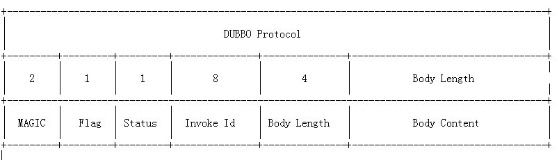
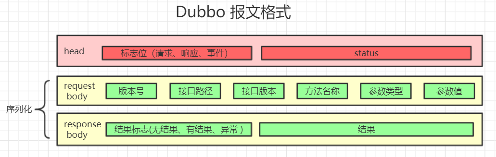

### Dubbo

#### Duboo基础
* 必要启动组件
  * 服务端
    * ApplicationConfig // 公用配置
    * RegisterConfig // 公用配置
    * ProcotolConfig
    * ServiceConfig
  * 客户端
    * ApplicationConfig //公用配置
    * RegisterConfig // 公用配置
    * ReferenceConfig
* \<**dubbo:provider**\>和\<**dubbo:service**\>的区别,provider相关于模版,service是具体的服务提供者
* \<**dubbo:consumer**>和\<**dubbo:reference**\>的区别,consumer相关于模版,reference是具体的服务调用者
* 常规配置
  * \<**dubbo:registry**\> 
    * register=true/false 是否注册,false代表了只读,不会注册,默认为true
    * subscribe=true/fase 默认是true,订阅
    * check=true/fase 检查注册中心可用,默认为true, true会报错,false不会报错
  * \<**dubbo:service**\> ,以下参数\<**dubbo:provider**\>也可以配置
    * group 分组 设置分组,组名一样方可继续访问
    * version 版本号
    * retries 容错尝试次数 (服务端配置用在客户端)
    * loadbalance 当前服务的负载均衡策略 (服务端配置用在客户端)
    * timeout 超时时间 (服务端配置用在客户端,所以这种配置对所有对客户端生效)
      * timeout优先级,由高到低
        * \<**dubbo:reference**\>里的\<**dubbo:method** timeout\>
        * \<**dubbo:service**\>中的\<**dubbo:method** timeout\>
        * \<**dubbo:reference** timeout\>
        * \<**dubbo:service** timeout\>
        * \<**dubbo:consumer** timeout\>
        * \<**dubbo:provider** timeout\>
* 多版本设置（灰度发布）
  ```
  当一个接口实现，出现不兼容升级时，可以用版本号过渡，版本号不同的服务相互间不引用。
  可以按照以下的步骤进行版本迁移：
    0.在低压力时间段，先升级一半提供者为新版本
    1.再将所有消费者升级为新版本
    2.然后将剩下的一半提供者升级为新版本
  ```
* Dubbo Admin
  * 一般来讲dubbo-admin修改的动态配置优先级高于dubbo项目本身的静态配置,实现原理是:
    ```
    动态修改的配置文件,会保存在注册中心(zookeeper/redis)
    dubbo请求的url参数,由注册中心来提供,所以动态配置高于静态配置
    注册中心都是支持持久化的,所以dubbo-admin修改的配置参数也会持久化.
    ```
* Dubbo注册中心
  * 以Zookeeper为例子
  * Dubbo服务在注册到注册中心后,每一个\<**dubbo:service**\>服务都会有4个节点:[configurators, consumers, providers, routers]
    * configurators 配置
    * consumers
    * providers
    * routers 路由
  * 疑问?
    * /dubbo/config在zookeeper中dubbo下也有一个config,不知道作用是..
  * 当集群启动的时候,是由注册中心提供的服务

#### Dubbo集群容错
* failover 失败自动切换
* failfast 一次请求失败后，立马报错
* failsafe 不报错，也不重试，会记录
* failback 不报错，也不重试，会记录，定时重试
* focking 并行请求，有一个返回，其他丢弃
* broadcast 逐个调用

#### Dubbo服务治理
* 服务调用链路
* 服务请求次数，以及服务的延迟，优化接口。

#### Dubbo源码解读
* 通知机制,当结点变更,使用观察模式,通知其他结点. 大致流程.
  * 文字流程,类似SpringAOP,主要是分为生成代理对象和代理对象的调用.
    1. 请求url
    2. 由netty请求zookeeper
    3. RegistryProtocol.refer方法获取zookeeper中的urls
    4. urls做负载均衡处理后获取一个invoker
    5. 由invoker通过代理方式生成代理类(com.xxx.service.StudentService的代理实现类)
    6. 由代理类调用目标方法,经过了一个链式调用.


* 负载均衡策略
  * 权重随机
  * 轮播
  * 最少活跃数
  * 一致性Hash算法 1:15-1:21
    * 热点问题,当结点的hash运算后,过于紧密. (默认虚拟160个结点,随机指向其中的结点,打乱结点之间的hash运算过与近导致的热点数据)
    * 其中某个结点坏掉导致多个数据结点的数据全部打乱(取模运算就会出现这个问题)

#### Dubbo协议/序列化
* Dubbo 支持的RPC协议列表（单一长连接，NIO异步通信）

| **名称**   | **实现描述**   | **连接描述**   | **适用场景**   | 
|:----|:----|:----|:----|
| **dubbo**   | 传输服务: mina, netty(默认), grizzy序列化: hessian2(默认), java, fastjson自定义报文   | 单个长连接NIO异步传输   | 1、常规RPC调用2、传输数据量小 3、提供者少于消费者   | 
| **rmi**   | 传输：java rmi 服务序列化：java原生二进制序列化   | 多个短连接BIO同步传输   | 1、常规RPC调用  2、与原RMI客户端集成  3、可传少量文件  4、不防火墙穿透   | 
| **hessian**   | 传输服务：servlet容器序列化：hessian二进制序列化   | 基于Http 协议传输，依懒servlet容器配置   | 1、提供者多于消费者  2、可传大字段和文件 | 
| **http**   | 传输服务：servlet容器序列化：java原生二进制序列化   | 依懒servlet容器配置   | 1、数据包大小混合   | 
| **thrift**   | 与thrift RPC 实现集成，并在其基础上修改了报文头   | 长连接、NIO异步传输   |    | 
* 序列化：

|    | 特点   | 
|:----|:----|
| fastjson   | 文本型：体积较大，性能慢、跨语言、可读性高   | 
| fst   | 二进制型：体积小、兼容JDK原生的序列化。要求JDK1.7支持。   | 
| hessian2   | 二进制型：跨语言、容错性高、体积小   | 
| java   | 二进制型：在JAVA原生的基础上可以写入Null   | 
| compactedjava   | 二进制型：与java类似，内容做了压缩   | 
| nativejava   | 二进制型：原生的JAVA序列化   | 
| kryo   | 二进制型：体积比hessian2还要小，但容错性没有hessian2好 

* Dubbo协议报文编码
  
  * **magic**：类似java字节码文件里的魔数，用来判断是不是dubbo协议的数据包。魔数是常量0xdabb,用于判断报文的开始。
  * **flag**：标志位, 一共8个地址位。低四位用来表示消息体数据用的序列化工具的类型（默认hessian）高四位中，第一位为1表示是request请求，第二位为1表示双向传输（即有返回response），第三位为1表示是心跳ping事件。
  * **status**：状态位, 设置请求响应状态，dubbo定义了一些响应的类型。具体类型见com.alibaba.dubbo.remoting.exchange.Response
  * **invoke id**：消息id, long类型。每一个请求的唯一识别id（由于采用异步通讯的方式，用来把请求request和返回的response对应上）
  * **body length**：消息体body长度, int类型，即记录Body Content有多少个字节。


#### Dubbo面试
* 接口幂等性
  * 唯一标识
  * 处理后，插入一个记录表，这里即是记录，也是唯一键的判断标准（数据库唯一键）。
  * 或者，基于redis的set缓存，设置过期时间，进行重复判重。

#### Dubbo面试
* 注册中心挂了可以通信么继续
  * 可以，因为刚刚开始初始化的时候，消费者会将提供者的地址信息拉取到本地缓存，所以注册中心挂了可以继续通信。

#### Dubbo 开发问题
1. timeout设置方式，优先级consumer高于provider
```java
  @DubboReference(timeout = 10000) 优先级高
  Or
  dubbo.consumer.timeout=10000 优先级低

  建议使用“注解”，针对每个服务提供不同的超时配置，而不是全局配置
```