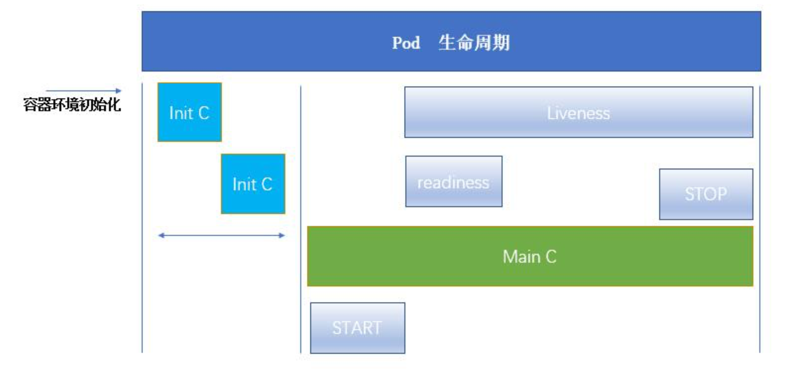

### K8S文档

#### kubeadm安装部署
1. 服务器基本环境配置
   1. 配置集群hosts文件，ssh互相免密登录
   ```
    修改/etc/hosts文件 
   ```
   2. 关闭集群防火墙、dnsmasq、selinux
   ```
    systemctl disable --now firewalld
    systemctl disable --now dnsmasq
    systemctl disable --now NetworkManager
    # SELinux 设置工作模式 0：切换成 permissive（宽容模式）； 1： 切换成 enforcing（强制模式
    setenforce 0
   ```
   2. 修改selinux文件
   ```
   vim /etc/sysconfig/selinux
   # 安全增强式Linux（SELinux，Security-Enhanced Linux）是一个Linux内核的安全模块，其提供了访问控制安全策略机制，包括了强制访问控制（Mandatory Access Control，MAC）。
   SELINUX=disabled
   ```
   3. 关闭swap分区，注释swap挂载选项
   ```
   swapoff -a && sysctl -w vm.swappiness=0
   vim /etc/fstab
   注释掉所有后边有swap的

   什么是swap?
    swap space是磁盘上的一块区域，可以是一个分区，也可以是一个文件，或者是他们的组合。简单点说，当系统物理内存吃紧时，Linux会将内存中不常访问的数据保存到swap上，这样系统就有更多的物理内存为各个进程服务，而当系统需要访问swap上存储的内容时，再将swap上的数据加载到内存中，这就是我们常说的swap out和swap in。

   sysctl
    命令被用于在内核运行时动态地修改内核的运行参数，可用的内核参数在目录/proc/sys中。它包含一些TCP/ip堆栈和虚拟内存系统的高级选项， 这可以让有经验的管理员提高引人注目的系统性能。用sysctl可以读取设置超过五百个系统变量。 
   ```
   4. 同步集群时间
   ```
    ln -sf /usr/share/zoneinfo/Asia/Shanghai /etc/localtime
    echo 'Asia/Shanghai' > /etc/timezone
    ntpdate time2.aliyun.com
    */5 * * * * ntpdate time2.aliyun.com
    ntpdate time2.aliyun.com
   ```
   5. 配置limit
   ```
    # ulimit为shell内建指令，可用来控制shell执行程序的资源。
    ulimit -SHm 65535
   ```
2. 集群内核升级(存在问题，升级之后无法扫描到网卡)
   1. 下载升级包
   ```
    wget http://mirror.rc.usf.edu/elrepo/kernel/el7/x86_64/RPMS/kernel-ml-5.10.7-1.el7.elrepo.x86_64.rpm
    wget http://mirror.rc.usf.edu/elrepo/kernel/el7/x86_64/RPMS/kernel-ml-devel-5.10.7-1.el7.elrepo.x86_64.rpm
   ```
   2. 升级内核
   ```
    yum localinstall -y kernel-ml*
   ```
   3. 修改内核启动顺序,并重启机器
   ```
    grub2-set-default 0 && grub2-mkconfig -o /etc/grub2.cfg
    grubby --args="user_namespace.enable=1" --update-kernel="$(grubby --default-kernel)"
    reboot
    # grub2是boot loader，从磁盘当中载入核心文件， 以让核心能够顺利的驱动整个系统的硬件
    # grubby - 用于配置grub，lilo和elilo的命令行工具
   ```
   4. 安装ipvs，Kube-Proxy 如没有ipvs，将转换为iptables模式，效率低于ipvs
   ```
   # ipvs (IP Virtual Server) 实现了传输层负载均衡，也就是我们常说的4层LAN交换，作为 Linux 内核的一部分
    yum install ipvsadm ipset sysstat conntrack libseccomp -y
   ```
   5. 配置使用ipvs
   ```
    //FIXME: 有其他的方式，需要查看 https://www.bilibili.com/video/BV1w4411y7Go?p=12 15:11

    vim /etc/sysconfig/modules/k8s.modules
    #文件中写入以下命令
    modprobe -- ip_vs
    modprobe -- ip_vs_rr
    modprobe -- ip_vs_wrr
    modprobe -- ip_vs_sh
    modprobe -- nf_conntrack_ipv4
    modprobe -- ip_tables
    modprobe -- ip_set
    modprobe -- xt_set
    modprobe -- ipt_set
    modprobe -- ipt_rpfilter
    modprobe -- ipt_REJECT
    modprobe -- ipip
    #done

    #检查是否加载
    lsmod | grep -e ip_vs -e nf_conntrack_ipv4
    # 执行lsmod指令，会列出所有已载入系统的模块。
   ```
   6. 配置K8s内核,有关sysctl.conf的参数请看[Unix](../../Unix/Unix.md)
   ```
    # 修改 /etc/sysctl.conf
    # 如果有配置，则修改
    sed -i "s#^net.ipv4.ip_forward.*#net.ipv4.ip_forward=1#g"  /etc/sysctl.conf
    sed -i "s#^net.bridge.bridge-nf-call-ip6tables.*#net.bridge.bridge-nf-call-ip6tables=1#g"  /etc/sysctl.conf
    sed -i "s#^net.bridge.bridge-nf-call-iptables.*#net.bridge.bridge-nf-call-iptables=1#g"  /etc/sysctl.conf
    sed -i "s#^net.ipv6.conf.all.disable_ipv6.*#net.ipv6.conf.all.disable_ipv6=1#g"  /etc/sysctl.conf
    sed -i "s#^net.ipv6.conf.default.disable_ipv6.*#net.ipv6.conf.default.disable_ipv6=1#g"  /etc/sysctl.conf
    sed -i "s#^net.ipv6.conf.lo.disable_ipv6.*#net.ipv6.conf.lo.disable_ipv6=1#g"  /etc/sysctl.conf
    sed -i "s#^net.ipv6.conf.all.forwarding.*#net.ipv6.conf.all.forwarding=1#g"  /etc/sysctl.conf
    # 可能没有，追加
    echo "net.ipv4.ip_forward = 1" >> /etc/sysctl.conf
    echo "net.bridge.bridge-nf-call-ip6tables = 1" >> /etc/sysctl.conf # 必须
    echo "net.bridge.bridge-nf-call-iptables = 1" >> /etc/sysctl.conf # 必须
    echo "net.ipv6.conf.all.disable_ipv6 = 1" >> /etc/sysctl.conf # 必须
    echo "net.ipv6.conf.default.disable_ipv6 = 1" >> /etc/sysctl.conf
    echo "net.ipv6.conf.lo.disable_ipv6 = 1" >> /etc/sysctl.conf
    echo "net.ipv6.conf.all.forwarding = 1"  >> /etc/sysctl.conf
    # 执行命令以应用
    sysctl -p
   ```
3. 基本组件安装
   1. 更新Docker镜像以及yum repository
    ```
    # 设置 yum repository
    yum install -y yum-utils \
    device-mapper-persistent-data \
    lvm2

    yum-config-manager --add-repo http://mirrors.aliyun.com/docker-ce/linux/centos/docker-ce.repo

    # 卸载旧版本
    yum remove -y docker \
    docker-client \
    docker-client-latest \
    docker-ce-cli \
    docker-common \
    docker-latest \
    docker-latest-logrotate \
    docker-logrotate \
    docker-selinux \
    docker-engine-selinux \
    docker-engine

    # 安装并启动 docker
    yum install -y docker-ce-19.03.8 docker-ce-cli-19.03.8 containerd.io
    systemctl enable docker
    systemctl start docker

    # 阿里云 docker hub 镜像
    export REGISTRY_MIRROR=https://registry.cn-hangzhou.aliyuncs.com
    #更换Docker镜像源
    #直接修改/etc/docker/daemon.json
    "registry-mirrors": ["https://registry.cn-hangzhou.aliyuncs.com"]
    ```
    2. 安装nfs-utils
    ```
    # 安装 nfs-utils
    # 必须先安装 nfs-utils 才能挂载 nfs 网络存储
    yum install -y nfs-utils
    yum install -y wget
    ```
    3. 配置k8s的yum源
    ```
    # 配置K8S的yum源
    cat <<EOF > /etc/yum.repos.d/kubernetes.repo
    [kubernetes]
    name=Kubernetes
    baseurl=http://mirrors.aliyun.com/kubernetes/yum/repos/kubernetes-el7-x86_64
    enabled=1
    gpgcheck=0
    repo_gpgcheck=0
    gpgkey=http://mirrors.aliyun.com/kubernetes/yum/doc/yum-key.gpg
        http://mirrors.aliyun.com/kubernetes/yum/doc/rpm-package-key.gpg
    EOF
    ```
    4. 安装kubelet kubeadm kubectl
    ```
    # 卸载旧版本
    yum remove -y kubelet kubeadm kubectl

    # 安装kubelet、kubeadm、kubectl
    yum install -y kubelet-1.18.2 kubeadm-1.18.2 kubectl-1.18.2

    # 修改docker Cgroup Driver为systemd
    # 如果不修改，在添加 worker 节点时可能会碰到如下错误
    # [WARNING IsDockerSystemdCheck]: detected "cgroupfs" as the Docker cgroup driver. The recommended driver is "systemd". 
    # Please follow the guide at https://kubernetes.io/docs/setup/cri/
    sed -i "s#^ExecStart=/usr/bin/dockerd.*#ExecStart=/usr/bin/dockerd -H fd:// --containerd=/run/containerd/containerd.sock --exec-opt native.cgroupdriver=systemd#g" /usr/lib/systemd/system/docker.service
    或者
    vim /etc/docker/daemon.json
    {
    "exec-opts": ["native.cgroupdriver=systemd"], "log-driver": "json-file",
    "log-opts": {
        "max-size": "100m" 
    }
    }

    # 重启 docker，并启动 kubelet
    mkdir -p /etc/systemd/system/docker.service.d
    systemctl daemon-reload && systemctl restart docker && systemctl enable docker

    # systemctl daemon-reload 重新加载属于systemctl服务配置文件加载的服务，如果修改了某些配置文件，使用此加载配置。
    
    sytemctl start kubelet

    docker version
    #如果此时执行 service status kubelet 命令，会fail，是正常的
    ```
4. 初始化Master节点
   1. 设置环境变量（只在**Master**节点执行）
    ```
    # export 命令只在当前 shell 会话中有效，开启新的 shell 窗口后，如果要继续安装过程，请重新执行此处的 export 命令
    export MASTER_IP=192.168.29.29
    # 替换 apiserver.demo 为 您想要的 dnsName
    export APISERVER_NAME=apiserver.demo
    # Kubernetes 容器组所在的网段，该网段安装完成后，由 kubernetes 创建，事先并不存在于您的物理网络中
    export POD_SUBNET=10.100.0.1/16
    echo "${MASTER_IP} ${APISERVER_NAME}" >> /etc/hosts
    ```
    1. 创建init.sh(只在**Master**节点执行)
    ```
    #!/bin/bash

    # 脚本出错时终止执行
    set -e

    if [ ${#POD_SUBNET} -eq 0 ] || [ ${#APISERVER_NAME} -eq 0 ]; then
    echo -e "\033[31;1m请确保您已经设置了环境变量 POD_SUBNET 和 APISERVER_NAME \033[0m"
    echo 当前POD_SUBNET=$POD_SUBNET
    echo 当前APISERVER_NAME=$APISERVER_NAME
    exit 1
    fi


    # 查看完整配置选项 https://godoc.org/k8s.io/kubernetes/cmd/kubeadm/app/apis/kubeadm/v1beta2
    rm -f ./kubeadm-config.yaml
    cat <<EOF > ./kubeadm-config.yaml
    apiVersion: kubeadm.k8s.io/v1beta2
    kind: ClusterConfiguration
    kubernetesVersion: 1.18.2
    imageRepository: registry.aliyuncs.com/k8sxio
    controlPlaneEndpoint: "${APISERVER_NAME}:6443"
    networking:
    serviceSubnet: "10.96.0.0/16"
    podSubnet: "${POD_SUBNET}"
    dnsDomain: "cluster.local"
    EOF

    # kubeadm reset之后
    # kubeadm init
    # 根据您服务器网速的情况，您需要等候 3 - 10 分钟
    kubeadm init --config=kubeadm-config.yaml --upload-certs
    或者
    kubeadm init --image-repository=registry.aliyuncs.com/google_containers --pod-network-cidr=10.244.0.0/16 --kubernetes-version=v1.20.4 --v=5

    # 配置 kubectl
    rm -rf /root/.kube/
    mkdir /root/.kube/
    cp -i /etc/kubernetes/admin.conf /root/.kube/config

    启动 kubelet
    systemctl start kubelet
    停掉子节点的kubelet
    systemctl status kubelet

    # 安装 calico 网络插件
    # 参考文档 https://docs.projectcalico.org/v3.13/getting-started/kubernetes/self-managed-onprem/onpremises
    echo "安装calico-3.13.1"
    rm -f calico-3.13.1.yaml
    wget https://kuboard.cn/install-script/calico/calico-3.13.1.yaml
    kubectl apply -f calico-3.13.1.yaml
    ```
    1. 检查Master初始化结果（只在 master 节点执行）
    ```
    # 执行如下命令，等待直到所有的容器组处于 Running 状态 (查看pod状态)
    watch kubectl get pod -n kube-system -o wide
    # 查看 master 节点初始化结果（查看nodes状态）
    kubectl get nodes -o wide
    ```
5. 初始化 worker节点
   1. 获取join命令,有效期两个小时
   ```
    # 只在 master 节点执行
    kubeadm token create --print-join-command
    #获得的结果如下所示 直接复制Master所输出的命令 不用更改
    kubeadm join apiserver.demo:6443 --token mpfjma.4vjjg8flqihor4vt     --discovery-token-ca-cert-hash sha256:6f7a8e40a810323672de5eee6f4d19aa2dbdb38411845a1bf5dd63485c43d303
   ```
   1. 初始化Worker节点（只在woker节点执行）
   ```
    export MASTER_IP=192.168.29.29
    # 替换 apiserver.demo 为初始化 master 节点时所使用的 APISERVER_NAME
    export APISERVER_NAME=apiserver.demo
    echo "${MASTER_IP}    ${APISERVER_NAME}" >> /etc/hosts
   ```
   1. worker加入集群（只在woker节点执行
    ```
    # 替换为 master 节点上 kubeadm token create 命令的输出
    kubeadm join apiserver.demo:6443 --token mpfjma.4vjjg8flqihor4vt     --discovery-token-ca-cert-hash sha256:6f7a8e40a810323672de5eee6f4d19aa2dbdb38411845a1bf5dd63485c43d303
    检查加入结果（只在master节点执行）
    ```
    1. 检查加入结果（只在master节点执行）
    ```
    kubectl get nodes -o wide

    #输出如下所示
    [root@demo-master-a-1 ~]# kubectl get nodes
    NAME     STATUS   ROLES    AGE     VERSION
    demo-master-a-1   Ready    master   5m3s    v1.18.x
    demo-worker-a-1   Ready    <none>   2m26s   v1.18.x
    demo-worker-a-2   Ready    <none>   3m56s   v1.18.x
    ```
6. 安装 Ingress Controller(只在Master节点操作)
   1. 创建nginx-ingress.yaml
   ```
    vim nginx-ingress.yaml

    # 如果打算用于生产环境，请参考 https://github.com/nginxinc/kubernetes-ingress/blob/v1.5.5/docs/installation.md 并根据您自己的情况做进一步定制

    apiVersion: v1
    kind: Namespace
    metadata:
    name: nginx-ingress

    ---
    apiVersion: v1
    kind: ServiceAccount
    metadata:
    name: nginx-ingress 
    namespace: nginx-ingress

    ---
    apiVersion: v1
    kind: Secret
    metadata:
    name: default-server-secret
    namespace: nginx-ingress
    type: Opaque
    data:
    tls.crt: LS0tLS1CRUdJTiBDRVJUSUZJQ0FURS0tLS0tCk1JSUM4akNDQWRxZ0F3SUJBZ0lJUzBpTHZyTENoMUF3RFFZSktvWklodmNOQVFFTEJRQXdGVEVUTUJFR0ExVUUKQXhNS2EzVmlaWEp1WlhSbGN6QWVGdzB5TVRBeE1Ua3hNVFUwTVRoYUZ3MHlNakF4TVRreE1UVTBNakJhTURReApGekFWQmdOVkJBb1REbk41YzNSbGJUcHRZWE4wWlhKek1Sa3dGd1lEVlFRREV4QnJkV0psY201bGRHVnpMV0ZrCmJXbHVNSUlCSWpBTkJna3Foa2lHOXcwQkFRRUZBQU9DQVE4QU1JSUJDZ0tDQVFFQXM4MEFUZU9pUnc2SmltL2MKMUd6MDc1aHZNNWwrYk9SN3lSZE1qMEZvM3ErVlVkVmNlTGcwbWhKTmxLWVUxdlpqVDBmTmtISHBsYnFRbnhsUwpQbzR1SHlDVHRPKzVPMHhlUjF0ZnM4cmpSM25JLzhSY2FLcks4Y3BUVktMWWgxUVNVVnd3VjZ4Z2tMY0ZzTXBjCmpjVEErQnViTCtpL29MWTNmTUNKZnppMU8vZzEzLzlMZ2RjR2k4bW9aSXd5cm5JSU5oWlduUTJ0b2FyZ1Y0WjgKTlFDMVpzbkVsWWRnQjRLQmtJMnlhRkdDUElnTkQ0SWh2aXZhd2VhR292SmtRdVlMeU1GRVNnNEt3RkVZcm5xdwpnNWVwZG1wbTZvbnFpRWdzTGJWS2Y1ZGdtUFByTWtIQ093RzZ6eE9PYmI4NmlvZnQ4NWpLak4yRnZybUNNSi9pCm0zcVlaUUlEQVFBQm95Y3dKVEFPQmdOVkhROEJBZjhFQkFNQ0JhQXdFd1lEVlIwbEJBd3dDZ1lJS3dZQkJRVUgKQXdJd0RRWUpLb1pJaHZjTkFRRUxCUUFEZ2dFQkFCLzdURW1lZUhOL0FqQ3B2NTBUc1l1VElLTWFyZnF3czlQUgoyQ2N2S04yRXVsWHFnUGtidG5SQmRBTEhHa0FYc2FqaGRNR1dTbHBTbGUwMWRzN0VjMEI4ZVczYTFXVjNjaWVtCkY2ZnZFWkpwTkdrNDAyOXZ5N0Z6OTU5RGVtU0lFSFo3Z2VpQUt1WWtWNTlNYnNXU0JFb0VoOFZQeCtXNXI4TUkKMTQ5U0lFei9UQVZuUXRVU3lZQk1hNXJDRDlLcmJlS2pBV25oWkJ1MVIvSVJKY1ZlYzFtUkd6QmdmcU1VSjcxUApYTk9IcENoZzBBd3p5a1JndUlKWWwvcG8yV1ZaSlJ2Y3o2QldQT3gzb2oxdjZTWER6b0F2OXRXSzJEN2xyTkRlCm8wdG5qRjd4cGU3L0RMNFhsS2N0UE5DT1JlZDRHdW9LemMxNVRoNVVvUXdpV2RYS1I3WT0KLS0tLS1FTkQgQ0VSVElGSUNBVEUtLS0tLQo=
    tls.key: LS0tLS1CRUdJTiBSU0EgUFJJVkFURSBLRVktLS0tLQpNSUlFcEFJQkFBS0NBUUVBczgwQVRlT2lSdzZKaW0vYzFHejA3NWh2TTVsK2JPUjd5UmRNajBGbzNxK1ZVZFZjCmVMZzBtaEpObEtZVTF2WmpUMGZOa0hIcGxicVFueGxTUG80dUh5Q1R0Tys1TzB4ZVIxdGZzOHJqUjNuSS84UmMKYUtySzhjcFRWS0xZaDFRU1VWd3dWNnhna0xjRnNNcGNqY1RBK0J1YkwraS9vTFkzZk1DSmZ6aTFPL2cxMy85TApnZGNHaThtb1pJd3lybklJTmhaV25RMnRvYXJnVjRaOE5RQzFac25FbFlkZ0I0S0JrSTJ5YUZHQ1BJZ05ENEloCnZpdmF3ZWFHb3ZKa1F1WUx5TUZFU2c0S3dGRVlybnF3ZzVlcGRtcG02b25xaUVnc0xiVktmNWRnbVBQck1rSEMKT3dHNnp4T09iYjg2aW9mdDg1aktqTjJGdnJtQ01KL2ltM3FZWlFJREFRQUJBb0lCQUZuUVlJT0gzd3NCbndEeApLZTFPMC9kUFBOVVlxb2Q0aHNFSGkyM1A3Yk8zSDY2MkZyQVN5K3Zla3JSYlZmT2ZOakpuR3E4NXg4WE1ZT3VvCmVXWFlIZi9jaFF3UDU0WlFlcFBJZUFEV3F6dU1BVFNLQU9NajFhWjhPNjMrZm96ekdRZGROcVRFN2FPOFdQSmIKMDJuWnk4N2o4MXcyTm1yd09yMXRiQUdKOFRZWHkzSmVaTDF5RUxJVnB6WVNSMmVMSlJkR2FOWndiaFZ1a3lMNQp3VWZhUFdiSHVIdzUzSjM3VDd1WnRWbXNzS2RPRi9mQVIyWmVJYTRuRkFFSTR4Mi9Bc3ZOUldhbWFNV1l6L2JYCjgwMkFEZHZEVXdvY1NMVmZCQkNUZm1acjVLYlc4NVVjbmxDYTlsMWswVWtkaDdnWVJwd3Z6ZERQcTRObGhFWHAKU1FnTWhrMENnWUVBMWl2c29XQi9yYzFnbXFOWElnSTViQWpZUDNxNko5S3RRclY0aWxtbjBJQTg1RkRYT1A2Lwo2VTlXUlRaZkZoSjNKOXFMUTFyODRwcWUyaW1tUVVHdHp6TGxNMU42SUdnSzdCTlNSaTM2bmdidC9rWGRoRGdNCm9LVUhlcmZCblRhM0xOZWtsazdSYmozVWEyVXdYaVd2cGh0b245c25OMVRrT3REemw3S2tOYjhDZ1lFQTF1cWUKTWJSL1lDZm41K0tXS3owQ2s5SmhGV0kwZFQxQkFORDVobVliZFlPSXByYmJHOEJYTXREVFV3elpXM0FHV0JzYQpISjcyWWxwdWk1TWFtclR4Z2w4aXJhaXZiaW92MkJOZnMyNXFWbkFFSytzWXp1NUNYbENMR1d2VzVZTUpleGd5CnIwZU4zMG9SaUtGTU9KWHNMVURTcmd4TFJkZWZ6eFd2UWIzeTR0c0NnWUVBaG51T1dzYjlaV1ZSQThrTkxZMjQKQU42TTYwOWxGUngxTHk1RVFwdUpoS01CbVZ3cHlPQXVJWkp2MllZS3J4RnBRTjA2RlZGTStmMmRRZUJsUlJTNAp6eUptU1pSaFczZjVZOE8rSmRNNVM0R09iOXZ1L05jMUZxcUp4OFViRGwwTktGdEFQaUcvNERseTZQemhJajBICnpvWG5iSGx3Wm80bndjYnpMbzQrRG9FQ2dZRUFsRHo0S0tpclF4UERiYnBvZ2lKdTZLOHZyNlF4TXJ5eFhYTEcKNmVEOEI2NVdUMGZKRWZjMUxpUEQzNEQ1VzR5Rms3Zjk1c2Z1Z2lDR0oxZXIvaEhZazJnemJ6enU1RG5ORG1rdQpsWUVQYjllTHlRODc2VitGLzYvbWdmNVVGN0t1azIwNWFKVWVVbW13ZG1GclJZeURmeU03TGpua29hUDg0c1crClFNWllCZ2tDZ1lBRkFtTUIwRWRPcHYvVTNpUWF3c2g4RVZJQm1tYzltU2dRM0E0NFptMi90UGpJMHdRbnBHYjQKM2MrMGNZbEVYeGJ6SDJsTlQyQ3NBakJaSGtHSFhEWUhCU2tnRGp5QUV0WGl1NnpSRCszZ1dIRGJVeEVEUTBnbAp1dWtXZG1GOGtkUVRVT3hpRG5RVjhtVkZhdE9OdTJ6RlEvYmFVVVZQL2p2eE8xdmpva29JSXc9PQotLS0tLUVORCBSU0EgUFJJVkFURSBLRVktLS0tLQo=
    ---
    kind: ConfigMap
    apiVersion: v1
    metadata:
    name: nginx-config
    namespace: nginx-ingress
    data:
    server-names-hash-bucket-size: "1024"


    ---
    kind: ClusterRole
    apiVersion: rbac.authorization.k8s.io/v1
    metadata:
    name: nginx-ingress
    rules:
    - apiGroups:
    - ""
    resources:
    - services
    - endpoints
    verbs:
    - get
    - list
    - watch
    - apiGroups:
    - ""
    resources:
    - secrets
    verbs:
    - get
    - list
    - watch
    - apiGroups:
    - ""
    resources:
    - configmaps
    verbs:
    - get
    - list
    - watch
    - update
    - create
    - apiGroups:
    - ""
    resources:
    - pods
    verbs:
    - list
    - apiGroups:
    - ""
    resources:
    - events
    verbs:
    - create
    - patch
    - apiGroups:
    - extensions
    resources:
    - ingresses
    verbs:
    - list
    - watch
    - get
    - apiGroups:
    - "extensions"
    resources:
    - ingresses/status
    verbs:
    - update
    - apiGroups:
    - k8s.nginx.org
    resources:
    - virtualservers
    - virtualserverroutes
    verbs:
    - list
    - watch
    - get

    ---
    kind: ClusterRoleBinding
    apiVersion: rbac.authorization.k8s.io/v1
    metadata:
    name: nginx-ingress
    subjects:
    - kind: ServiceAccount
    name: nginx-ingress
    namespace: nginx-ingress
    roleRef:
    kind: ClusterRole
    name: nginx-ingress
    apiGroup: rbac.authorization.k8s.io

    ---
    apiVersion: apps/v1
    kind: DaemonSet
    metadata:
    name: nginx-ingress
    namespace: nginx-ingress
    annotations:
        prometheus.io/scrape: "true"
        prometheus.io/port: "9113"
    spec:
    selector:
        matchLabels:
        app: nginx-ingress
    template:
        metadata:
        labels:
            app: nginx-ingress
        spec:
        serviceAccountName: nginx-ingress
        containers:
        - image: nginx/nginx-ingress:1.5.5
            name: nginx-ingress
            ports:
            - name: http
            containerPort: 80
            hostPort: 80
            - name: https
            containerPort: 443
            hostPort: 443
            - name: prometheus
            containerPort: 9113
            env:
            - name: POD_NAMESPACE
            valueFrom:
                fieldRef:
                fieldPath: metadata.namespace
            - name: POD_NAME
            valueFrom:
                fieldRef:
                fieldPath: metadata.name
            args:
            - -nginx-configmaps=$(POD_NAMESPACE)/nginx-config
            - -default-server-tls-secret=$(POD_NAMESPACE)/default-server-secret
            #- -v=3 # Enables extensive logging. Useful for troubleshooting.
            #- -report-ingress-status
            #- -external-service=nginx-ingress
            #- -enable-leader-election
            - -enable-prometheus-metrics
            #- -enable-custom-resources
   ```
   1. kubectl create -f nginx-ingress.yaml,这只是一个没有路径配置的ingress，要想创建一个可以路由到自己的应用上的ingress 还要配合service
   2. ingress配置（注意backend里的service信息）
   ```
    apiVersion: networking.k8s.io/v1beta1
    kind: Ingress
    metadata:
    name: my-ingress-for-nginx  # Ingress 的名字，仅用于标识
    annotations:
        kubernetes.io/ingress.class: "nginx"
        #nginx.ingress.kubernetes.io/ssl-redirect: "true"
        #nginx.ingress.kubernetes.io/backend-protocol: "HTTPS"
    spec:
    rules:                      # Ingress 中定义 L7 路由规则
    - host: dc03.drplant.dev   # 根据 virtual hostname 进行路由（请使用您自己的域名）
        http:
        paths:                  # 按路径进行路由
        - path: /tomcat
            backend:
            serviceName: tomcat-service-2  # 指定后端的 Service 为之前创建的 nginx-service
            servicePort: 8080
   ```
   1. service配置
   ```
    apiVersion: v1
    kind: Service
    metadata:
    name: tomcat-service
    spec:
    selector:
        app: tomcat
    ports:
    - name: tomcat-port
        protocol: TCP
        port: 8080
        nodePort: 32600
        targetPort: 8080
    type: NodePort
    ---
    apiVersion: v1
    kind: Service
    metadata:
    name: tomcat-service-2
    spec:
    selector:
        app: tomcat
    ports:
    - name: tomcat-port
        protocol: TCP
        port: 8080
        targetPort: 8080
    type: ClusterIP
   ```

#### Harbor安装
1. 安装压缩包
2. 修改harbor.cfg的配置文件
   1. https 端口可以在这里修改。

#### K8S组件
* kube-apiserver API 服务器是 Kubernetes 控制面的组件， 该组件公开了 Kubernetes API。 API 服务器是 Kubernetes 控制面的前端。
* **etcd** 是兼具一致性和高可用性的键值数据库，可以作为保存 Kubernetes 所有集群数据的后台数据库。
  * 设置**bashrc->** alias etcdctl3='ETCDCTL_API=3 etcdctl --cacert=/etc/kubernetes/pki/etcd/ca.crt  --cert=/etc/kubernetes/pki/etcd/server.crt --key=/etc/kubernetes/pki/etcd/server.key'）
  ```
    # /etc/kubernetes/pki/etcd 目录是kubeadm默认安装的证书位置
    # 如果要是etcdctl第三版本的api，需要加上前缀“ETCDCTL_API=3”
    ETCDCTL_API=3 etcdctl --cacert=/etc/kubernetes/pki/etcd/ca.crt  --cert=/etc/kubernetes/pki/etcd/server.crt --key=/etc/kubernetes/pki/etcd/server.key
  ```
  * etcdctl3 --endpoints 127.0.0.1:2379 snapshot save snapshotdb
  * etcdctl3 --write-out=table snapshot status snapshotdb
  * health check
  ```
    # 健康检查
    etcdctl3  --endpoints=https://192.168.29.29:2379,https://192.168.29.31:2379 endpoint health
    # 表格输出
    etcdctl3 endpoint --cluster health -w table
    # 显示状态
    etcdctl3 endpoint status -w table
  ```
  * 数据备份的脚本
  ```
    # /bin/bash
    ETCD_PATH=/etc/kubernetes/pki/
    CACERT=$ETCD_PATH/etcd/ca.crt
    CERT=$ETCD_PATH/etcd/server.crt
    KEY=$ETCD_PATH/etcd/server.key
    ENDPOINTS=https://127.0.0.1:2379

    ETCDCTL_API=3 etcdctl \
    --cacert="${CACERT}" --cert="${CERT}" --key="${KEY}" \
    --endpoints=${ENDPOINTS} \
    snapshot save /tmp/etcd-snapshot-`date +%Y%m%d%H%M%S`.db
  ```
* kube-scheduler 控制平面组件，负责监视新创建的、未指定运行节点（node）的 Pods，选择节点让 Pod 在上面运行。
* kube-controller-manager 在主节点上运行 控制器 的组件。
从逻辑上讲，每个控制器都是一个单独的进程， 但是为了降低复杂性，它们都被编译到同一个可执行文件，并在一个进程中运行。
  * 节点控制器（Node Controller）: 负责在节点出现故障时进行通知和响应
  * 副本控制器（Replication Controller）: 负责为系统中的每个副本控制器对象维护正确数量的 Pod
  * 端点控制器（Endpoints Controller）: 填充端点(Endpoints)对象(即加入 Service 与 Pod)
  * 服务帐户和令牌控制器（Service Account & Token Controllers）: 为新的命名空间创建默认帐户和 API 访问令牌
#### Node组件 
> 节点组件在每个节点上运行，维护运行的 Pod 并提供 Kubernetes 运行环境。
* kubelet 一个在集群中每个节点（node）上运行的代理。 它保证容器（containers）都 运行在 Pod 中。
* kube-proxy kube-proxy 是集群中每个节点上运行的网络代理， 实现 Kubernetes 服务（Service） 概念的一部分。
* 容器运行时（Container Runtime）Kubernetes 支持多个容器运行环境: Docker、 containerd、CRI-O 以及任何实现 Kubernetes CRI (容器运行环境接口)。
#### Volume
* 挂载

#### API
* API-Label，标签，可以定义一组标签，由选择器selector进行选择


#### 资源yaml定义
* 查看对应的模版
  * kubectl explain pod 查看pod模版 
* 使用模版创建容器（Pod）-> `ubectl apply -f xxx.yaml`【或】`kubectl create -f xxx.yaml`
  * create yaml 必须完整，删除现有的，生成最新的。
  * apply yaml 升级现有的，所以可以只写需要升级的属性。
* 必须存在的属性
  1. version 版本
  2. kind 资源类型和角色，比如Pod,Deployment,Service等
  3. metadata 元数据类型，固定值就写metadata
  4. matadata.name 名称，命名Pod名字
  5. matadata.namespace 元数据对象的命名空间，由我们自身定义
  6. Spec 详细定义对象，固定值就写Spec
  7. spec.containers[] spec对象的容器列表定义，是个列表，以下属性都是spec.containers\[\].name，为了简写，只写`spec.containers\[\]\.`后面的属性，比如`name`
     1. name 定义容器的名字
     2. image 定义用到的镜像名称
     3. imagePullPolicy 镜像拉取策略
        1. Always 每次尝试拉取新镜像（默认）
        2. Never  只拉本地镜像
        3. IfNotPresent 本地没有拉取在线的
     4. command[] 容器启动命令
     5. args[] 容器启动命令参数
     6. workDir 容器工作目录
     7. volumeMounts[] 容器内部的存储卷配置
        1. volumeMounts[].name 名称
        2. volumeMounts[].mountPath 挂在目录
        3.  volumeMounts[].readOnly 读写模式，默认true
     8. ports[] 容器需要用到的端口列表
         1.  ports[].name 名称
         2.  ports[].containerPort 容器要监听的端口号
         3.  ports[].hostPort 与containerPort相同，注意设置了hostPort同一台主机无法启动该容器的相同副本
         4.  ports[].protocol 端口协议tcp/udp
     9. env[] 环境变量
         1.  env[].name 环境变量名称
         2.  env[].value  环境变量值
     10. resource  制定资源
         1. resource.limit 容器运行时资源的上限
         2. resource.limit.cpu 指定CPU限制，单位为core数，将用于docker run --cpu-shares参数
         3. resource.limit.memory 内存上限单位MIB，GIB
         4. resource.requests 容器启动和调度时的限制设置
         5. resource.requests.cpu cpu请求，单位为core数，容器启动时初始化可用数量
         6. resource.requests.memory 内存上限单位MIB，GIB
      11. restartPolicy 重启策略镜
          1. Always 总是重启
          2. OnFailure  失败退出（非0退出）才会重启
          3. Never pod终止后，不重启该pod
  8.  nodeSelector 定义Node的Label过滤标签，以key：value格式指定
  9.  imagePullSecrets 定义pull镜像使用的secret名称，以name：secretkey格式指定
  10. hostNetWork 是否使用主机网络模式，默认是false。如果true就是使用宿主机网络，不使用docker网桥，设置了true无法在同一台宿主机上启动第二个副本
   
#### K8S容器
1. 容器启动流程 kubectl create ...
   1. kubectl api
   2. etcd 持久化
   3. kubectl lite
   4. kubectl cri // 容器环境初始化
      1. pause 容器->网络和数据卷初始化
      2. initC 初始化 // 成功后变为 Ready状态
      3. mainC
         1. start
         2. readiness // 检测是否可读
         3. liveness // 容器检测，选择重启或者删除
         4. stop
   5. pod -> running
   6. 容器生命周期图
2. 模版 
   1. initC模版，**初始化**
   ```
   apiVersion: v1
   kind: Pod
   metadata:
     name: myapp-pod 
     labels:
       app: myapp
   spec:
     containers:
     - name: myapp-container
       image: busybox
       command: ['sh', '-c', 'echo The app is running! && sleep 3600']
     initContainers:
     - name: init-myservice
       image: busybox
       command: ['sh', '-c', 'until nslookup myservice; do echo waiting for myservice; sleep 2; done;']
     - name: init-mydb
       image: busybox
       command: ['sh', '-c', 'until nslookup mydb; do echo waiting for mydb; sleep 2; done;']
   kind: Service
   apiVersion: v1
   metadata:
     name: myservice
   spec:
     ports:
     - protocol: TCP
       port: 80
       targetPort: 9376
   --- 
   kind: Service
   apiVersion: v1
   metadata:
     name: mydb
   spec:
     ports:
     - protocol: TCP
       port: 80
       targetPort: 9377
   ```
   1. **检测**探针 - 就绪检测(readinessProbe容器的检测)
    ```
    apiVersion: v1
    kind: Pod
    metadata:
      name: readiness-httpget-pod
      namespace: default
    spec:
      containers:
      - name: readiness-httpget-container
        image: wangyanglinux/myapp:v1
        imagePullPolicy: IfNotPresent
        readinessProbe:
          httpGet:
            port: 80
            path: /index1.html 
          initialDelaySeconds: 1 
          periodSeconds: 3
    ```
   2. **检测**探针 - 存活检测(exec)(livenessProbe容器检测，启动后持续检测)
   ```
    apiVersion: v1
    kind: Pod
    metadata:
      name: liveness-exec-pod
      namespace: default
    spec:
      containers:
      - name: liveness-exec-container
        image: hub.atguigu.com/library/busybox
        imagePullPolicy: IfNotPresent
        command: ["/bin/sh","-c","touch /tmp/live ; sleep 60; rm -rf /tmp/live; sleep
    3600"] 
        livenessProbe:
        exec:
          command: ["test","-e","/tmp/live"]
        initialDelaySeconds: 1
        periodSeconds: 3
   ```
   3. **检测**探针 - 存活检测（http）(livenessProbe容器检测，启动后持续检测)
   ```
    apiVersion: v1
    kind: Pod
    metadata:
      name: liveness-exec-pod
      namespace: default
    spec:
      containers:
      - name: liveness-exec-container
        image: hub.atguigu.com/library/busybox
        imagePullPolicy: IfNotPresent
        livenessProbe:
          httpGet:
            port: http
            path: /index.html
          initialDelaySeconds: 1
          periodSeconds: 3
          timeoutSeconds: 10
   ```
   4. **检测**探针 - 存活检测（tcp）(livenessProbe容器检测，启动后持续检测)
   ```
    apiVersion: v1
    kind: Pod
    metadata:
      name: liveness-exec-pod
      namespace: default
    spec:
      containers:
      - name: liveness-exec-container
        image: hub.atguigu.com/library/busybox
        imagePullPolicy: IfNotPresent
        livenessProbe:
          tcpSocket:
            port: 80
          initialDelaySeconds: 1
          periodSeconds: 3
          timeoutSeconds: 10
   ```
3. 服务 
   1. 当服务创建后，通过命令kubectl get pod -n kube-system 可以看到会启动对应当dns服务，比如:coredns-66db54ff7f-xmhxl等，pod的服务就会请求dns 


#### K8S控制器（由控制器控制pod）
> Kubernetes 中内建了很多 controller(控制器)，这些相当于一个状态机，用来控制 Pod 的具体状态和行为
* 控制器种类
  * ReplicationController 和 ReplicaSet Deployment
  * DaemonSet
  * StateFulSet
  * Job/CronJob
  * Horizontal Pod Autoscaling
* RS控制器(ReplicaSet)
    ```
    apiVersion: extensions/v1beta1
    kind: ReplicaSet
    metadata:
      name: frontend
    spec:
    replicas: 3
    selector:
        matchLabels:
        tier: frontend
    template:
        metadata:
        labels:
            tier: frontend
        spec:
        containers:
        - name: php-redis
            image: gcr.io/google_samples/gb-frontend:v3 
            env:
            - name: GET_HOSTS_FROM
            value: dns
            ports:
            - containerPort: 80
    ```
* Deployment（注意v1.16版本后api都变了，所以下面都这个不好用）
    ```
    apiVersion: extensions/v1beta1
    kind: Deployment
    metadata:
      name: nginx-deployment 
    spec:
      replicas: 3
      template:
        metadata:
        labels:
            app: nginx
        spec:
        containers:
        - name: nginx
          image: nginx:1.7.9 
          ports:
          - containerPort: 80
    ```
    * kubectl scale deployment 容器名 --replicas 10 // 扩容到10个
    * kubectl set image deployment/nginx-deployment nginx=nginx:1.9.1 //deployment 更新镜像，从而达到更新应用程序
    * kubectl rollout undo deployment/nginx-deployment //回滚
* Job
> Job 负责批处理任务，即仅执行一次的任务，它保证批处理任务的一个或多个 Pod 成功结束
```
apiVersion: batch/v1
kind: Job
metadata:
  name: pi
spec:
  template:
    metadata:
      name: pi
    spec:
      containers: 
      - name: pi
        image: perl
        command: ["perl", "-Mbignum=bpi", "-wle", "print bpi(2000)"] 
      restartPolicy: Never
```

#### K8S的服务（Service）
* Service 在 K8s 中有以下四种类型
  * ClusterIp 默认类型，自动分配一个仅 Cluster 内部可以访问的虚拟IP
  * NodePort 在ClusterIP基础上为Service在每台机器上绑定一个端口，这样就可以通过: NodePort来访问该服务
  * LoadBalancer 在NodePort的基础上，借助cloud provider创建一个外部负载均衡器，并将请求转发到: NodePort
  * ExternalName 把集群外部的服务引入到集群内部来，在集群内部直接使用。没有任何类型代理被创建， 这只有kubernetes1.7或更高版本的kube-dns才支持
* example
    deploy.yaml
    ```
    apiVersion: apps/v1
    kind: Deployment
    metadata:
      name: myapp-deploy
      namespace: default
    spec:
      replicas: 3
      selector:
        matchLabels:
          app: myapp
          release: stabel
      template:
        metadata:
          labels:
            app: myapp
            release: stabel
            env: test
        spec:
          containers:
          - name: myapp
            image: crccheck/hello-world:latest
            imagePullPolicy: IfNotPresent
            ports:
            - name: http
              containerPort: 80
    ```
    service.yaml （注意标签属性matchLabels）
    ```
    apiVersion: v1
    kind: Service
    metadata:
      name: myapp
      namespace: default
    spec:
      type: ClusterIP
      selector:
        app: myapp
        release: stabel
      ports:
      - name: http 
        port: 80
        targetPort: 80
    ```
#### K8S的Ingress
* github地址 https://github.com/kubernetes/ingress-nginx
* 官网 https://kubernetes.github.io/ingress-nginx/
* Ingress的Service有几种模式
  * NodePort可以通过端口访问
  * 
* Ingress服务暴露
```
apiVersion: apps/v1
kind: Deployment
metadata:
  name: nginx-dm
spec:
  replicas: 2
  selector:
    matchLabels:
      app: nginx-svc
  template:
    metadata:
      labels:
        app: nginx-svc
    spec:
      containers:
        - name: nginx-svc
          image: wangyanglinux/myapp:v1
          imagePullPolicy: IfNotPresent
          ports:
            - containerPort: 80
---
apiVersion: v1
kind: Service
metadata:
  name: svc-nginx 
spec:
  ports:
    - port: 80
      targetPort: 80
      protocol: TCP
  selector:
    app: nginx-svc       
---
apiVersion: networking.k8s.io/v1
kind: Ingress
metadata:
  name: nginx-test 
spec:
  rules:
    - host: n.drplant.com
      http: 
        paths:
        - path: / 
          pathType: ImplementationSpecific
          backend:
            service:
              name: s-nginx
              port:
                number: 80
```
* Ingress添加证书
  * openssl req -x509 -sha256 -nodes -days 365 -newkey rsa:2048 -keyout tls.key -out tls.crt -subj "/CN=nginxsvc/O=nginxsvc" 创建证书
  * kubectl create secret tls tls-secret --key tls.key --cert tls.crt 创建secret
```
apiVersion: networking.k8s.io/v1
kind: Ingress
metadata:
  name: nginx-tls-test
spec:
  tls:
    - hosts:
      - apiserver.demo
      secretName: tls-secret
  rules:
    - host: apiserver.demo
      http:
        paths:
        - path: /
          pathType: ImplementationSpecific
          backend:
            service:
              name: s-nginx
              port:
                number: 80
```

#### K8S的存贮
1. ConfigMap
   * 类似注册中心，配置一个配置，可以导入到环境中的env中 
     * 目录创建 kubectl create configmap game-config --from-file=目录
        ```
        cat game.properties
        enemies=aliens
        lives=3
        enemies.cheat=true
        enemies.cheat.level=noGoodRotten secret.code.passphrase=UUDDLRLRBABAS secret.code.allowed=true secret.code.lives=30

        ---
        cat ui.properties 
        color.good=purple
        color.bad=yellow
        allow.textmode=true
        how.nice.to.look=fairlyNice
        ```
     * 文件创建， kubectl create configmap game-config --from-file=文件
   * Pod之中使用ConfigMap
     * 使用 ConfigMap 来替代环境变量
       1. 创建special-config
        ```
        apiVersion: v1
        kind: ConfigMap
        metadata:
          name: special-config
          namespace: default
        data:
          special.how: very 
          special.type: charm
        ```
       2. 创建env-config
        ```
        apiVersion: v1
        kind: ConfigMap
        metadata:
          name: env-config
          namespace: default
        data:
          log_level: INFO
        ```
       3. 创建env-config
        ```
        apiVersion: v1
        kind: Pod
        metadata:
          name: dapi-test-pod
          namespace: default
        spec:
          containers: 
            - name: test-container
              image: wangyanglinux/myapp:v1
              command: [ "/bin/sh", "-c", "env" ]
              env:
                - name: SPECIAL_LEVEL_KEY
                  valueFrom:
                    configMapKeyRef:
                      name: special-config
                      key: special.how 
                - name: SPECIAL_TYPE_KEY
                  valueFrom:
                    configMapKeyRef:
                      name: special-config
                      key: special.type 
            envFrom:
              - configMapRef:
                  name: env-config
          restartPolicy: Never 
        ```
   * 热更新。
2. volumn 
* 共享存贮，shared-data

#### 容器设计模式
* Sidecar

#### 注意点
1. get svc 获取服务后，type=ClusterIP的时候，是无法在外部访问的，可以修改为NodePort就可以在外部访问到了，所有节点都可以访问到 

#### 常用命令
* kubectl run --image=nginx:alpine nginx-app --port=80
  * kubectl run --help
* kubectl create -f test.yaml
* kubectl get po -A
* kubectl get pod -o wide
* kubectl delect xxx
* kubectl describe pod xxx 查看pod信息
* kubectl create secret docker-registry myregcred \\n     --docker-server=https://hub.docker.com/ \\n     --docker-username=wonsaign \\n     --docker-password=0357003570 \\n     --docker-email=wonsaign@163.com
* kubectl get rs //获取资源
* kubectl get svc //获取服务
* kubectl log 容器名 -c 服务名 查看错误日志
  * 如：kubectl log myapp-pod -c init-myservice
* kubectl exec 容器名 -it  -- /bin/sh   进入容器
* kubectl scale deployment 容器名 --replicas 10 // 扩容到10个
* kubectl set image deployment/nginx-deployment nginx=nginx:1.9.1 //deployment 更新镜像，从而达到更新应用程序
* kubectl rollout undo deployment/nginx-deployment
* kubectl get ing -A // 查看ingress
* kubectl get cm 查看configmap 
* journalctl -xefu kubelet 查看错误日志
* k label pod nginx-deployment-559d658b74-kgm9f app=nginx2 --overwrite 更换标签
* k get pods --show-labels -l app=nginx2 标签筛选
* k annotate pods nginx-deployment-559d658b74-kgm9f my-annotate='hello my annotate' 添加注解
* k get pods nginx-deployment-559d658b74-kgm9f -o yaml //以yaml方式查看pod 
* k get  pod nginx-deployment-559d658b74-kgm9f --output=yaml //跟上面的方式是相等的
* kubeadm alpha certs check-expiration 查看证书的过期时间 
* kubeadm upgrade node --certificate-renewal=true 升级节点 更新证书
* 

#### 遇到的问题
* nslookup myservice 
  ```
    Server:	202.106.196.115
    Address:      202.106.196.115#53
    server can't find myservice: NXDOMAIN
  ```
* 解决k8s执行kubeadm join遇到could not find a JWS signature的问题
  ```
    我们 kubectl join的时候, 需要2个参数: 
    token 和 discovery-token-ca-cert-hash. 那么解决方案就是重新生成 token 和 discovery-token-ca-cert-hash.

    1. 生成token
    kubeadm token create --ttl 0
    如：y5i7zk.77go3qfvy3om7rkw

    2. 生成证书摘要
    openssl x509 -pubkey -in /etc/kubernetes/pki/ca.crt | openssl rsa -pubin -outform der 2>/dev/null | openssl dgst -sha256 -hex | sed 's/^.* //'
    如：e4509816d73510fd6e008eba43d11b5807cd3de9f562dacd0dd2582c74eecafc

    3. 子节点join
    sudo kubeadm join apiserver.demo:6443 --token 0hefyv.i0apu80bj0wn27hg   --discovery-token-ca-cert-hash sha256:683d76607b799219b95d76499d0e946de73199d96b12d655cfcd72c6b06ddce7 --v=5
  ```
* The HTTP call equal to 'curl -sSL http://localhost:10248/healthz' failed with error: Get "http://localhost:10248/healthz"
> kubelet已经启动，先暂时暂停已经启动的kubelet

* misconfiguration: kubelet cgroup driver: "cgroupfs" is different from docker cgroup driver: "systemd"
> /etc/docker/daemon.json 修改其中的"exec-opts": ["native.cgroupdriver=systemd"]属性
> systemctl daemon-reload && systemctl restart docker && systemctl enable docker
* kubelet 启动失败

* network: error getting ClusterInformation: connection is unauthorized: Unauthorized]
  * journalctl -f -u kubelet.service | grep -i error -C 500  // 查看错误日志
  * kubectl delete -f calico.yaml
  * 删除下面/etc/cni/net.d/下所有关于calico的配置

* 开启kube-proxy的ipvs服务 (https://cloud.tencent.com/developer/article/1631710)
  * kubectl edit configmap kube-proxy -n kube-system
  * 修改为metricsBindAddress: 127.0.0.1:10249    mode: "ipvs" 
  * kubectl delete pod xxx -n kube-system 删除所有pod
  * kubectl logs kube-proxy-xxx   -n kube-system 如果日志中出现'Using ipvs Proxier'即可
  * kubectl get svc --all-namespaces
  * ipvsadm -ln 查看ipvs映射
* Get error “unknown field ”serviceName“ in io.k8s.api.networking.v1.IngressBackend” when switch from v1beta1 to v1 in Kubernetes Ingress
    ```
    `Ingress` and `IngressClass` resources have graduated to `networking.k8s.io/v1`. Ingress and IngressClass types in the `extensions/v1beta1` and `networking.k8s.io/v1beta1` API versions are deprecated and will no longer be served in 1.22+. Persisted objects can be accessed via the `networking.k8s.io/v1` API. Notable changes in v1 Ingress objects (v1beta1 field names are unchanged):
    * `spec.backend` -> `spec.defaultBackend`
    * `serviceName` -> `service.name`
    * `servicePort` -> `service.port.name` (for string values)
    * `servicePort` -> `service.port.number` (for numeric values)
    * `pathType` no longer has a default value in v1; "Exact", "Prefix", or "ImplementationSpecific" must be specified
    Other Ingress API updates:
    * backends can now be resource or service backends
    * `path` is no longer required to be a valid regular expression
    ```
* Unable to connect to the server: x509: certificate signed by unknown authority (possibly because of "crypto/rsa: verification error" while trying to verify candidate authority certificate "kubernetes")
  * mkdir -p $HOME/.kube
  * sudo cp -i /etc/kubernetes/admin.conf $HOME/.kube/config
  * sudo chown $(id -u):$(id -g) $HOME/.kube/config

* The connection to the server localhost:8080 was refused - did you specify the right host or port?
  * echo "export KUBECONFIG=/etc/kubernetes/admin.conf" >> ~/.bash_profile
  * source ~/.bash_profile
  * Run join with sudo ,maybe need this `mv /etc/kubernetes/kubelet.conf /etc/kubernetes/admin.conf`
* CNI failed to retrieve network namespace path: cannot find network namespace
  * ip link set cni0 down
  * brctl delbr cni0
* 【Kubernetes】The connection to the server <master>:6443 was refused - did you specify the right host or port?
  * 问题产生的原因就是：6443端口是kube-serviceapi接口没有启动，尝试重新启动k8s集群
* Unable to auto-detect an IPv4 address using interface
  * 修改calico.yaml配置文件中IP_AUTODETECTION_METHOD中对应的网卡，修改一个就能启动一个了，应该是修改后，会同步修改配置文件/etc/cni/net.d/下关于calico的配置
* lsb: bring up/down networking
  * 关闭NetworkManager
  * 通过ip addr 找到网卡的名称
  * 修改 网卡里的DEVICE和NAME都改成xxx，千万记得都要改成，不要有注释。
  * 还不行，see it -> https://cloud.tencent.com/developer/article/1354933

#### minikube启动
* 安装virtualbox
* 下载minikube
* minikube start --vm-driver=virtualbox
* minikube status
* minikube stop
* minikube --help
* 


#### TODO
- [x] ingress 证书 :white_check_mark:
- [x] 权重 调整不了，但是可以金丝雀发布，nginx代理两个ingress，有一个灰度发布 :white_check_mark:
- [x] 单一5000 低于5000网络交换
- [ ] 卡顿（原因？）:thinking:
- [x] 测试calico
- [x] 测试方式呢？jmeter -> wrk done
- [ ] 数据加载太慢了
- [ ] K8S组件整理 etcd controller
- [ ] 关于控制器的删除
- [x] matlab项目启动的如何？ 进程过程。 今天问下 done
- [x] 大屏的项目需要重新启动，关于数据库索引建立的情况。
- [x] m02 内部vpn 不能访问了
- [x] k8s的etcd怎么保存，不至于每次重启都删除掉吧  
- [ ] k8s管理工具helm
- [ ] k8s关于etcd存贮备份恢复，持久化
- [ ] nginx 视频回家看下，学习下调优
- [ ] 自己主导工作。
- [ ] 记下来，背！
- [ ] 整理核心，学习后整理核心。
