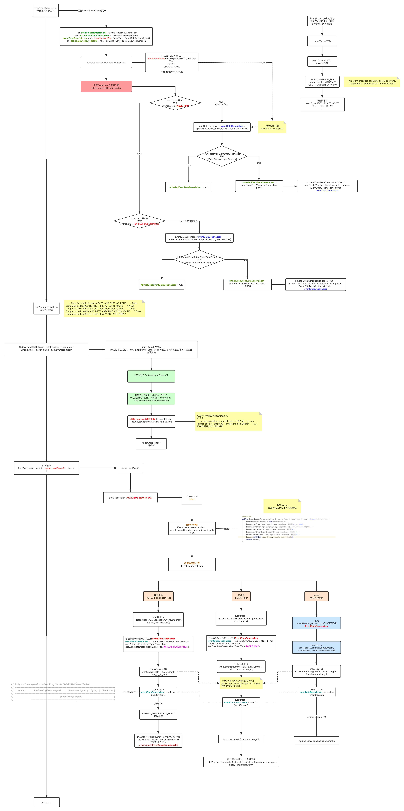

### mysql-binlog-connector-java

#### 相关sql
```
maxwell设置
CREATE USER 'maxwell'@'%' IDENTIFIED BY '123456';
GRANT ALL ON maxwell.* TO 'maxwell'@'%';
GRANT SELECT, REPLICATION CLIENT, REPLICATION SLAVE on *.* to 'maxwell'@'%'; 

binlog
// 正在同步的binlog
show master status;
// 展示binlog的格式
SHOW BINLOG EVENTS
   [IN 'log_name']
   [FROM pos]
   [LIMIT [offset,] row_count]
example：
    show binlog events in 'mysql-bin.000009' FROM 779 ;
    show binlog events in 'mysql-bin.000009' FROM 779 limit 5; // pos为779的位置取5条
    show binlog events in 'mysql-bin.000009' FROM 779 limit 2,5;// pos为779的位置偏移两条后取5条
// binlog列表
show binary logs;

```

#### 前期准备支持Binlog
##### 是什么
> binlog是用来记录对mysql数据更新或潜在发生更新的SQL语句，并以"事务"的形式保存在磁盘中
##### 为了什么
* 主从同步
* 数据恢复
* 增量备份
##### 存储形式
* 以多个文件，以索引文件index和日志文件组成，分片存贮的方式，所以定位方式是：“filename”+“position”
* 组成部分，下图是文件结构示意图
  * 文件头
  * event事件
    * Header  --> 通用事件头（common-header)
      | 属性 | 字节数 | 含义 |
      | :-----| :----| :---- |
      | timestamp | 4 | 包含了该事件的开始执行时间 |
      | eventType | 1 | 事件类型 |
      | serverId | 4 | 标识产生该事件的MySQL服务器的server-id |
      | eventLength | 4 | 该事件的长度(Header+Data+CheckSum) |
      | nextPosition | 4 | 下一个事件在binlog文件中的位置 |
      | flags | 2 | 标识产生该事件的MySQL服务器的server-id。 |
      {header=EventHeaderV4{timestamp=1605161482000, eventType=GTID, serverId=1, headerLength=19, dataLength=46, nextPosition=537, flags=0}
    * Data  --> 私有事件头（post-header）和事件体（event-body）
      | 属性 | 字节数 | 含义 |
      | :-----| :----| :---- |
      | binlogVersion | 2 | binlog版本 |
      | serverVersion | 50 | 服务器版本 |
      | timestamp | 4 | 该字段指明该binlog文件的创建时间 |
      | headerLength | 1 | 事件头长度，为19 |
      | headerArrays | n| 一个数组，标识所有事件的私有事件头的长度 |
      ```
      ArrayHeader是这种形式的
      headerArrays=[56, 13, 0, 8, 0, 18, 0, 4, 4, 4, 4, 18, 0, 0, 95, 0, 4, 26, 8, 0, 0, 0, 8, 8, 8, 2, 0, 0, 0, 10, 10, 10, 42, 42, 0, 18, 52, 0, 1]
      具体含义参考官网
      https://dev.mysql.com/doc/internals/en/format-description-event.html
      ```
#### 源码分析
##### BinlogfileReader
> 下图是binfilereader的执行流程




##### BinlogfileClient
> 下图是client的执行流程图，使用了SSLSocket作为长连接，通过不停发ping包命令，保持心跳连接。


#### 客户端定制
* 设计思路是这样的
  * show binlog events in 'mysql-bin.000009' FROM 779 ;通过客户端开启dump请求，不是从show master status的位置开始