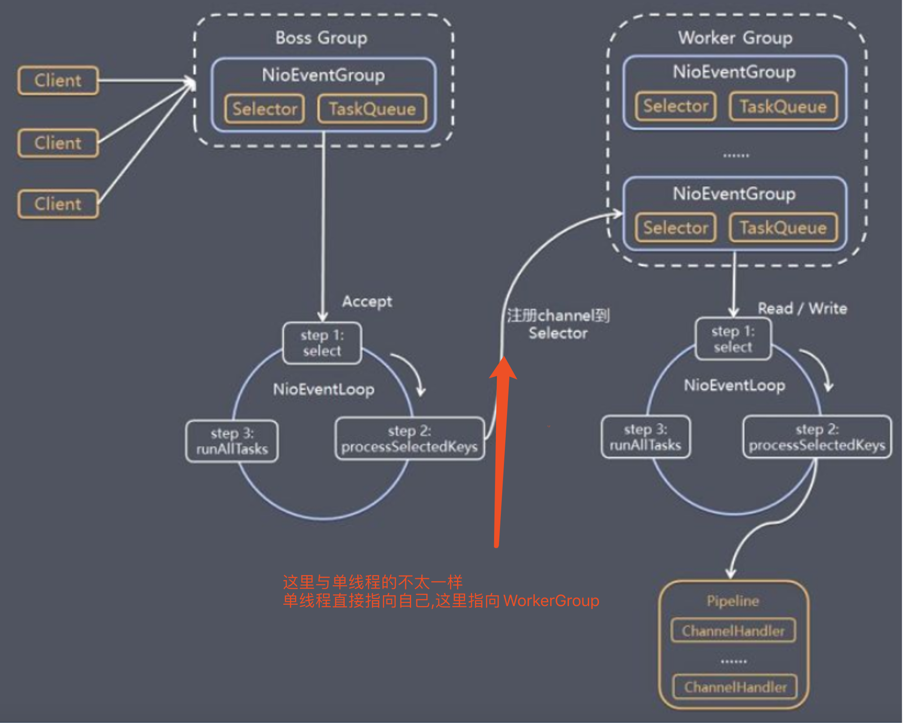
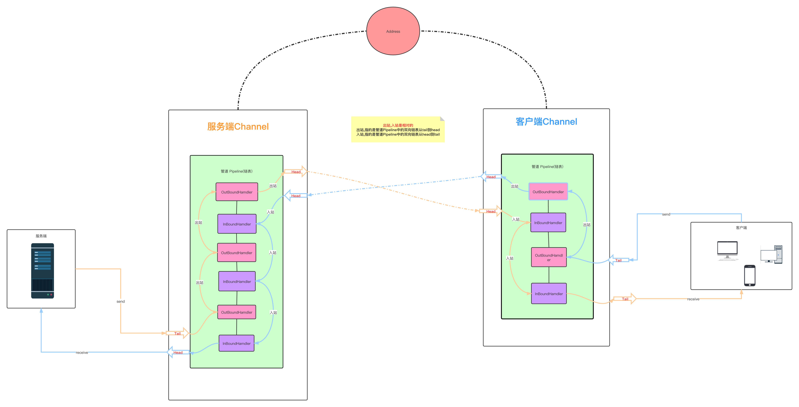
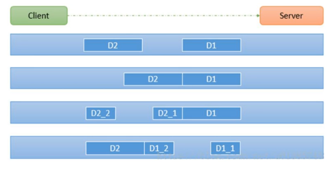

#### Netty
> Netty基于NIO模型.
* Netty的Server端,有两个EventLoopGroup,一个master,一个worker,对应的NIO中的两个线程池,使用一主多从(或多主多从,**多主可以用来负载均衡**)的模型结构.(1主多从展示:1主Selector,8个从Selector),
  * 一个EventLoopGrou master = new EventLoopGrou(1);
  * 一个EventLoopGrou worker = new EventLoopGrou(8);
* Neety实现模型.(**图中红色部分标记出主从结构与NIO模型中,处理完事件之后,再次注册到自身的不同,也是主从连接的关键.**)

* ByteBuff缓冲区,Netty会自己申请一部分连续的内容,方便缓存数据.(是高并发提速的)

IO模型地址:
[javaIO](../../Java/base/JavaIO.md)

##### Netty源码分析
> 下面是netty的源码分析过程
* netty的客户端和服务端,初始化以及连接的步骤
  0. 本次服务器使用的两个事件处理器,一个BossGroup用于处理连接事件(老板拉活儿),一个WorkerGroup负责读取/回写事件(工人干活)
  1. 创建NioEventLoopGroup
     1. 是一个事件的执行者,里面包含了一个线程池(如果不配置,默认使用cpu核数*2)
     2. 创建选择器Selector,这个`Selector是NIO的`
  2. 创建ServerBootstrap,这是整个netty的核心启动类
     1. 设置group,就是将上面的bossGroup和workerGroup设置上
     2. 设置option
     3. 设置channel,本次例子选用NioServerSocketChannel.class.整个channel最终是通过反射实例化的,但是不在这里.
     4. 设置childHandler,**这里其实是给workerGroup设置的,因为workGroup用来read|write**
     5. 设置端口号->bind(端口号),最复杂的过程.
        1. 绑定地址
        2. doBind
           1. 创建channel实例,这里会调用2-3步骤的newChannel方法反射获取channel
           2. init初始化通道
              1. setChannelOptions(channel, options, logger);设置2-2步骤的option选项
              2. channel.addLast(new ChannelInitializer);// ChannelInitializer这里就是ServerBootstrap(启动类的),但是还不会运行new ChannelInitializer.
           3. ChannelFuture regFuture = config().group().register(channel);
              1. config()是个配置类
              2. group()是bossGroup
              3. register(channel)注册
                 1. next(); 从boosGroup中的selector选择器容器中的选择一个出来.
                 2. 然后register,注册
                    1. bossGroup.execute(register0())其实调用的bossGroup的线程池里的方法
                       1. bossGroup.execute // 此步骤是执行步骤
                          1. SingleThreadEventExecutor.this.run();最终执行是由SingleThreadEventExecutor执行的.
                             1. int selectedKeys = selector.select(timeoutMillis); **这里是NIO的代码**,死循环超时等待.
                             2. processSelectedKeys() 一旦上面由事件里,便会跳出死循环.处理器key,就是事件
                                1. 如果是ACCEPT事件
                                   1. doReadMessages,这个方法会最终创建workerGroup(包括workGroup的pipeline)
                                      1. ch.configureBlocking(false); **这里是NIO的代码**
                                      2. super(parent, ch, SelectionKey.OP_READ); 设置关注事件是**OP_READ**
                                      3. pipeline = newChannelPipeline(); 创建workGroup自己的pipeline
                                   2. 由boosGroup的channel其中的pipeline调用fireChannelRead(readBuf.get(i));
                                      1. 由于在创建的步骤创建来一个ServerBootstrap(Netty内部实现的),所以这里会调用ServerBootstrap的channelRead方法
                                         1. ServerBootstrap的channelRead方法最关键的代码就是**childGroup.register(child).addListener(new ChannelFutureListener())**
                                         2. 注册workerGroup,逻辑于2-5-3方法是一样的逻辑的.
                                2. 如果是READ事件
                                   1. 调用byteBuf直接读取
                                   2. pipeline.fireChannelRead(byteBuf); 调用pipeline中所有的handler中的ChannelRead方法.
                       2. runAllTasks();由于
                          1. 调用了2-5-2-2-2的task任务创建了,有待验证
                          2. 调用register0()
                    2. register0()
                       1. 所有任务全部执行一遍.
                       
下面是上面文字的图形版,图太大了.

   

##### Netty重要组件-Pipeline
* ChannelPipeline,在Netty的channel里,有一个双向链表的容器,而存入链表中的都是实现了`ChannelHander`的`Handler`
* ChannelHander,处理了入站,出站的逻辑(ChannelOutboundHandler,ChannelInboundHandler)

##### Netty拆包粘包
* TCP发包的时候,可能会对字符串进行拆包,粘包.如下图
  * D2和D1完整发的时候是正常的,
  * D2和D1一起发的时候是粘包
  * D2的一半和D1+D2的另一半是拆包
  * D1的一半和D2+D1的另一半是拆包

* 解决方式
  1. 自己增加分隔符(在业务里)
  2. 继承MessageToByteEncoder抽象类

##### Netty心跳检测机制
* 在`TCP长连接`中,保持有效性.
* 创建IdleStateHandler()的Hander加入ChannelPipeline的Hander链表容器中就可以实现心跳机制.

##### Netty直接内存和零拷贝
> Netty可以使用堆外内存,进行数据进行操作,在java中使用参数指定堆外内存大小 -XX:MaxDirectMemorySize
> Netty使用Unsafe类,调用c语言函数,直接获取内存.

* 优点
  1. 可以扩展至更大的内存空间。比如超过1TB甚至比主存还大的空间;
  2. 理论上能减少GC暂停时间;
  3. 可以在进程间（系统调用，aio）共享，减少JVM间的对象复制，使得JVM的分割部署更容易实现;
  4. 它的持久化存储可以支持快速重启，同时还能够在测试环境中重现生产数据
  5. 堆外内存能减少IO时的内存复制，不需要堆内存Buffer拷贝一份到直接内存，然后才写入Socket中
     1. jvm虚拟机(堆内存->直接内存->系统调用->硬盘/网卡)
     2. 堆内存(直接内存->系统调用->硬盘/网卡)零拷贝,就是说少一次直接内存到堆内存的copy
* 缺点 
  1. 需要手动释放（或者在引用直接内存的对象回收的时候释放，相当于依赖gc）
  2. 当依靠gc时，需要考虑gc时机如何确定，频繁显示调用System.gc()显然不是个好主意，因为不可控，而依靠堆内存控制，需要计算堆外内存的增长速率与堆内内存增长速率的关系，合理配置jvm参数，在堆外内存OOM之前触发gc
  3. Unsafe对象通常是不可见的，因为其实现并非开源，并且不同jre发行商都对此有不同实现和政策
  4. 初始分配较慢
  5. 没有JVM帮助管理内存容易发生内存溢出.