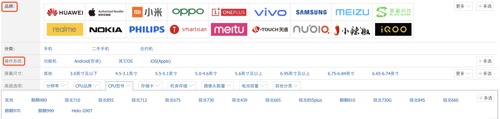

##Redis 
> Redis作为一个可基于内存亦可持久化的日志型、Key-Value数据库.
> redis-cli -h 127.0.0.1 -p 6379 -a pwd 快速连接

#### Linux 安装redis
* yum install redis
* 一般在usr目录下
* 可执行文件在/usr/bin
* systemctl start redis; 启动redis
* redis-cli -p 6379进入redis内部. 

#### 常用命令
* 遍历Key
  * keys pattern
  * SCAN cursor [MATCH pattern] [COUNT count]
* BitMap位图

#### Redis持久化
* RDB(快照)
  * 快照执行,文件是二进制的,所以占用空间小 ,但是由于快照本身的性质,是不会实时保存的.
* AOF(append-only)
  * 使用RESP协议存储,可读性,能看懂,占用空间大
  * 恢复数据时候,会一行一行的执行,恢复数据比较慢.
  * AOF有重写机制,因为随着使用的增加,AOF文件可能会越来愈大,那么下次启动恢复的时候,就会很慢.为了解决AOF文件体积膨胀的问题，Redis提供了AOF重写功能.
    * `auto-aof-rewrite-min-size` 64mb //aof文件至少要达到64M才会自动重写，文件太小恢复速度本来就很快，重写的意义不大
    * `auto-aof-rewrite-percentage` 100 //aof文件自上一次重写后文件大小增长了100%则再次触发重写
* 通常是使用AOF,因为数据更全
* Redis4.0以后使用了混合持久化
  * RDB+AOF(盲猜,即使AOF的部分数据定时要流入到RDB,这样恢复数据的时候,就比较快,也不会丢失数据,因为实时数据都在AOF里)
  * 实际上RDB+AOF混合保存的,**在发生AOF重写的时候**,而是将重写这一刻之前的内存做RDB快照处理,增量继续以RESP格式保存AOF文件中
  

#### Redis五种数据类型
##### String
* 应用场景
  * 单值缓存
  ```
    SET key value
    GET key
  ```
  * 对象缓存
  ```
    SET user:1 value(Json格式数据) // 实际上此种方式并不是很好
    MSET user:1:name wangs  user:1:age 18
    MGET user:1:name  user:1:age
  ```
  * 分布式锁
  ```
    SETNX product:1001 true // 返回1代表了成功
    SETNX product:1001 true // 返回0代表了失败
    DEL product:1001
  ```
##### Hash
* 应用场景
  * 对象缓存
  ```
    HMSET user {userId}:name wangs  {userId}:age 18 // 对比上面的批量MSET,此种方式更为优秀
    HMSET user 1:name wangs  1:age 18
    HMGET user 1:name 1:age
  ```
  * 电商购物车
  ```
    以用户Id为key
    以商品Id为fieldId
    以数量为value
        <----->Then<----->
    购物车操作[key = cart:1001(用户1001的购物车), filed=10088(商品id是10088), value=1(值)]
    添加商品->hset cart:1001 10088 1
    增加数量->hincrby cart:1001 10088 1
    商品总数->hlen cart:1001
    删除商品->hdel cart:1001 10011
    获取购物车内所有产品->hgetall cart:1001
  ```
  * 优缺点
    * 优点
      * 同类数据归类整合存贮,方便数据管理
      * 相比string操作,内存和cpu更小
      * 相比string存贮更节空间
    * 缺点
      * 过期功能不能设置在field上
      * Redis集群架构下不适合大规模使用
##### List
> 实际上List其实类似于Java中LinkedList的实现方式,它是有方向的,比如addFirst和addLast,getFirst和getLast.
> List是有正数索引和负数索引的,正数0,1,2,3,...(正数索引从最小是0) 负数...,-4,-3,-2,-1(负数索引从最大是-1)
* 常用操作
  ```
    LPUSH key value [v1,v2...] // 将一个或多个value放入key列表的表头(最左边,addFirst)
    RPUSH key value [v1,v2...] // 将一个或多个value放入key列表的表头(最右边,addLast)
    LPOP key // 移除并返回头元素,getFirst
    RPOP key // 移除并返回尾元素,getLast
    LRANGE key start stop // 取出start 到 stop区间内的数值.
    BLPOP key [k1,k2,...] timeout // 从key列表表头弹出一个元素,若列表中没有元素,则阻塞等待timeout秒,如果timeout=0,一直阻塞等待.
    BRPOP key [k1,k2,...] timeout // 从key列表表尾弹出一个元素,若列表中没有元素,则阻塞等待timeout秒,如果timeout=0,一直阻塞等待.
  ```

* 常用数据结构
  ```
    Stack(栈) = LPUSH + LPOP -> FILO
    Queue(队列) = LPUSH + RPOP
    Blocking MQ(阻塞队列) = LPUSH + BRPOP
  ```
* 应用场景
  * 微博消息和公众号消息流
  ```
    比如我关注了张三和李四.(这种适合小粉丝用户,主动推送的方式,如果粉丝非常多,则变成主动拉去的方式)
    张三发一条微博
    LPUSH msg:{我的id} 消息ID1
    李四发一条微博
    LPUSH msg:{我的id} 消息ID2
    查看最新消息
    LRANGE msg:{我的id} 0 5 获取5条最新的消息.
  ```
##### Set
* 常用操作
  ```
    SADD key member [m1,m2,....] //往集合key中存入元素,元素存在则忽略
    SREM key member [m1,m2,....] //从集合key中删除元素
    SMEMBERS key  //获取key中所有的元素(members)
    SCARD key //获取key中所有元素的个数
    SMEMBER key member //判断member元素是否存在于key中
    SRANDMEMBER key [count] //从key集合中随机获取几个元素,但是不删除
    SPOP key [count] //从key集合中随机获取几个元素,删除元素,适用于抽奖
  ```
* 集合操作
  ```
    SINTER set1,set2,set3 交集
    SUNION set1,set2,set3 并集
    SDIFF set1,set2,set3 差集
  ```
* 应用场景
  * 抽奖
  ```
    点击参与抽奖加入集合
    SADD key {userId}
    查看参与抽奖的所有用户
    SMEMBERS key
    抽取count名中奖者
    SRANDMEMBER key [count] / SPOP key [count] // 前者是不删除,后者删除
  ```
  * 微信,微博点赞,收藏,标签
  ```
    点赞
    SADD like:{消息Id} {用户名Id}
    取消点赞
    SREM like:{消息Id} {用户名Id}
    检查用户是否点过赞
    SISMEMBER like:{消息Id} {用户名Id}
    获取点赞的用户列表
    SMEMBERS like:{消息Id}
    获取点赞用户数
    SCARD like:{消息Id}
  ```
  * 集合操作应用的场景
  ```
    我关注的人 mySet->{a,b,c,you,him}
    你关注的人 yourSet->{b,d,f,me}
    他关注的人 hisSet->{a,b,c,d,e,f,me,you}
        <----->Then<----->
    我和你共同关注的人
    SINTER mySet yourSet
    我关注的人也关注他
    SISMEMBER yourSet him
    我可能认识的人
    SDIFF yourSet himSet
  ```
  * 结合操作实现电商商品筛选(这种方式避免了多个数据库的)
  ```
    下面是筛选条件
    SADD brand:huawei P30    // 品牌
    SADD brand:xiaomi mi-6x  // 品牌
    SADD brand:iPhone iphone9  // 品牌
    SADD os:android P30 mi-6x  // 操作系统
    SADD cpu:brand:inter P30 mi-6x // cpu
    SADD ram:8G P30 mi-6x iphone9 // 内存

    // 高级选项
    SINTER os:android cpu:brand:inter ram:8G ->{P30 mi-6x}
  ```
    

#### StringRedisTemplate与RedisTemplate
> SpringBoot封装了redis模版工具类,下面即使工具类的简单介绍.
* RedisTemplate中提供了几个常用的接口方法的使用，分别是:
  ```
  1 privateValueOperations<K,V>valueOps;
  2 privateHashOperations<K,V>hashOps;
  3 privateListOperations<K,V>listOps;
  4 privateSetOperations<K,V>setOps;
  5 privateZSetOperations<K,V>zSetOps;
  ```
* RedisTemplate中定义了对5种数据结构操作
  ```
  1 redisTemplate.opsForValue();//操作字符串 
  2 redisTemplate.opsForHash();//操作hash
  3 redisTemplate.opsForList();//操作list
  4 redisTemplate.opsForSet();//操作set
  5 redisTemplate.opsForZSet();//操作有序set
  ```
* Redis客户端命令对应的RedisTemplate中的方法列表:
  * **String**
    | Redis       | RedisTemplate rt   |
    | --------   | :----- |
    | set key value        | rt.opsForValue().set("key","value")     | 
    | get key       | rt.opsForValue().get("key")      |
    | del key       | rt.delete("key")      | 
    | strlen key      | rt.opsForValue().size("key")      | 
    | getset key value      | rt.opsForValue().getAndSet("key","value")     | 
    | getrange key start end       | rt.opsForValue().get("key",start,end)     | 
    | append key value       | rt.opsForValue().append("key","value")      | 
  * **Hash**
    | Redis       | RedisTemplate rt   |
    | --------   | :----- |
    | hmset key field1 value1 field2 value2...       | rt.opsForHash().putAll("key",map) //map是一 个集合对象     | 
    | hset key field value      | rt.opsForHash().put("key","field","value")     |
    | hexists key field      | rt.opsForHash().hasKey("key","field")      | 
    | hgetall key      | rt.opsForHash().entries("key") //返回Map对象      | 
    | hvals key     | rt.opsForHash().values("key") //返回List对象     | 
    | getrange key start end       | rt.opsForHash().keys("key") //返回List对象     | 
    | hmget key field1 field2...      | rt.opsForHash().multiGet("key",keyList)     | 
    | hsetnx key field value     | rt.opsForHash().putIfAbsent("key","field","value"     | 
    | hdel key field1 field2     |rt.opsForHash().delete("key","field1","field2")    | 
    | hget key field      | rt.opsForHash().get("key","field")    | 
  * **List**
      | Redis       | RedisTemplate rt   |
      | --------   | :----- |
      | lpush list node1 node2..  | rt.opsForList().leftPush("list","node")    | 
      | lpush list node1 node2..  | rt.opsForList().leftPushAll("list",list) //list是集 合对象   | 
      | rpush list node1 node2..  | rt.opsForList().rightPush("list","node")    | 
      | rpush list node1 node2..  | rt.opsForList().rightPushAll("list",list) //list是集 合对象   | 
      | lindex key index       | rt.opsForList().index("list", index)      |
      | llen key     | rt.opsForList().size("key")    |
      | lpop key     | rt.opsForList().leftPop("key")    | 
      | rpop key     | rt.opsForList().rightPop("key")     | 
      | lpushx list node      | rt.opsForList().leftPushIfPresent("list","node")    | 
      | rpushx list node      | rt.opsForList().rightPushIfPresent("list","node ")    | 
      | lrange list start end       | rt.opsForList().range("list",start,end)      | 
      | lrem list count value      | rt.opsForList().remove("list",count,"value")     | 
      | lset key index value       | rt.opsForList().set("list",index,"value")     | 
  * **Set**
      | Redis       | RedisTemplate rt   |
      | --------   | :----- |
      | sadd key member1 member2...  | rt.boundSetOps("key").add("member1","me mber2",...)    | 
      | lpush list node1 node2..  | rt.opsForSet().add("key", set) //set是一个集合 对象   | 
      | scard key     | rt.opsForSet().size("key")   |
      | sidff key1 key2    | rt.opsForSet().difference("key1","key2") //返 回一个集合对象    | 
      | sinter key1 key2     | rt.opsForSet().intersect("key1","key2")//同上    | 
      | sunion key1 key2      | rt.opsForSet().union("key1","key2")//同上   | 
      | sdiffstore des key1 key2      | rt.opsForSet().differenceAndStore("key1","ke y2","des")   | 
      | sinter des key1 key2      | rt.opsForSet().intersectAndStore("key1","key2 ","des")     | 
      | sunionstore des key1 key2     | rt.opsForSet().unionAndStore("key1","key2"," des")     | 
      | sismember key member      | rt.opsForSet().isMember("key","member")    | 
      | smembers key     | rt.opsForSet().members("key")    | 
      | spop key     | rt.opsForSet().pop("key")     | 
      | srandmember key count      | rt.opsForSet().randomMember("key",count)    | 
      | srem key member1 member2...      | rt.opsForSet().remove("key","member1","member2",...)     | 

    
#### Redis其他应用
##### 分布式锁
* 回顾一下,分布式锁为什么需要?

##### 主从架构
> 主从架构并不能减轻服务器的压力,它是保障的数据安全,放置意外事件导致数据丢失.
* 搭建过程
  1. 复制一份redis.conf文件
  2. 将相关配置修改为如下值:
     1.  port6380
     2.  pidfile/var/run/redis_6380.pid
     3.  logfile"6380.log"
     4.  dir/usr/local/redis‐5.0.3/data/6380
  3. 配置主从复制
     1. replicaof192.168.0.606379#从本机6379的redis实例复制数据
     2. replica‐read‐onlyyes
  4. 启动从节点 
     1. redis‐serverredis.conf
  5. 连接从节点 
     1. redis‐cli‐p6380
  6. 测试在6379实例上写数据，6380实例是否能及时同步新修改数据
  7. 可以自己再配置一个6381的从节点
* 主从数据复制原理...重看
* 主从架构,并没有选举的过程,**slave只不过是备份.**
##### 哨兵
> sentinel哨兵是特殊的redis服务，不提供读写服务，主要用来监控redis实例节点。


* 哨兵的搭建过程
  1. 复制一份sentinel.conf文件 
     * cpsentinel.confsentinel‐26379.conf
  2. 将相关配置修改为如下值: 
     1. port26379
     2. daemonizeyes
     3. pidfile"/var/run/redis‐sentinel‐26379.pid"
     4. logfile"26379.log"
     5. dir"/usr/local/redis‐5.0.3/data"
     6. #sentinelmonitor<master‐name><ip><redis‐port><quorum>
     7. #quorum是一个数字，指明当有多少个sentinel认为一个master失效时(值一般为:sentinel总数/2+ 1)，master才算真正失效
     8. sentinelmonitor mymaster 192.168.0.60 63792
  3. 启动sentinel哨兵实例
     1. src/redis‐sentinelsentinel‐26379.conf
  4. 查看sentinel的info信息
     1. src/redis‐cli‐p26379
     2. info
  5. 可以自己再配置两个sentinel，端口26380和26381，注意上述配置文件里的对应数字都要修改

##### 集群
> 集群可以水平分摊redis服务器的压力,比如之前100g的数据,可以创建5个集群,每个20g,减少服务器压力
* RedisCluster将所有数据划分为16384个slots(槽位)，每个节点负责其中一部分槽位。槽位的信息存储于每个节点中。
* Redis集群,水平减轻数据分担,会分配给每个集群一个slot段,当要存贮的key经过计算(HASH_SLOT = CRC16(key)&16384),会得出一个小于16384的值,并将数据存贮在对应slot区域的集群中.
* 使用gossip协议
  * ping，pong，meet,fail
  * 
* Redis集群示意图.

* Redis集群搭建(只有3.0版本以后才支持)
  * 第一步 在/usr/local下创建文件夹 redis-cluster,然后在其下面创建6个文件夹.
    ```
    1. mkdir -p /user/local/redis-cluster
    2. mkdir 8001,mkdir 8002,mkdir 8003,mkdir 8004,mkdir 8005,mkdir 8006
    ```
  * 第二步 把之前的redis.conf配置文件copy到8001下,修改如下内容
    ```
    1. daemonize yes (守护线程启动,就是后台启动)
    2. port 8081(分别对每个机器对端口号进行配置)
    3. bind 192.168.1.10(必须要绑定当前机器的ip,这里方便redis集群定位机器,不绑定可能会出现循环查找集群节点机器的情况)
    4. dir /user/local/redis-cluster/8001(指定数据文件存放位置,必须要指定不同的目录位置,不然会丢失数据)
    5. cluster-enable yes(启动集群模式)
    6. cluster-config-file nodes-8001.conf(这里800x最好和port对应上)
    7. cluster-node-timeout 5000 (5秒超时)
    8. appendonly yes(打开AOF持久化)
    ```
  * 第三步 把修改后的配置文件,分别copy到各个文件夹下,注意每个文件要修改第2,4,6项的端口号,可以批量修改
    ```
    * %s/源字符串/目的字符串/g
    ```
  * 第四步 由于redis集群需要使用ruby命令,所以我们需要安装ruby
    ```
    1. yum install ruby
    2. yum install rubygems
    3. gem install redis --version(安装redis 和 ruby的接口)
    ```
  * 第五步 分别启动6个redis实例,然后检查是否启动成功
    ```
    1. /user/local/redis/bin/redis-server /usr/local/redis-cluster/800*/redis.conf
    2. ps -ef|grep redis
    ```
  * 第六步 在redis3的安装目录下执行redis-trib.rb命令创建整个redis集群
    ```
    1. cd /user/local/redis3/src
    2. ./redis-trib.rb create --replicas 1 192.168.10:8001 192.168.10:8002 192.168.10:8003 192.168.10:8004 192.168.10:8005 192.168.10:8006 (注意 --replicas 1 ,这个 ‘1’ 是master/slave的比值,因为我们每个节点只有1个主节点和从节点,所以比值是1,如果是1个主和2个从,那么就是0.5; 规定的前面的都是主节点8001,8002,8003,后面的都是从节点8004,8005,8006)
    ```
  * 第七步 验证集群
    ```
    1. 连接任意一个客户端即可: ./redis-cli -c -h -p(-c表示集群模式,指定ip地址和端口号) 如:/user/local/redis/bin/redis-cli -c -h 192.168.1.10 -p 800*
    2. 进行验证: cluster info (查看集群信息),cluster nodes (查看节点列表)
    3. 进行数据验证操作
    4. 关闭集群需要逐个进行关闭,使用命令
    ```

#### Redis分布式锁
* Redisson,使用LUA脚本,是原子性的.

#### Redis缓存设计

##### Redis缓存击穿
> 什么是缓存击穿?名称高大上,实际上就是查询一个根本不存在的数据,缓存层和存储层都不会命中，通常出于容错的考虑，如果从存储层查不到数据则不写入缓存层。
* 产生原因
  * 自身业务代码或者数据出现问题。
  * 一些恶意攻击、 爬虫等造成大量空命中。
* 解决方案
  * 缓存空对象.
  * 加锁,查询加锁,只有拿到锁的查询才可以进入数据库查询.(Mysql的二级缓存使用的就是这种方式.)
  * 布隆过滤器.
    * 简单介绍:布隆过滤器（Bloom Filter）是1970年由布隆提出的。它实际上是一个很长的二进制向量(位图)和一系列随机映射函数（哈希函数）。布隆过滤器可以用于检索一个元素是否在一个集合中。它的优点是空间效率和查询时间都远远超过一般的算法，缺点是有一定的误识别率和删除困难。
    * 布隆过滤器的优点:可以大量减少使用**空对象**的空间
  
##### Redis缓存失效
> 大量的缓存,都在同一事件到期,如果此时有大量的请求过来就会导致问题.
* 产生原因
  * 带有过期事件的缓存,同一时间大量失效
* 解决方法
  * 生成的不能的缓存过期事件使用随机数在30秒内上下波动
##### Redis缓存雪崩
> 缓存雪崩指的是缓存层支撑不住或宕掉后，流量会像奔逃的野牛一样，打向后端存储层。
* 产生原因
  * 超大并发量
  * 缓存设计不好，类似大量请求访问bigkey
* 解决方案
  * 限流.一般选择多级限流熔断器的策略，让最终到达redis缓存的只有可以接受的qps，不至于击溃缓存（限流组件满足后，返回自定义实现的failover，友好提示）
  * Bigkey，分段思想，拆分取模
* 热点缓存key重建优化
  * 开发人员使用“缓存+过期时间”的策略既可以加速数据读写，又保证数据的定期更新，这种模式基本能够满足绝大部分需求。 但是有两个问题如果同时出现，可能就会对应用造成致命的危害:
    * 当前key是一个热点key(例如一个热门的娱乐新闻)，并发量非常大。
    * 重建缓存不能在短时间完成，可能是一个复杂计算， 例如复杂的SQL、 多次IO、 多个依赖等。
  * 热Key处理方式
    * 热key可以部分缓存在本地，使用guava缓存处理。
    * 或者通过加机器，来降低key的热度。
* **Redis对于过期键**有三种清除策略: 
  * 被动删除:当读/写一个已经过期的key时，会触发惰性删除策略，直接删除掉这个过期key 
  * 主动删除:由于惰性删除策略无法保证冷数据被及时删掉，所以Redis会定期主动淘汰一批已过期的key当前已用内存超过maxmemory限定时，触发主动清理策略当REDIS运行在主从模式时，只有主结点才会执行被动和主动这两种过期删除策略，然后把删除 操作”del key”同步到从结点。这里，`如果有1000w的缓存，每隔100ms遍历过期key的时候，redis就死了`。。。
##### Redis分段拆分思想
* 场景:如果大促商品是同一个商品，那么集群就相当于失效，因为商品key运算过后的都是一个值，只会定位到同一个slot，这时候，就需要对商品进行分段处理，比如pid1234的商品有1000个库存，将pid1234分成10个段，如pid1234-1，pid1234-2等等，每个段存100个库存，降低并发量，思路于concurrentHashmap相似
* 增加机器时候，使用hash一致性算法，成为一个hash环，按照大于hash值的顺时针查找，直到找到为止。

##### Redis实现高性能/高并发
* 高性能，查询mysql的条件比较复杂
* 高并发，挡住热点流量
* 缺点
  * 雪崩
  * 穿透
  * 数据不一致
  * 并发竞争

##### Redis工作原理

##### Redis为啥快
* 纯内存
* IO多路复用
* 单线程减少多线程切换开销

##### Redis过期删除
* 定期删除+惰性删除，会导致内存中大量占用过期的key
* 内存淘汰策略，LRU
* LRU算法手写一下

##### Reids并发
* redis的并发量，是几万级别，如何达到10万级别以上？
  * 读写分离，master一定要开启持久化，否则，一旦重启，缓存数据为null，slave节点瞬间同步null的结构。


##### Redis主从复制原理
* 第一次全量复制，slave保存后rdb持久化到磁盘
* 第二次，是增量复制。根据offset，在master自己的backlog中找到丢失的数据，发送给slave节点
* 2.8以后支持断点续传。
* 无磁盘化复制，`repl-diskless-sync`开启后，直接写rdb到slave的socket中，无需落盘，`repl-diskless-sync-delay`

##### Redis高可用
* 主备切换，可以使用哨兵
  * **集群监控**
  * 消息通知
  * **故障转移**
  * 配置中心
* 主备切换的问题，如果master还未同步到slave，数据丢失了咋办？
  * **min-slaves-max-lag 10** ,要求至少有1个slave，数据复制和同步的延迟不能超过10秒,如果说一旦所有slave，数据复制和同步的延迟都超过了10秒钟，那么这个时候，master就不会再接收任何请求了。
* 集群脑裂，网络问题，导致master不能与sentinal连同，所以会选举一个slave变为master，此时恢复网络，产生了两个master，这就是`脑裂`
  * min-slaves-to-write 1
  * min-slaves-max-lag 10 通过这两个参数解决

##### 缓存和数据库双写一致
* 经典的cache aside pattern
  * 读取，先get cache，没有get database， cache redis
  * update  update database，then `remove cache`
  * 为啥是删除缓存，而不是更新缓存?
    * 缓存中的某个值，可能是经过两个表的复杂计算，所以更新代价非常大，不如下次get的时候，重新cache
* 如何保证一致性？
  * 更新操作key，删除缓存，这样每次get的时候，都去数据库获取一下。
  * **并发**，一个更新（库存-1），另外一个线程获取缓存（此时缓存是空的），于是从数据库里获取出来，发现是1000，但是库存即将-1，更新为999，双写不一致。
    * **hash产品的id**
    * **分发到同一个内存队列中，串行化消费（读操作，在写操作后的同一个查询读，可以排重处理，那么其他读读服务，可以等待40ms，如果还没找到，直接从数据库里找。）**
    * 每个内存队列，最多积压多少个写操作。另外如果多个服务，都有内存队列，读写请求


##### 电商商品详情页