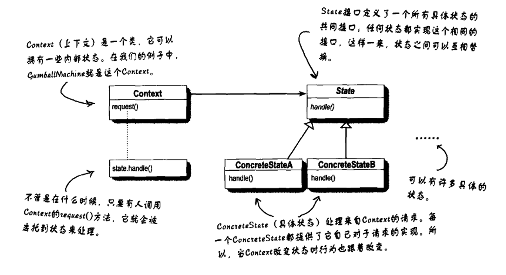
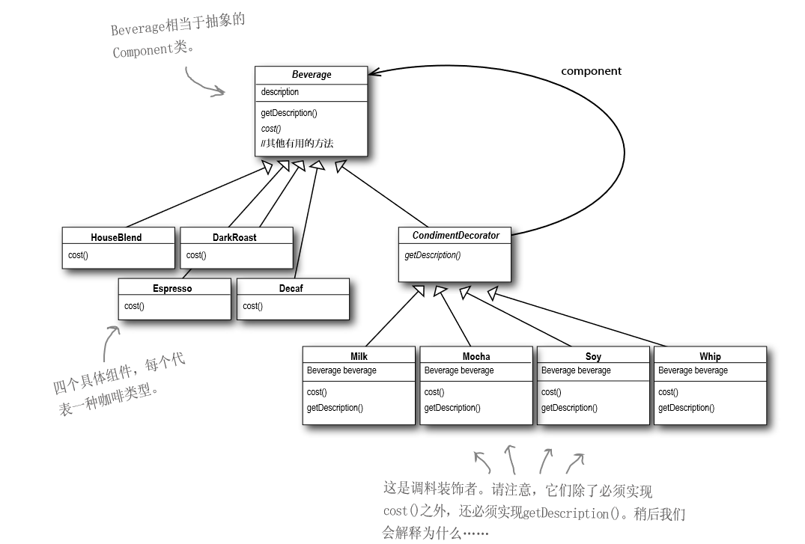
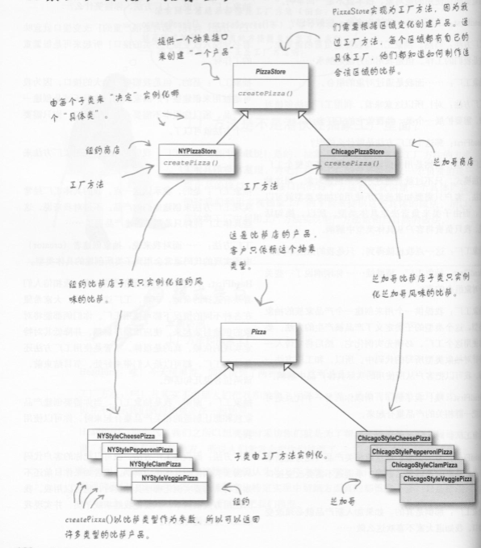
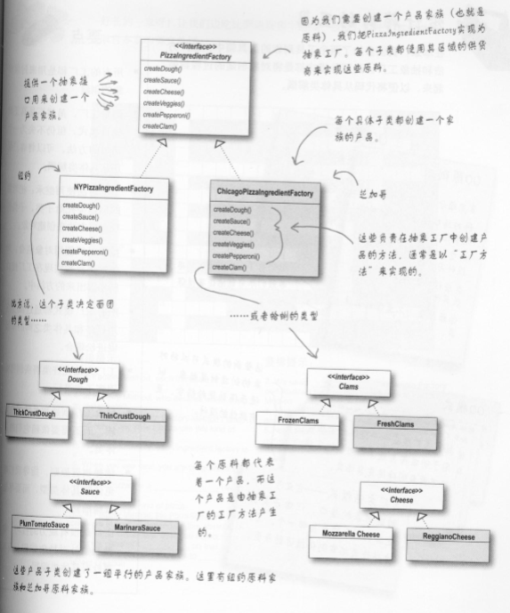
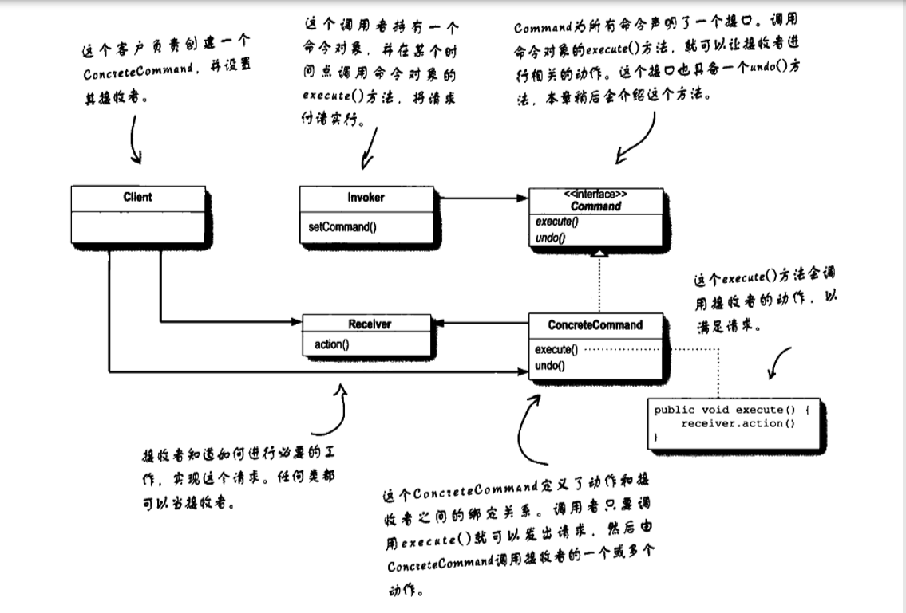
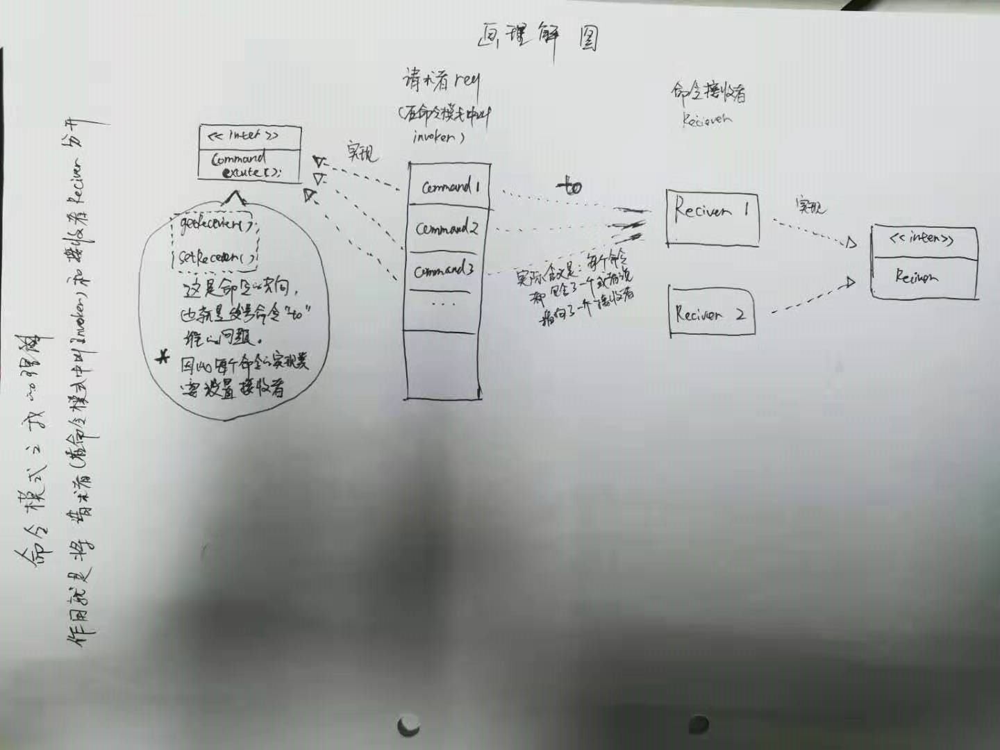
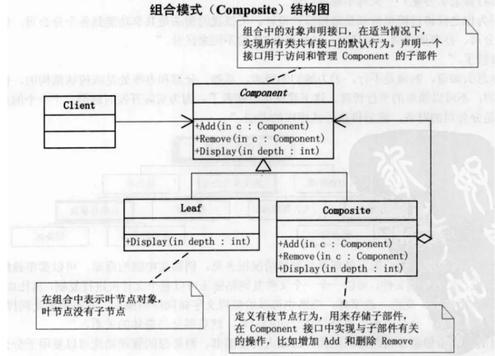
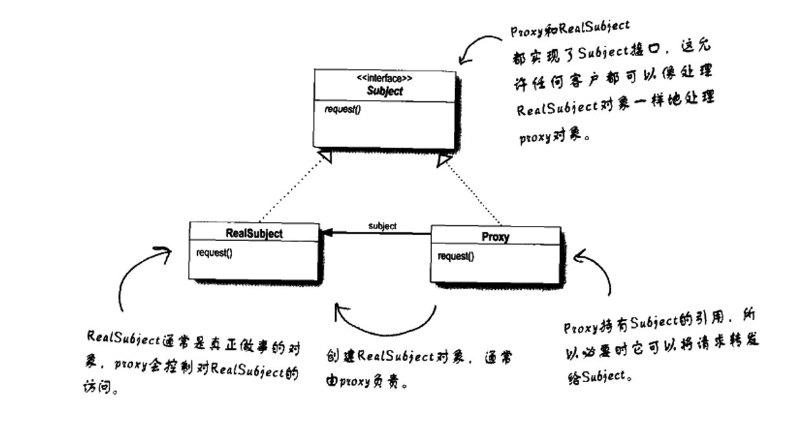
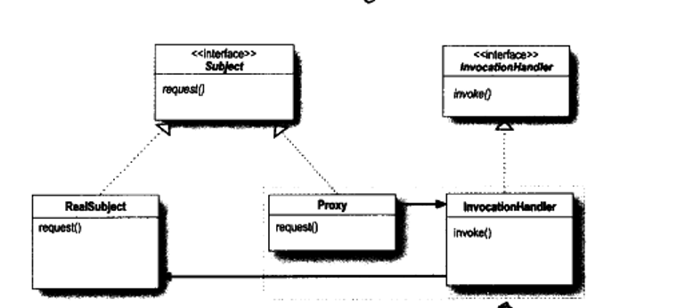

<font size=6 color=orange>Head First</font>设计模式
> 模式源于生活,抽象于程序,所有的设计模式皆可用生活中的例子反应.

### 面向对象
* 抽象->画出骨架，不必填充
* 封装->三大特性之一，隐藏实现细节，符合迪米特原则（最少知道原则）
* 继承->三大特性之一，依赖倒置原则和里氏替换原则的支持实现
* 多态->三大特性之一

### 软件设计原则
1. **单一职责原则(SRP)**(Single-Responsibility Principle)　　
　　就一个类而言，应该只专注于做一件事和仅有一个引起它变化的原因。所谓职责，我们可以理解为功能，就是设计的这个类功能应该只有一个，而不是两个或更多。也可以理解为引用变化的原因，当你发现有两个变化会要求我们修改这个类，那么你就要考虑撤分这个类了。因为职责是变化的一个轴线，当需求变化时，该变化会反映类的职责的变化。
    优点：消除耦合，减小因需求变化引起代码僵化。

2. **里氏代换原则(LSP)**(Liskov Substitution Principle)
　　子类型必须能够替换它们的基类型。一个软件实体如果使用的是一个基类，那么当把这个基类替换成继承该基类的子类，程序的行为不会发生任何变化。软件实体察觉不出基类对象和子类对象的区别。
　　优点：可以很容易的实现同一父类下各个子类的互换，而客户端可以毫不察觉。

3. **依赖倒置原则(DIP)**(Dependence Inversion Principle)
　　**要依赖于抽象，不要依赖于具体，客户端依赖于抽象耦合；抽象不应依赖于细节，细节应依赖于抽象；要针对接口编程，不针对实现编程**。
　　优点：使用传统过程化程序设计所创建的依赖关系，策略依赖于细节，这是糟糕的，因为策略受到细节改变的影响。依赖倒置原则使细节和策略都依赖于抽象，抽象的稳定性决定了系统的稳定性。
   * 怎样做到依赖倒置？
     * 以抽象方式耦合是依赖倒转原则的关键。抽象耦合关系总要涉及具体类从抽象类继承，并且需要保证在任何引用到基类的地方都可以改换成其子类，因此，里氏代换原则是依赖倒转原则的基础。
     * 在抽象层次上的耦合虽然有灵活性，但也带来了额外的复杂性，如果一个具体类发生变化的可能性非常小，那么抽象耦合能发挥的好处便十分有限，这时可以用具体耦合反而会更好。
　　  层次化：所有结构良好的面向对象构架都具有清晰的层次定义，每个层次通过一个定义良好的、受控的接口向外提供一组内聚的服务。
　　  依赖于抽象：建议不依赖于具体类，即程序中所有的依赖关系都应该终止于抽象类或者接口。尽量做到：
     * **任何变量都不应该持有一个指向具体类的指针或者引用**；
     * **任何类都不应该从具体类派生**；
     * **任何方法都不应该覆写它的任何基类中的已经实现的方法**.
4. **接口隔离原则(ISP)**(Interface Segregation Principle)
　　使用多个专一功能的接口比使用一个的总接口总要好。从一个客户类的角度来讲：一个类对另外一个类的依赖性应当是建立在最小接口上的。过于臃肿的接口是对接口的污染，不应该强迫客户依赖于它们不用的方法。
　　优点：会使一个软件系统功能扩展时，修改的压力不会传到别的对象那里。
   * 如何实现接口隔离原则？
     * **利用委托分离接口**；
     * **利用多继承分离接口**；
5. **迪米特原则(LD)**(Law of Demeter)
　　迪米特法则又叫做最少知识原则(Least Knowledge Principle或简写为LKP)，就是说，一个对象应当对其他对象有尽可能少的了解，对象与对象之间应使用尽可能少的方法来关联，避免千丝万缕的关系。
　　在软件系统中，**一个模块设计的好不好的最主要、最重要的标志，就是该模块在多大的程度上将自己的内部数据和其他与实现有关的细节隐藏起来**。一个设计好的模块可以将它所有的实现细节隐藏起来，彻底地将提供给外界的API和自己的实现分割开来。这样一来，模块与模块之间就可以仅仅通过彼此的API相互通信，而不理会模块内部的工作细节。这一概念就是“信息的隐藏”，或叫做“封装”，也就是大家熟悉的软件设计的基本教义之一。信息的隐藏非常重要的原因在于，它可以使各个子系统之间脱藕，从而允许它们独立地被开发、优化、使用、阅读以及修改。
   * 如何实现迪米特法则？迪米特法则的主要用意是控制信息的过载，在将其运用到系统设计中应注意以下几点：
     * 在类的划分上，应当创建有弱耦合的类，类之间的耦合越弱，就越有利于复用
     * 在类的结构设计上，每一个类都应当尽量降低成员的访问权限。一个类不应当public自己的属性，而应当提供取值和赋值的方法让外界间接访问自己的属性。
     * **在类的设计上，只要有可能，一个类应当设计成不变类**
     * 在对其它对象的引用上，一个类对其它对象的引用应该降到最低
     * 对于顶级的类来说，只有两个可能的访问性等级：package-private和public，一个类可以设置成为package-private的，就不应该把它设置成为public的
     * 谨慎使用Serializable：如果一个类实现了Serializable接口的话，客户端就可以将这个类串行后再并行化。假如以后这个类一旦修改，客户端势必也将改动。所以能不用就不用

6. **开放－封闭原则(OCP)**(Open-Closed Principle)
　　对扩展开放，对修改关闭。
　　优点：按照OCP原则设计出来的系统，降低了程序各部分之间的耦合性，其适应性、灵活性、稳定性都比较好。当已有软件系统需要增加新的功能时，不需要对作为系统基础的抽象层进行修改，只需要在原有基础上附加新的模块就能实现所需要添加的功能。增加的新模块对原有的模块完全没有影响或影响很小，这样就无须为原有模块进行重新测试。
   * 如何实现“开-闭”原则？
     * **在面向对象设计中，不允许更改的是系统的抽象层，而允许扩展的是系统的实现层。**
     * 解决问题关键在于抽象化，抽象化是面向对象设计的第一个核心本质。对一个事物抽象化，即封装了事物的本质，看不到任何细节。
     * **在面向对象编程中，通过抽象类及接口，规定了具体类的特征作为抽象层，相对稳定，不需更改，从而满足“对修改关闭”；而从抽象类导出的具体类可以改变系统的行为，从而满足“对扩展开放”**。
     * 对实体进行扩展时，不必改动软件的源代码或者二进制代码。

### 优秀程序设计的18大原则
1. 避免重复原则(DRY - Don’t repeat yourself)
　　编程的最基本原则是避免重复。在程序代码中总会有很多结构体，如循环、函数、类等等。一旦你重复某个语句或概念，就很容易形成一个抽象体。

2. 抽象原则(Abstraction Principle)
　　与DRY原则相关。要记住，程序代码中每一个重要的功能，只能出现在源代码的一个位置。

3. 简单原则(Keep It Simple and Stupid)
　　简单是软件设计的目标，简单的代码占用时间少，漏洞少，并且易于修改。

4. 避免创建你不要的代码(Avoid Creating a YAGNI (You aren’t going to need it))
　　除非你需要它，否则别创建新功能。

5. 尽可能做可运行的最简单的事(Do the simplest thing that could possibly work)
　　尽可能做可运行的最简单的事。在编程中，一定要保持简单原则。作为一名程序员不断的反思“如何在工作中做到简化呢?”这将有助于在设计中保持简单的路径。

6. 别让我思考(Don’t make me think)
　　这是Steve Krug一本书的标题，同时也和编程有关。所编写的代码一定要易于读易于理解，这样别人才会欣赏，也能够给你提出合理化的建议。相反，若是繁杂难解的程序，其他人总是会避而远之的。

7. 开闭原则(Open/Closed Principle)
　　你所编写的软件实体(类、模块、函数等)最好是开源的，这样别人可以拓展开发。不过，对于你的代码，得限定别人不得修改。换句话说，别人可以基于你的代码进行拓展编写，但却不能修改你的代码。

8. 代码维护(Write Code for the Maintainer)
　　一个优秀的代码，应当使本人或是他人在将来都能够对它继续编写或维护。代码维护时，或许本人会比较容易，但对他人却比较麻烦。因此你写的代码要尽可能保证他人能够容易维护。用书中原话说“如果一个维护者不再继续维护你的代码，很可能他就有想杀了你的冲动。”

9. 最小惊讶原则(Principle of least astonishment)
　　最小惊讶原则通常是在用户界面方面引用，但同样适用于编写的代码。代码应该尽可能减少让读者惊喜。也就是说，你编写的代码只需按照项目的要求来编写。其他华丽的功能就不必了，以免弄巧成拙。

10. 单一责任原则(Single Responsibility Principle)
　　某个代码的功能，应该保证只有单一的明确的执行任务。

11. 低耦合原则(Minimize Coupling)
　　代码的任何一个部分应该减少对其他区域代码的依赖关系。尽量不要使用共享参数。低耦合往往是完美结构系统和优秀设计的标志。

12. 最大限度凝聚原则(Maximize Cohesion)
　　相似的功能代码应尽量放在一个部分。

13. 隐藏实现细节(Hide Implementation Details)
　　隐藏实现细节原则，当其他功能部分发生变化时，能够尽可能降低对其他组件的影响。

14. 迪米特法则又叫作最少知识原则(Law of Demeter)
　　该代码只和与其有直接关系的部分连接。(比如：该部分继承的类，包含的对象，参数传递的对象等)。

15. 避免过早优化(Avoid Premature Optimization)
　　除非你的代码运行的比你想像中的要慢，否则别去优化。假如你真的想优化，就必须先想好如何用数据证明，它的速度变快了。
　　“过早的优化是一切罪恶的根源”——Donald Knuth

16. 代码重用原则(Code Reuse is Good)
　　重用代码能提高代码的可读性，缩短开发时间。

17. 关注点分离(Separation of Concerns)
　　不同领域的功能，应该由不同的代码和最小重迭的模块组成。

18. 拥抱改变(Embrace Change)
　　这是Kent Beck一本书的标题，同时也被认为是极限编程和敏捷方法的宗旨。

### 设计工具
> 模式不是被发明,而是被发现
> 设计是一门艺术,总有可取的地方
* 封装变化
* 多用组合,少用继承
* 针对接口编程,不针对实现编程
* 为交互对象之间的松耦合设计而努力
* 对扩展开放,对修改关闭
* 依赖倒置,要依赖抽象,而不是依赖具体的类
* 最少知道原则
  
#### 策略模式/状态模式(用接口/抽象代替具体实现类)
> 针对`变化`的部分,设计为接口,并在当前类中添加setter方法,随时切换接口的另一种实现类  
> 状态模式,允许对象在内部状态改变时改变它的行为,与策略模式极其相像

* 策略模式和状态模式的区别
  * 策略模式使用的是组合,主要应用在`算法`上;context会将行为委托给当前的状态类
  * 状态模式由Context对象,在对象内随着时间自由切换状态,来改变`行为`,是`自动化`的;context允许随着状态的改变而改变行为


#### 观察者模式(对象之间一对多)
> 在对象的定义之间存在`一对多`的关系,这样一个状态改变,依赖它的其他对象收到通知,并自动更新.
* Subject(观察者),使用一个接口(java.util使用的是一个类Observerable来继承)

#### 装饰者模式(创建富有弹性的对象)
> `动态的添加`责任到对象上,是`弹性的继承`,是`动态行为`的扩展,各个装饰者都有一个共同的抽象类或接口  
> 通过一个/一批方法(行为)的增强,是原来的组件的行为具有新的特性

* 使用心得
  * 装饰者,类似人床衣服,首先要有个`人`的身体(苗条的或者性感的身体),这个叫做被装饰物;然后是这种衣服,如内衣,秋衣,棉衣,外套等等,是可以动态装饰最终这个`人`的.
  * 使用的时候,感觉相当于每一个装饰块儿都会暂存一个上一个装饰块儿装饰到的某一个步骤.(在本类中暂存或者使用父类暂存,推荐使用后者,记住创建一个带有父类的对象时,这个父类是与当前子类是一部分,`父类中的属性就是子类的,父类不过是子类的一部分属性,只不过是通用的,这个通用不是所有子类一起用,而是所有子类自己都有的互不干扰的属性,要明白这点`.)
* 装饰者和建造者的区别
  * 装饰者的构造过程不稳定,建造者是稳定的
  * 装饰者是<font color=LightSeaGreen>动态行为的<b>`横向`</b>扩展</font>;建造者是<font color=LightSeaGreen>动态行为的<b>`纵向`</b>延申</font>
  * 装饰者针对的是组件中的某一个方法的扩展;建造者是管理当前对象的行为赋值顺序的动态变化所引起的不同结果
* 要点
  * 组件和装饰者是同一个父类继承关系,并实现同一行为
  * 装饰者的继承--增强扩展组件,`只是继承了类型,而不是继承了行为`
  * 装饰者按照顺序来装饰,最基层一定是`组件`,装饰的过程不稳定(一旦装饰顺序错误,可能会失败)
  * 装饰者模式,类似组装,类似文学中的`美丽的,性感的,高挑的亚洲女人`-><font color=LightSeaGreen>亚洲女人是组件</font>,其他形容词是`装饰者`
  * java IO 就是典型的装饰者模式()->new FilterInputStream(new BufferedInputStream(new LineNumberInputStream()))，此例子是构造方法传参。


#### 简单工厂/工厂模式/抽象工厂模式(对象创建过程抽象化)
> 工厂模式是用来封装对象的创建的

* 简单工厂,不是一种设计模式,而是一种编程习惯,在创建产品的地方,引入工厂引用,使用工厂来实例化对象 
* 工厂模式,通过定义一个抽象工厂类,工厂类中生产产品的方法定义为抽象方法,并由子类`继承实现`,实例化不同的工厂(只生产一类产品:CPU),强调的是`生产具体产品的方式`
* 抽象工厂,通过组合的方式,创建相关或依赖对象的家族,因为不关心具体产品是什么,所以从具体的产品中解耦,它强调了不同组件(产品)之间的依赖关系(不同的CPU,显卡,内存通过不同的组合生产出的商务,游戏,学生等概念产品等等),以变在不同的上下文中实现各式各样的工厂(通过不同的组合,组合出商务本厂,游戏本厂,和学生本厂)
```
  个人的生活哲学理解:(以辣条为例)
  为什么使用工厂模式,为什么使用抽象工厂?
  工厂模式,是使产品生产步骤化,就像一个车间的流水线.生产的产品过程是一个原子化的步骤,缺失一步将导致产品失败.面粉加工成辣条,上调,装袋,包装,装箱.这一系列是原子的(原子性由单一组件完成).
  抽象工厂,突然有一天,就有那么一天,产品做大了,想给产品添加各种花活儿,就以辣条为例子,不单单生产辣条了,辣片,豆皮,那么原来的车间就被分开了,面粉被加工成辣条,辣片,豆皮就会被分离出一个单独的生产原料车间,后续步骤不变,上调,装袋,包装,装箱.原来的一条龙车间就会被分成多个车间,由工厂模式变为抽象工厂的雏形,只要给抽离出来的车间指定一套标准,那么抽象工厂就完成了.(原子性又各个组件完成了.)
```

* 简单工厂,工厂模式和抽象工厂的不同
  * 简单工厂,是一种编程习惯,是一种重构方法
  * 工厂模式潜伏在抽象工厂中,抽象工厂的方法常以工厂模式的方法实现
  * 工厂模式,主要是`继承`,<font color=LightSeaGreen>强调具体产品生产的方式</font>;
  * 抽象工厂,主要是`组合`,<font color=LightSeaGreen>强调不同的对象(抽象产品)之间的组合所产生的不同的<b>概念产品</b></font>,侧重点不同
  * 一般来讲,抽象工厂使用工厂模式的方法实现具体的工厂;工厂模式使用简单工厂的方法作为生产产品的具体过程




#### 命令模式(通过对请求的封装,使其响应者之间解耦)
> 发出请求和执行请求解耦,被解耦对象之间是通过Command接口沟通的,如何解耦的?--通过`封装一个命令与(执行者)一组动作的关系`来参数化实现,并通过设置,将该命令设置在请求者(Invoker)众多请求(请求容器)的某一位置.`通过一个中间角色(Command),将请求和接收两个动作分离`.

* 命令模式中有`三个角色`,
  * 真正的命令`执行者`(在命令接口的实现类中,Command接口的实现execute,undo方法内真正的执行动作的角色)
  * `命令`接口(包含execute等方法),每个命令的实现类中的execute等方法,都代表了`一组动作`
  * `Invoker`命令的请求者,Invoker是一个存储着多个命令的容器,并通过setCommand方法,将命令设置在其中
* Command接口除了有execute()方法以外
  * 还要有undo()方法,来执行回退
    * 通过使用`状态`来记录,并退回
  * 宏命令,在Command接口中,定义一组命令集合,并在execute方法的视线中,逐一调用命令集合中每个命令的execute方法,实现批量命令
  * 队列请求,将实现了Command接口的运算块(实例),放入队列中,此时队列是Invoker,与运算块(命令的实现类)完全解耦,工作队列只需要知道取出命令对象,而不在乎哪个线程来执行运算块(命令的实现类),可有效的把运算限制在固定数目的线程中进行.
  * 日志请求,在命令模式中添加store/load方法,利用对象的序列化实现这些方法,将`命令`缓存在磁盘中.如:当update请求达到时,将其封装为命令接口,并调用UpdateCommandImpl实现类中的store/load方法通过序列化,将当前命令存储在磁盘中;对于高级应用而言,这些技巧可以被扩展到`事务`处理中.



#### 单例模式
> 无

#### 门面模式和适配器模式(接口方法的整理)
> 适配器模式,就是转换接口时候使用的,请求接口和响应接口类型/名称不同,通过实现目标接口的实现类,对请求接口进行封装,适配器是实现类

* 适配器特点:
  * 使用对象的组合代替
  * 适配器是一个是实现类,`一个`适配器,实现了一种接口的转换
  * 真实世界的适配器模式:Collections.sort(),每个类通过实现comparable的compareTo方法
> 门面模式,使用一个接口,封装了其他几个组件之间相互组合以及使用的依赖关系,来简化接口,Spring Dao Service等就是使用的这个模式

* 门面模式的特点:
  * 简化接口
  * 接口之间的关系是一对多的关系
  * 将客户从组件的子系统中解耦  

* 适配器,装饰者和门面模式
  * 门面是将一群对象包装起来以简化接口
  * 适配器是将一个对象包装起来转换接口
  * 门面模式是将一个对象包装起来,用来增加新的行为和责任

#### 模板模式(以及与策略模式的不同之处)
> 在一个方法中定义了一个算法的骨架,而将一些步骤延迟到子类中,可以在不改变结构的情况下,重新定义算法中的某些步骤  
> 当一个方法的流程大致相同,但是细节不同的时候,可以使用模板模式,它定义了一个算法的`步骤`

* 模板模式的特点:
  * `继承`,父类中实现了算法的骨架了,并要声明为final
  * 延迟实现,依赖子类中的算法是实现
  * 添加一个空实现的方法hook()->钩子方法,来反控制父类骨架算法中的某些步骤和细节
  * 提供了代码重用的技巧
  * 模板模式包含了:具体方法,抽象方法和钩子方法
> 钩子是一种被声明在`抽象类`中的方法,但是只有空的或者默认的实现,钩子是一种技巧    
> 钩子可以让子类能够有机会对模板方法中即将发生的步骤做出反应(因为父类的算法是final,所以使用钩子增加灵活性)

* 真实世界的适配器模式:Collections.sort(),每个类通过实现comparable的compareTo方法,来完成排序算法
* 策略模式和模板模式的区别:
  * 策略模式,定义的是<font color=LightSeaGreen><b>一群</b></font>算法(的切换);模板是定义了<font color=LightSeaGreen><b>一个</b></font>算法的大纲,细节不同,但是结构不变
  * 策略模式的每个算法的实现有`可能完全不同`;模板模式的实现`基本上相同`
  * 策略模式,`组合实现`;模板,`继承`(要依赖父类骨架算法的实现);
  * 策略模式的某个算法,可能会使用到模板模式来定义出不同的细节
  * `策略模式和模板模式的区别,非常像工厂和抽象工厂的区别`

#### 迭代器和组合
> Java的Iterator,就是java迭代器的默认实现,提供了一组方法(hasNext方法,next方法),可以顺序访问聚合对象中的各个元素  
> 组合模式,允许将对象组合成`树形结构`来表现"整体/部分"层次结构

* 组合模式:
  * 父类组件Component,包含基本的操作(add,remove,getChild,operation)
  * 其中add,remove,getChild是组合组件Composite相关的操作,因为组合组件Composite包含了一个List<Component>存贮数据,Leaf组件不支持这类方法
  * 可在toString方法中,使用迭代器Iterator来实现递归显示
  * 它以单一责任设计原则换取透明性,透明性就是Composite和Leaf可以一视同仁


#### 代理模式
>为另外一个对象提供一个替身或占位符以控制对这个对象的访问,主要作用`控制访问`.  
>代理模式有很多变体,缓存代理,同步代理,防火墙代理,写入复制代理

* 适配器和代理模式以及装饰者
  * 适配器是改变对象的适配接口;代理模式则实现相同的接口,而代理模式实现的是控制访问
  * 代理模式,控制对象的访问,保护对象避免不想要的访问;装饰者是对接口方法的一种横向扩展


