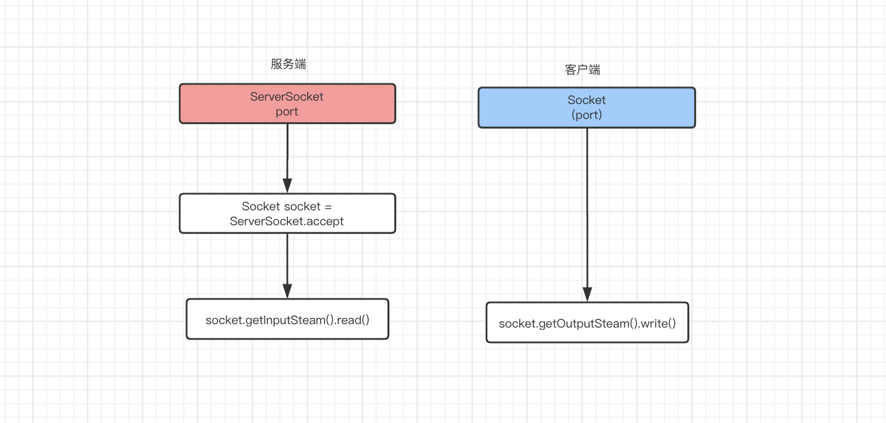
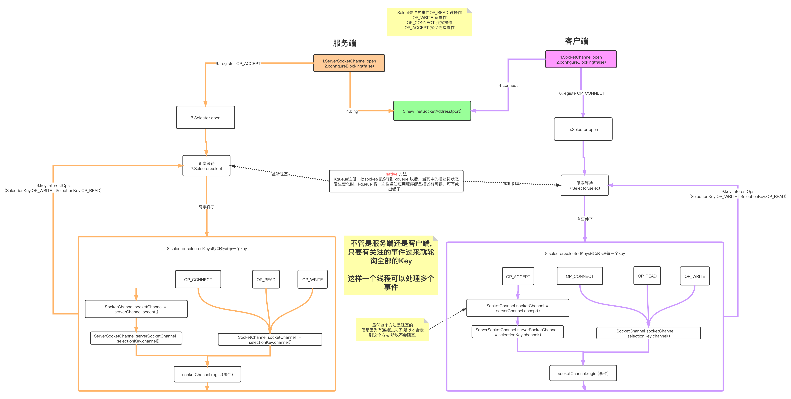

#### Java IO模型

##### BIO
> 同步阻塞IO

##### NIO
> 同步非阻塞IO,一个线程可以处理多个事件,大大提高了线程利用率,减少了线程创建的成本.
> 进化版本1:使用线程池,来处理更多的请求.
> 进化版本2:就算使用线程池,但是因为事件太多了,高并发下,连接性大大降低了.是使用两个线程池-->处理连接线程池+处理读写线程池

##### AIO(NIO2)
> 异步非阻塞IO,是基于NIO模型进行封装的.