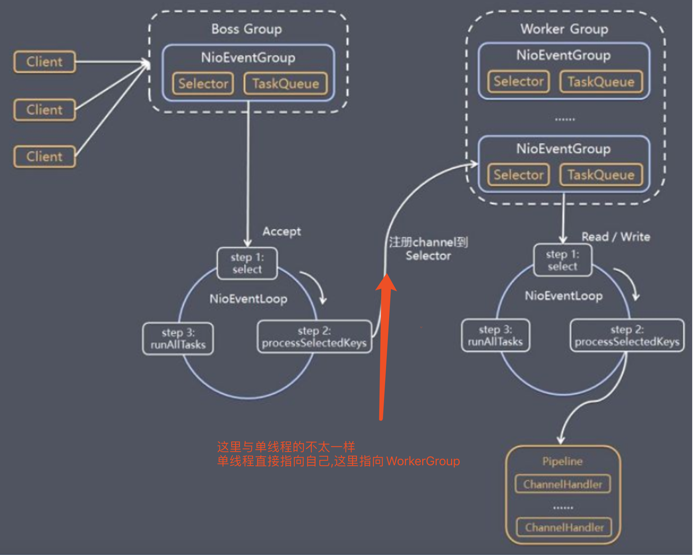
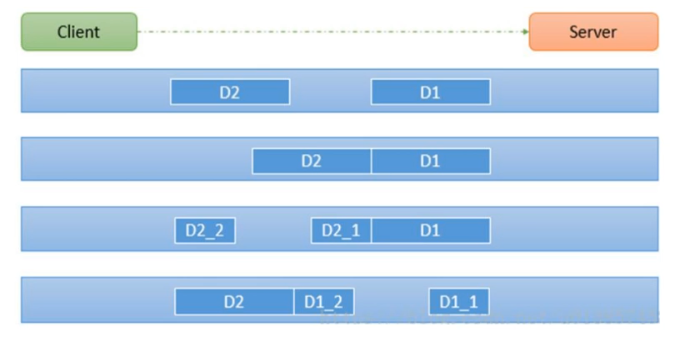

#### Netty
> Netty基于NIO模型.

* Netty的Server端,有两个EventLoopGroup,一个master,一个worker,对应的NIO中的两个线程池,使用一主多从(或多主多从,**多主可以用来负载均衡**)的模型结构.(1主多从展示:1主Selector,8个从Selector),
  * 一个EventLoopGrou master = new EventLoopGrou(1);
  * 一个EventLoopGrou worker = new EventLoopGrou(8);
* Neety实现模型.(**图中红色部分标记出主从结构与NIO模型中,处理完事件之后,再次注册到自身的不同,也是主从连接的关键.**)

* ByteBuff

IO模型地址:
[javaIO](javaIO.md)

##### Netty重要组件-Pipeline
* ChannelPipeline,在Netty的channel里,有一个双向链表的容器,而存入链表中的都是实现了`ChannelHander`的`Handler`
* ChannelHander,处理了入站,出站的逻辑(ChannelOutboundHandler,ChannelInboundHandler)

##### Netty拆包粘包
* TCP发包的时候,可能会对字符串进行拆包,粘包.如下图
  * D2和D1完整发的时候是正常的,
  * D2和D1一起发的时候是粘包
  * D2的一半和D1+D2的另一半是拆包
  * D1的一半和D2+D1的另一半是拆包

* 结果方式
  1. 自己增加分隔符(在业务里)
  2. 继承MessageToByteEncoder抽象类

##### Netty心跳检测机制
* 在`TCP长连接`中,保持有效性.
* 创建IdleStateHandler()的Hander加入ChannelPipeline的Hander链表容器中就可以实现心跳机制.

##### Netty直接内存和零拷贝
> Netty可以使用堆外内存,进行数据进行操作,在java中使用参数指定堆外内存大小 -XX:MaxDirectMemorySize
> Netty使用Unsafe类,调用c语言函数,直接获取内存.

* 优点
  1. 可以扩展至更大的内存空间。比如超过1TB甚至比主存还大的空间;
  2. 理论上能减少GC暂停时间;
  3. 可以在进程间（系统调用，aio）共享，减少JVM间的对象复制，使得JVM的分割部署更容易实现;
  4. 它的持久化存储可以支持快速重启，同时还能够在测试环境中重现生产数据
  5. 堆外内存能减少IO时的内存复制，不需要堆内存Buffer拷贝一份到直接内存，然后才写入Socket中
     1. jvm虚拟机(堆内存->直接内存->系统调用->硬盘/网卡)
     2. 堆内存(直接内存->系统调用->硬盘/网卡)零拷贝,就是说少一次直接内存到堆内存的copy
* 缺点 
  1. 需要手动释放（或者在引用直接内存的对象回收的时候释放，相当于依赖gc）
  2. 当依靠gc时，需要考虑gc时机如何确定，频繁显示调用System.gc()显然不是个好主意，因为不可控，而依靠堆内存控制，需要计算堆外内存的增长速率与堆内内存增长速率的关系，合理配置jvm参数，在堆外内存OOM之前触发gc
  3. Unsafe对象通常是不可见的，因为其实现并非开源，并且不同jre发行商都对此有不同实现和政策
  4. 初始分配较慢
  5. 没有JVM帮助管理内存容易发生内存溢出.