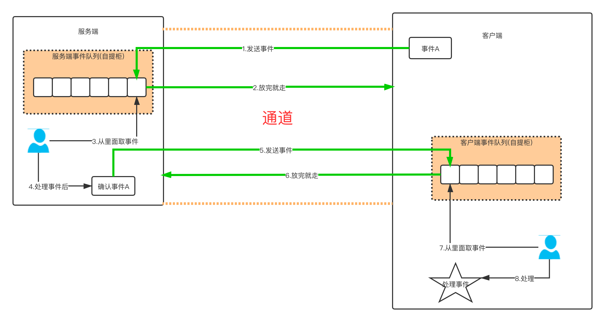
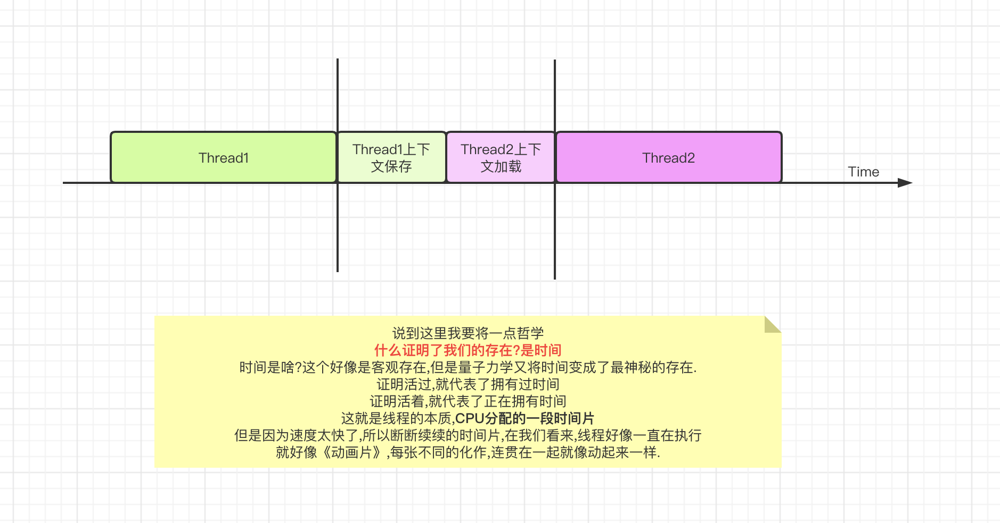
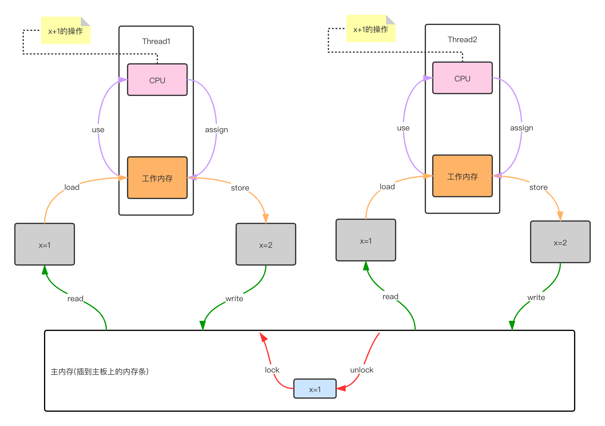
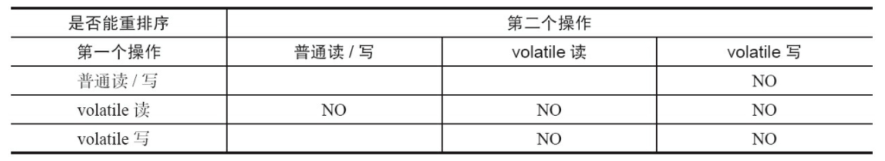
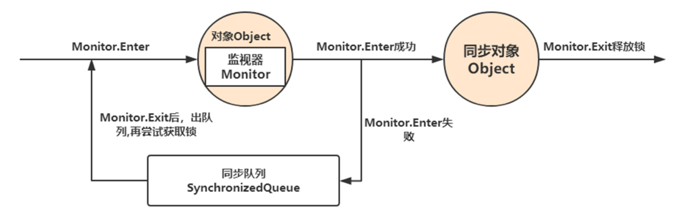
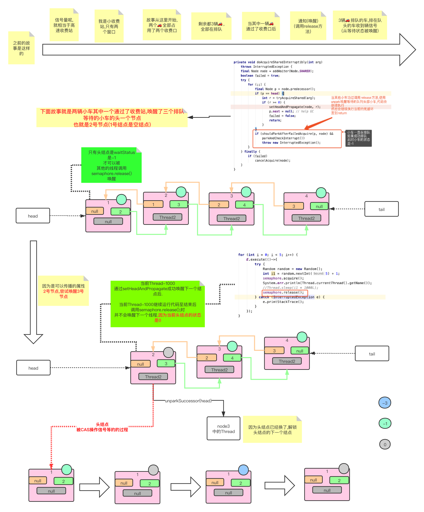
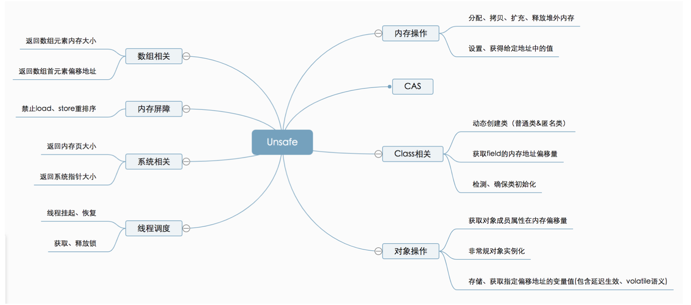
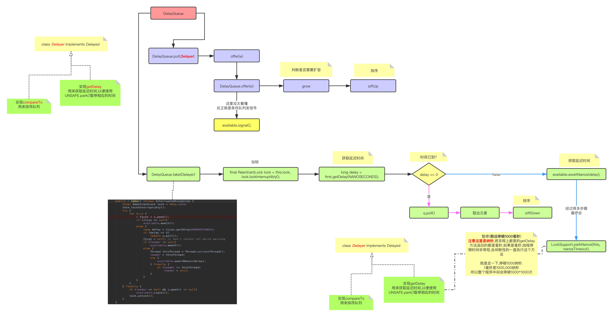
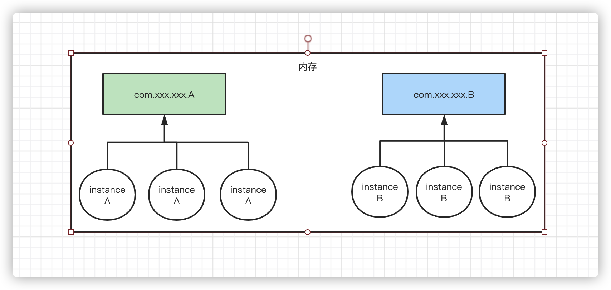

## Interesting Java
* 多重注解
* int.class,Integer.TYPE==int.class,表示的就是int类型（实际是int类型的字节码）
* Integer.valueOf(i)方法,
    * -128 >= i >= 127范围内,都被放在一个Integer[] cache的数组内,所以可以用地址比较符(==)比较,返回是true
    * 超过上述范围,都是new Integer(),地址比较符(==)返回不同的比较地址,所以是false 
* 代理模式和适配器模式
* ClassLoader,就是加载.class文件的java程序或C程序,分为两类:
    * 一类是`BootStrap`,由C实现,是虚拟机的一部分
    * 另外一类是`其他加载器`,也是java程序,并全部继承java.lang.ClassLoader,`这些加载器`的启动`由BootStrap加载器`先`加载`到内存后才能去加载其他的类.
        * BootStrap ClassLoader:负责加载`JDK/jre/lib`目录下的二进制Class文件
        * Extension ClassLoader:负责加载`JDK/jre/lib/ext`目录下的二进制Class文件
        * Application ClassLoader:负责加载`ClassPath`目录下的二进制Class文件,一般用户开发使用的都是该类加载器,由IDE生成对应的classpath路径,使Application ClassLoader能够根据路径加载程序,一般是默认的类加载器.
* Java Application ,java应用程序,为什么说tomcat是应用服务器呢?因为它就是java写的,eclipse也是,启动这两个程序需要运行Java程序中的Main函数,这是程序的唯一入口,在函数中启动线程查找所有系统变量并初始化加载让程序一直存活,利用CPU线程的特性(程序执行的最小单位).
* final关键字:
    * 修饰类,方法:禁止继承
    * 修饰成员变量:代表常量,一旦赋值不可修改
* 值对象和引用对象(注意不是值引用和对象引用)
    * 值对象要保证不可变性[^2](如人和指纹,是一种`组合`关系,具有`相同的生命周期`)
* 线程的几种状态
* 接口和抽象类 `接口like-a 抽象类is-a;接口多实现,抽象类单一继承;接口不能有实现不能私有,抽象类可以有`
* group by having,按照年龄段,select (select ... 按照条件筛选年龄) a group by 
* HashMap源码
* Redis锁以及两种序列化的区别,
    * AOF:将每一个收到的写命令都通过write函数追加到文件中(默认是 appendonly.aof)。实时,有序易懂,但是体积大,重启加载默认选择RDB
    * RDB:适合备份,文件格式紧凑体积小,实时性差,适合恢复大量数据
* Redis事务:
    * Transaction t =	jedis.multi();// 开启事务
    * t.exec();// 结束事务
* 静态内部类与非静态内部类
    * 静态:静态内部类是当前类`本身的属性`,如ThreadLocal.ThreadLocalMap,不与这个类的`实例`相关
    * 静态内部类不想访问外部类的属性，所以定义为静态；如果想要访问外部类属性，则直接使用内部类即可。
* 静态内部类与普通类,最主要的区别在于`可见性`(public,default,protected,private)
* 查看日志中包含某一个关键字的Linux 语句 `grep -rn "abc" *`
* tomcat 原理解析
* 跨域:简单来说A网站的JavaScript试图访问B网站的资源,解决方式CORS跨域资源共享
* a+=b和a=a+b,区别在于`前者会隐式的把运算结果转换为a数据类型 ,后者不会`
* sleep和wait的区别
    * sleep:Thead的静态方法,是用来控制自身的;sleep不会放弃锁;使用无限制;必须捕获InterruptException,允许在其他线程调用interrupt()方法时,`打断`当前线程并`提前`从sleep中wake up,并对异常捕获提前返回.
    * wait:是Object方法,用于线程之间通信;wait会放弃锁;必须放在同步方法/代码块中;
* 线程实现的方法,
    * 继承Thread,其实Thread类也是实现了runable接口,并且run方法也是要求自定义实现的
    * 实现runnable接口
    * 实现callable接口,属于exccutor框架中的功能类,是runnable接口的升级版,在jdk1.5以后有的
* 线程同步实现的方式:sychronnized;wait/notify;lock
* 同步方法和同步代码块的区别:
    * 同步代码块使用的是管程(monitor);
    * 同步方法是从JVM方法常量池中的方法表结构(method_info Structure) 中的 ACC_SYNCHRONIZED 访问标志区分一个方法是否同步方法
    * ThreadLocal,是线程的局部变量,每个Thread都有一个ThreadLocalMap[^1],用来存贮<ThreadLoacal,Object>的key,value键值对.从概念上看`可以将ThreadLocal<T>看做Map<Thread,T>`.
    * 当调用ThreadLocal.get()方法,会将当前ThreadLocal引用作为正在运行Thread中的ThreadLocalMap的key,在Map的Entry[]中检索value值.简而言之：get方法总是返回当前线程使用set方法设置的最新值。ThreadLocal的值会随着线程的消亡而被垃圾回收，所以在使用线程池的时候（线程不会消亡），总是在end时清除保存的值，总是在begin时set值。
    * 应用：实现应用程序框架的时候被大量使用
    * 伪代码:
    ```
    public T get() {
        Thread t = Thread.currentThread();
        ThreadLocalMap map = getMap(t);
        if (map != null) {
            ThreadLocalMap.Entry e = map.getEntry(this);
            if (e != null) {
                @SuppressWarnings("unchecked")
                T result = (T)e.value;
                return result;
            }
        }
        return setInitialValue();// 没有就初始化
    }
    ThreadLocalMap getMap(Thread t) {
        return t.threadLocals;
    }
    private T setInitialValue() {
        T value = initialValue();// initialValue()默认为:null
        Thread t = Thread.currentThread();
        ThreadLocalMap map = getMap(t);
        if (map != null)
            map.set(this, value);
        else
            createMap(t, value);
        return value;
    }
    ```
* Spring MVC工作原理
* 重载和覆盖的区别:重载是`水平`方向上的,参数不同;覆盖是`垂直`方向上的,返回值参数值相同,抛出异常必须是同类或者子类,不能是private
* 多线程沟通:
    * Object->notify/wait;
    * Lock->Condition 
* MySQL和MongoDB比较
    * MySQL
    * MongoDB:
        * 文档数据库,可以存放JSON,XML,BSON
        * 适合场景：
            * 高负载:频繁插入
            * 高可用:主从模式
            * 大数据:分片存储5G~10G的数据
            * 基于位置的数据查询:支持二维空间索引
            * 非结构化数据的爆发增长:增加一个字段或者少一个对以前的数据都无影响
            * 事件的记录，内容管理或者博客平台等等,数据具体格式无法确定。
        * 数据处理：数据是存储在硬盘上的，HOT数据被加载到内存中，从而达到高速读写。
        * 支持fail-over
        * 占用空间比较大
        * 本身不支持事务
        * 自带map-reduce,sharding
* Java中isAssignableFrom的用法(是native函数)，A.class.isAssignableFrom(B.class),表示A类（或接口）是否是B类（或接口）一样，或者是B类的超类（或超接口），是返回true。
* 接口和抽象类
  * 抽象类is-a,虽然关键字是interface但是编译后仍是.class.
  * 接口can-do,抽象类是二当家,接口位于顶层,而`抽象类对各个接口进行了组合,然后实现部分接口的行为`
* 内部类,相当于类中的一个属性.
* super()方法,指的是默认的父类无参构造函数,必须出现在构造方法的第一行.
* 静态代码块只会执行一次,为什么呢?因为静态代码是与class相关联的而不是实例,第一次是因为要放入常量池.
* Override和Overload
  * java覆写(Override)必须是方法名参数一样才可以.
  * java重载(Overload),其有几种准测
    1.精确匹配,当int,Integer,Integer...,Object同时存在时,精确匹配
    2.m1(long)可以接受int类型;m1(int)不可以接受int类型
* 泛型
  * 泛型类，可以看做普通类的工厂
  * 泛型类中，不能使用静态泛型类变量。  
  * 泛型中E,T,K,V
    * E,Element
    * T,the Type of object
    * K,key
    * V,value
  * 泛型方法中的的尖括号<>,
    * 如<String>,尖括号中的每一个元素代表了一种未知类型
    * <>未知非常讲究,必须是返回值之前或者类名之后
    * 泛型在`定义处`,只具备执行Object的能力.所以<String,Integer>String get(String s, Integer i),调用的时候可以传入get(123,"abc");但是参数s中的方法s.intValue是做不到的.
    * 类型擦除:编译之后的字节码指令,上面的get方法中的参数全部擦除为Object,返回类型也是Object,<String,Integer>没有这些花头花脑的方法签名.全部是(Ljava/lang/Object;Ljava/lang/Object;),泛型的目的是在编译器提醒程序员安全使用和放置数据.
* 数据类型的使用规范
  * 所有POJO类属性必须使用包装类数据类型
  * RPC方法的返回值和参数必须使用包装数据类型
  * 所有的局部变量推荐使用基本数据类型
* 在任何情况下都要显示指定容器容量.
* `数组是一种顺序表`.是表结构,划重点.


* java中main方法启动的是一个进程还是一个线程?
  * 是一个线程也是一个进程，一个java程序启动后它就是一个进程，进程相当于一个空盒，它只提供资源装载的空间，具体的调度并不是由进程来完成的，而是由线程来完成的。一个java程序从main开始之后，进程启动，为整个程序提供各种资源，而此时将启动一个线程，这个线程就是主线程，它将调度资源，进行具体的操作。Thread、Runnable的开启的线程是主线程下的子线程，是父子关系，此时该java程序即为多线程的，这些线程共同进行资源的调度和执行。
  * 代码如下 
    ```
      public static void main(String[] args) throws IOException, InterruptedException {
        String name = ManagementFactory.getRuntimeMXBean().getName();
        System.out.println(name);
        String pid = name.split("@")[0];
        System.out.println("Pid is:" + pid);
        
        System.err.println("进程中主线程ID="+Thread.currentThread().getId());
        
        Thread t1 = new Thread(new Runnable() {
            @Override
            public void run() {
                try {
                    Thread.sleep(60000);
                    System.out.println(1);
                } catch (InterruptedException e) {
                    e.printStackTrace();
                }
            }
        });
        t1.start();
        System.err.println("进程中子线程T1的ID="+t1.getId());

        Thread t2 = new Thread(new Runnable() {
            @Override
            public void run() {
                try {
                    Thread.sleep(60000);
                    System.out.println(1);
                } catch (InterruptedException e) {
                    e.printStackTrace();
                }
            }
        });
        t2.start();
        System.err.println("进程中子线程T2的ID="+t2.getId());
    }
    ```
    * 上述代码会输出，可以看出进程中必定有一个线程，它就是主线程，而且线程id为`1`
    ```
        1044@2013-20180318IJ
        Pid is:1044
        进程中主线程ID=1
        进程中子线程T1的ID=11
        进程中子线程T2的ID=12
    ```

    
* 程序，进程，线程的关系？
* List代表了线性结构，而线性结构的实现方式是两种
  * 数组，物理上连续的内存空间，所以ArrayList的增加方式不断的扩容，开辟新的空间，copy元素
  * 链表，物理上不连续，逻辑上连续
  * 队列
    * 栈（堆栈），同样是线性结构
      * 数组实现
      * 链表实现
    * 队（队列），也是线性结构
      * 数组实现，这里将数组变成一个“首位相接”的闭环，可以高效利用队列，减少因为数组特性出栈时所有元素前移一位，将`数组逻辑闭环`就可高效使用，原理是添加栈顶和栈尾位置指针，入栈出栈时候分别移动栈尾和栈顶指针的位置，就可以。那么如何判断闭环数组是null还是full，两种方式；
        * 方式一，留一下一个空位置，这样栈顶和栈尾指针永远不会相等，相等时候就是空队列
        * 方式二，使用一个标识标识空或者满。

##### 什么是XML
>  XML 指可扩展标记语言（EXtensible Markup Language）
  XML 是一种标记语言，很类似 HTML
  XML 的设计宗旨是传输数据，而非显示数据
  XML 标签没有被预定义。您需要自行定义标签。
  XML 被设计为具有自我描述性。
  XML 是 W3C 的推荐标准
* XML常用的解析方式SAX(simple API for XML)，DOM(文档对象模型：Document Object Model)
  * 二者的却别
    * DOM：把所有内容一次性的装载入内存，并构建一个驻留在内存中的树状结构（节点数）。如果需要解析的XML文档过大，或者我们只对该文档中的一部分感兴趣，这样就会引起性能问题
    * SAX:对文档进行顺序扫描，当扫描到文档（document）开始与结束、元素（element）开始与结束、文档（document）结束等地方时通知事件处理函数，由事件处理函数做相应动作，然后继续同样的扫描，直至文档结束
  * SAX处理过程中包含的事件步骤：
      1.在文档的开始和结束时触发文档处理事件。
      2.在文档内每一XML元素接受解析的前后触发元素事件。
      3.任何元数据通常由单独的事件处理
      4.在处理文档的DTD或Schema时产生DTD或Schema事件。
      5.产生错误事件用来通知主机应用程序解析错误。
  * 编程步骤
    （1）.创建事件处理程序（也就是编写ContentHandler的实现类，一般继承自DefaultHandler类，采用adapter模式）
    （2）.创建SAX解析器
    （3）.将事件处理程序分配到解析器
    （4）.对文档进行解析，将每个事件发送给事件处理程序
  * 接口介绍：
    * ContentHandler接口 （主要用到的接口）
    ContentHandler是Java类包中一个特殊的SAX接口，位于org.xml.sax包中。该接口封装了一些对事件处理的方法，当XML解析器开始解析XML输入文档时，它会遇到某些特殊的事件，比如文档的开头和结束、元素开头和结束、以及元素中的字符数据等事件。当遇到这些事件时，XML解析器会调用ContentHandler接口中相应的方法来响应该事件。
    ContentHandler接口的方法有以下几种：
    void startDocument()//文件打开时调用
    void endDocument()//当到文档的末尾调用
    void startElement(String uri, String localName, String qName, Attributes atts)//当遇到开始标记时调用
    void endElement(String uri, String localName, String qName)//当遇到节点结束时调用
    void characters(char[ ] ch, int start, int length)//当分析器遇到无法识别为标记或者指令类型字符时调用
    * DTDHandler接口
    DTDHandler用于接收基本的DTD相关事件的通知。该接口位于org.xml.sax包中。此接口仅包括DTD事件的注释和未解析的实体声明部分。SAX解析器可按任何顺序报告这些事件，而不管声明注释和未解析实体时所采用的顺序；但是，必须在文档处理程序的startDocument()事件之后，在第一个startElement()事件之前报告所有的DTD事件。
    DTDHandler接口包括以下两个方法
    void startDocumevoid notationDecl(String name, String publicId, String systemId) nt()
    void unparsedEntityDecl(String name, String publicId, String systemId, String notationName)
    * EntityResolver接口
    EntityResolver接口是用于解析实体的基本接口，该接口位于org.xml.sax包中。
    该接口只有一个方法，如下：
    public InputSource resolveEntity(String publicId, String systemId)
    解析器将在打开任何外部实体前调用此方法。此类实体包括在DTD内引用的外部DTD子集和外部参数实体和在文档元素内引用的外部通用实体等。如果SAX应用程序需要实现自定义处理外部实体，则必须实现此接口。
    * ErrorHandler接口
    ErrorHandler接口是SAX错误处理程序的基本接口。如果SAX应用程序需要实现自定义的错误处理，则它必须实现此接口，然后解析器将通过此接口报告所有的错误和警告。
    该接口的方法如下：
    void error(SAXParseException exception)
    void fatalError(SAXParseException exception)
    void warning(SAXParseException exception)
* XML验证方式：DTD,XSD。
  * DTD:
    * DTD即文档类型定义，是一种XML约束模式语言，是XML文件的验证机制,属于XML文件组成的一部分.
    * DTD 是一种保证XML文档格式正确的有效方法，可以通过比较XML文档和DTD文件来看文档是否符合规范，元素和标签使用是否正确.
    * DTD使用是非xml语法编写，不支持扩展，不支持命名空间，只提供非常有限的数据类型
  * XSD:
    * XML Schemal语言就是XSD，XML Schema描述了XML文档的结构，可以用一个指定的XML Schema来验证某个XML.
    * 文档设计者可以通过XML Schema指定一个XML文档所允许的结构和内容，并可据此检查一个XML文档是否是有效的。
    * XML Schema本身是一个XML文档，它符合XML语法结构。可以用通用的XML解析器解析它
  * 相比DTD，XSD的优点是：
  * `XML Schema的优点`:
    * XML Schema基于XML,没有专门的语法
    * XML Schema可以象其他XML文件一样解析和处理
    * XML Schema比DTD提供了更丰富的数据类型.
    * XML Schema提供可扩充的数据模型。
    * XML Schema支持综合命名空间
    * XML Schema支持属性组。

##### 什么是SPI
> 在java.util.ServiceLoader的文档里有比较详细的介绍。
> &nbsp;&nbsp;&nbsp;&nbsp;简单的总结下java spi机制的思想。我们系统里抽象的各个模块，往往有很多不同的实现方案，比如日志模块的方案，xml解析模块、jdbc模块的方案等。
&nbsp;&nbsp;&nbsp;&nbsp;面向对象的设计里，我们一般推荐模块之间基于接口编程，模块之间不使用实现类进行硬编码。一旦代码里涉及具体的实现类，就违反了可拔插的原则，如果需要替换一种实现，就需要修改代码。
> &nbsp;&nbsp;&nbsp;&nbsp;为了实现在模块装配的时候动态指定具体实现类，这就需要一种服务发现机制。java spi就是提供这种功能的机制：为某个接口寻找服务实现的机制。有点类似IOC的思想，将装配的控制权移到程序之外，在模块化设计中这个机制尤其重要。 
> &nbsp;&nbsp;&nbsp;&nbsp;java SPI应用场景很广泛，在Java底层和一些框架中都很常用，比如java数据驱动加载和Dubbo。
Java底层定义加载接口后，由不同的厂商提供驱动加载的实现方式，当我们需要加载不同的数据库的时候，只需要替换数据库对应的驱动加载jar包，就可以进行使用。

* 要使用Java SPI，需要遵循如下约定：
  * 当服务提供者提供了接口的一种具体实现后，在jar包的META-INF/services目录下创建一个以“接口全限定名”为命名的文件，内容为实现类的全限定名；
  * 接口实现类所在的jar包放在主程序的classpath中；
  * 主程序通过java.util.ServiceLoder动态装载实现模块，它通过扫描META-INF/services目录下的配置文件找到实现类的全限定名，把类加载到JVM；
  * SPI的实现类必须携带一个不带参数的构造方法.

#### Java集合
---
##### Collection

##### Map
> Map实现了一中K—V对应的关系,在java中有非常大的应用.
* TreeMap依靠Compareable或者Comparator来实现Key去重
* HashMap依靠hashMap和equals去重 
* HashMap属性认知
  * 下图是HashMap中的重要属性
  
* HashMap非常重点
  * 下面是**字符串** “1-16” 的hash散列分布
    ```
    key.hash   key     n - 1   table[key.hash & n - 1]
    49          1       15         1
    50          2       15         2
    51          3       15         3
    52          4       15         4
    53          5       15         5
    54          6       15         6
    55          7       15         7
    56          8       15         8
    57          9       15         9
    1567        10      15        15
    1568        11      15         0
    1569        12      15         1
    1570        13      15         2

    容器为默认大小16,阀值为16*0.75=12.(实际上并不是这么算的)
    为何没有14,15,16呢? 因为超过阀值会扩容,注意,这里是放入13个元素后开始扩容的,不是12个
    if (++size > threshold)
      resize();
    ```
  * 由上面可以看出,hash碰撞的情况非常的小,只有table[1],table[2]有两个元素,然后会被扩容
  * table数组说是数组,其实可以看作是一个**散列接盘器**,HashMap之所以接近O(n),是因为扩容要由于链表
  * 其实Map容器的是不满载的,比如声明16个空间,最多放入12(阈值)个(当放入13个后开始扩容),所以当超过阈值的时候,**扩容是优先于链表的追加的**.当链表长度超过8,则尝试变为tree,如果当前hashmap当table.size小于64则首先进行扩容,已经超过64个了,则会进行转化树.
    * 所以最良好的情况是12个元素,填满12个table的slot
    * 最差的情况是所有的key经过运算,最终只占一个table的slot,然后12个长度的链表(超过8个会尝试变为tree)
*  **转化树的条件**
    * 当前链表长度超过8
    * 当前hashmap的容量大于等于64
    ``` 
    map容量16
    key是String  1  12  23  34  45  56  67  78  89  100  111  122 
    都会落在table[1]的结点位置,可以测试出链表转tree(但是实际上是转换不成的,因为我的容量不够64)
    此数据帮助测试
    ```
* 从树转换回链表的时候,就是当树的节点数小于等于6的时候.
* 扩容的时候,是线程不安全的(无论是1.7还是1.8,1.7会形成环路,1.8不会.)
  * 为什么这么说? 
  * 如果两个线程在resize方法外调用,线程T1正在resize,正在搬运,T2此时开始扩容,那么table[key.hash & n - 1]就会不准确,因为n变了,之前是T1的时候n是32,T2的时候n是64,两次与运算的结果不一样,所以是不安全的.
* 树
  * 二叉查找树
    * 前序,中序,后序遍历左节点一定是在右节点之前遍历
    * 前序:根,左,右;中:左,中,右;后:左,右,中;
    * AVL树和红黑树 
      * AVL是绝对平衡树,左右子树高度相差不为1,面对低频修改和大量查询用AVL树
      * 红黑树保证的是从根节点到叶子节点最长的路径不超过最短路径的2倍,是相对(大体上)平衡树,面对频繁插入和删除红黑树更合适

* ConcunrrentHashMap
  * 使用CAS竞争资源
  * 当操作数据当时候才使用重量级锁synchronized
  * 当扩容(transfer这个方法),移动结点当时候会使用锁synchronized

* HashMap源码解读.
  1. put(k,v)放入值,下图来源于网络,我觉得总结的非常到位,所以借鉴过来,稍稍修正
    
  2. resize()扩容,整个图就来自于我自己了.图中阐释了jdk1.8以后的map扩容机制,
    
  3. 为什么说jdk1.8的map不会产生死锁呢?
      ```
      由于1.7的map扩容的时候,是讲原来的链表顺序反向存入新的table中,所以多个线程扩容的时候,容易产生**死链**.

      而1.8以后的扩容,可以看到,非常巧妙的进行了高低位运算,好处是
        * 可以更有效的将table中的slot利用上
        * 当多个线程一起进入当前方法时,运算结果一致性.
      ```


##### List
###### ArrayList
* 数组扩容,每次1.5倍,默认容量是10
* List<?>,称为通配符集合,它可以接受任意类型的集合引用赋值,不能add,但是可以remove和clear,一般用来接受外部集合或者返回一个不知道具体元素类型的集合.
* 并发容器CopyOnWriteArrayList,简称COW奶牛容器.读写分离,如果是写操作,复制一个新集合,在新集合内进行删除或添加,待一切修正完成后,将其指向新的集合.优点是,`可以高并发的对COW进行读和遍历`,而不需要加锁.
* 使用COW的注意事项
  * 1.尽量设置合理的容量初始值,它扩容代价比较大
  * 2.使用批量添加或删除方法的时候,如addAll或者removeAll操作,在高并发请求下,可以攒一下要添加的或删除的元素,避免添加一个元素而复制整个集合.
  * 3.适用于读多写极少的场景.
* 集合实现了Collection接口，这个接口中定义了迭代器Iterator。
* 使用Iterator的remove时候要注意，要先使用it.next(),才可以remove(),因为remove会删除上次调用的Element.

###### LinkedList
* 是个链表
* 应用
  * 使用过LinkeList做过区间重复性检测(不可有交叉重复区间) 思路如下:
    1. 将所有区间的开始从小到大排序
    2. 循环添加的时候,判断条件-> 空区间或者链表的getLast小于当前的开始,链表addLast
    3. 如果链表的getLast大于当前的开始,则说明有交集.

#### java指针
> 经常看源码的时候，被各种指针指向搞的蒙头转向，尤其是各种树之类的，脑子里经常要想，所以为了减少想，所以快速记住。
---
##### 赋值语句
* 记住，脑海里要有`向量`的概念，temp = a， 就是temp->a，另外值是不变的。脑海里要有内存中对象地址分配空间的概念，temp = a，temp直指向a所在的地址，即`java.util.String@11db6481`
* 指针指向的地址，不是另外一个指针。
    ```
    a=1,b=2;
    经典的值交换问题。使用`&`代表地址
    temp = a -> &1  相当于  temp -> &1
    a = b -> &2     相当于  a -> &2
    b = temp -> &1  相当于  b -> &1
    所以
    最终a=2,b=1

    指针指向的地址，不是另外一个指针。另外跟数学不同，这里的“=”，不是“==”
    temp = a;
    a = b; 
    记住，不等同于 temp = b; 两条语句没有任何关系。
    temp = a;
    b = a; 
    此时 temp = b;

    ```
* 赋值`=`不是相等`==`，赋值语句没有传递性，赋值完成就结束了。

下图简单的阐释了java指针
 


#### Java IO模型
---
##### 同步,异步,阻塞,非阻塞
> 这个需要举例子,另外加上代码的实现
* 背景:
  * 故事的开始,就以泡茶为例子(简单的两个步骤:烧水,选茶)(也可以用5星大厨和一堆改刀学徒来比喻.)
  * 步骤:烧水,选茶
  * 所有人物:童子们+泡茶大师
  * 人物状态:泡茶大师负责整个泡茶的过程,童子负责烧水,找茶叶,找茶具.
* 同步: 泡茶大师必须先有烧水,必须看到水质后才能准备茶叶.**选茶叶非常依赖水质和水温**
* 异步: 泡茶大师可以不用等待水质,就去准备茶叶.**选茶叶不依赖水质和水温**.
* 同步异步,讲究的**顺序性,依赖性**,按部就班.
* 阻塞: 童子A在烧水,童子B眼睛一直盯着水壶,死盯,等水好了,童子B去找茶叶.
* 非阻塞: 童子A在烧水,但是得烧一会儿,童子B一看要等待,童子B就去准备茶叶了.边烧水,边准备茶叶
  * 注意,网上很多的说:一个人边打电话,边打工作.其实在程序的世界里,**并行只能是多线程**.所以这里举例是两个童子--童子A和童子B
* 阻塞非阻塞,讲究的是**事件的执行率**,阻塞,一次只能干一个活儿,非阻塞,很多话可以一起干.
* 总结同步异步和阻塞非阻塞是两个维度的事儿,一个描述事件执行顺序(大师运筹帷幄),一个描述工作者工作状态(童子负责具体烧水,找茶叶.).

##### BIO
> 同步阻塞IO


##### NIO
> 同步非阻塞IO,一个线程可以处理多个事件,大大提高了线程利用率,减少了线程创建的成本.
> 进化版本1:使用线程池,来处理更多的请求.
> 进化版本2:就算使用线程池,但是因为事件太多了,高并发下,连接性大大降低了.是使用两个线程池-->处理连接线程池+处理读写线程池
* 同步非阻塞,就是事件顺序是一定的,但是又要一个线程忙到死.
  * 举例子就是,一个童子兼顾烧水+沏茶
    * 大师规定步骤是先烧水,然后沏茶(同步)
    * 童子们边烧水,边准备茶叶.(非阻塞),实际情况是童子A在烧水,童子B在沏茶
* 那么NIO是如何设计上面的同步非阻塞
  * 一个阻塞队列,就是泡茶大师的角色,规定了各个步骤的顺序性(同步)
  * 一堆线程分别去烧水,沏茶(非阻塞)
  * NIO的非阻塞是如何体现的呢?
    * 首先说一下BIO,快递员打电话给你,收件人叫他等一会儿,那么快递员就是阻塞状态.
    * NIO,就是快递员将快递放入自提柜,然后送别的小区去了,收件人收到短信(感知到有事件)就会自己去自提柜去取.
    * 上面的例子. 自提柜就是事件队列  快递员是客户端 收件人是服务端.
    * NIO就是:客户端有个事件队列,服务端发送事件,不必等待客户端返回,就可以返回继续干别的去了.
    * 具体就是下面的图了(简单图)
    

* 下面代码是经典的NIO实现代码的流程图.


##### AIO(NIO2)
> 异步非阻塞IO,是基于NIO模型进行封装的.

### Multi Thread
---

##### 计算机内存模型
* 下面动图展示了CPU与内存的关系,图中没有标明服务总线(主板)
* MESI高速缓存协议,提高了并发效率.
   * MESI的含义,CPU中每个缓存行（Cache line)使用4种状态进行标记（使用额外的两位(bit)表示):
     1. M(Modified)   这行数据有效，数据被修改了，和内存中的数据不一致，数据只存在于本Cache中。(修改)
     2. E(Exclusive)  这行数据有效，数据和内存中的数据一致，数据只存在于本Cache中。(独占)
     3. S(Shared)     这行数据有效，数据和内存中的数据一致，数据存在于很多Cache中。(共享)
     4. I(Invalid)    这行数据无效.。(无效)
   * MESI失效的原因
     1. Cache line 数据量太大超过了一行限制
     2. 当前CPU不支持MESI
   * 图示多线程说明,M,E,S,I简单的切换.
  

#### Java内存模型-JMM(Java Memory Model)
* JMM内存模型,其实是借鉴于操作系统的多线程模型.
* 用户线程(ULT),内核线程(KLT).
  * **用户线程ULT**:指不需要内核支持而在**用户程序中实现**的线程，其不依赖于操作系统核心，应用进程利用线程库提供创建、同步、调度和管理线程的函数来控制用户线程。另外，用户线程是由应用进程利用线程库创建和管理，不依赖于操作系统核心。不需要用户态/核心态切换，速度快。操作系统内核不知道多线程的存在，因此一个线程阻塞将使得整个进程(包括它的所有线程)阻塞。由于这里的处理器时间片分配是以进程为基本单位，所以每个线程执行的时间相对减少。
  * **内核线程KLT**:线程的所有管理操作都是由**操作系统内核完成**的。内核保存线程的状态和上下文信息，当一个线程执行了引起阻塞的系统调用时，内核可以调度该进程的其他线程执行。在多处理器系统上，内核可以分派属于同一进程的多个线程在多个处理器上运行，提高进程执行的并行度。由于需要内核完成线程的创建、调度和管理，所以和用户级线程相比这些操作要慢得多，但是仍然比进程的创建和管理操作要快。大多数市场上的操作系统，如Windows， Linux等都支持内核级线程。

* 那么基于两种线程类型,有几种线程模式
    * **内核线程实现**,程序一般不会直接使用内核线程，而是使用内核线程的一种高级接口——轻量级进程(Light Weight Process，LWP)，轻量级进程就是我们通常意义上所讲的线程，由于每个轻量级进程都由一个内核线程支持，因此只有先支持内核线程，才能有轻量级进程。由于LWP是由操作系统调用CPU创建的线程,所以是真正的线程,资源非常宝贵.这种轻量级进程与内核线程之间**1:1**的关系称为一对一的线程模型.轻量级进程也具有它的局限性:
      1. 由于是基于内核线程实现的，所以各种线程操作，如创建、析构及同步，都需要进行系统调用。而系统调用的代价相对较高，需要在用户态(User Mode)和内核态(Kernel Mode)中来回切换。
      2. 每个轻量级进程都需要有一个内核线程的支持，因此轻量级进程要消耗一定的内核资源(如内核线程的栈 空间)，因此一个系统支持轻量级进程的数量是有限的。
    * **用户线程实现**的方式被称为1:N实现。广义上来讲，一个线程只要不是内核线程，都可以认为是用户线程(User Thread，UT)的一种，因此从这个定义上看，轻量级进程也属于用户线程，但轻量级进程的实现始终是建立在内核之上的，许多操作都要进行系统调用，因此效率会受到限制，并不具备通常意义上的用户线程的优点。
* **java目前使用的的是内核线程实现,golang使用的是用户线程实现(golang中叫协程)**
  
* JMM模型图(图中可以看出使用的是1:1模型)
  
* 线程上下文切换.
  
* JMM-同步八种操作介绍
  1. lock(锁定):作用于主内存的变量，把一个变量标记为一条线程独占状态 
  2. unlock(解锁):作用于主内存的变量，把一个处于锁定状态的变量释放出来，释放后的变量才可以被其他线程锁定 
  3. read(读取):作用于主内存的变量，把一个变量值从主内存传输到线程的工作内存中，以便随后的load动作使用 
  4. load(载入):作用于工作内存的变量，它把read操作从主内存中得到的变量值放入工作内存的变量副本中 
  5. use(使用):作用于工作内存的变量，把工作内存中的一个变量值传递给执行引擎 
  6. assign(赋值):作用于工作内存的变量，它把一个从执行引擎接收到的值赋给工作内存的变量 
  7. store(存储):作用于工作内存的变量，把工作内存中的一个变量的值传送到主内存中，以便随后的write的操作 
  8. write(写入):作用于工作内存的变量，它把store操作从工作内存中的一个变量的值传送到主内存的变量中.

  

#### volatile关键字
* 底层原理: 
```
  volitile关键字,实际上会在底层汇编语言中生成`#Lock`指令
  其含义就是调用了MESI服务总线来帮助监督使用了volatile的变量,一旦有‘M’操作,在合适的时机‘I’其他线程中的变量.

  ---
  滥用volitile关键字活着CAS,会引起‘总线风暴’(总线操作的太多了)
```

* 可见性:实际上就是调用MESI缓存一致性协议,所以保证了可见行
* 指令不能实现线程安全的原因是:
  ```
  上面动图说明了,当一旦有一个`M`操作,其他线程中的变量全部变`I`
  即使变为`I`,但是也是进行了一次操作,此次操作就是无效化的,所以不会修改内存中的变量值.
  所以5w次的volatile变量每次都加1,就会因为某次无效化,而导致结果<=5w
  ```
* 指令重排
> volatile禁止指令重排的本质上是使用的内存屏障(read-store)
> java语言规范规定JVM线程内部维持顺序化语义。即只要程序的最终结果与 它顺序化情况的结果相等，那么指令的执行顺序可以与代码顺序不一致，此过程叫指令的重排序
  * 什么情况下产生指令重.
    1. as-if-serial语义:JVM的JSR-133规范中定义了as-if-serial语义，即compiler, runtime, and hardware三者需要保证在单线程模型下程序不会感知到指令重排的影响
    2. 重排序引发的问题
    ```
    1. public class Singleton {
    2.  private static Singleton instance = null;
    3.  private Singleton() { }
    4.  public static Singleton getInstance() {
    5.   if(instance == null) {
    6.        synchronzied(Singleton.class) {
    7.          if(instance == null) {
    8.              instance = new Singleton();  
    9.          }
    10.        }
    11.     }
    12.     return instance;
    13.   }
    14. }
    ----
    在极高并发的情况下,由于instance = new Singleton();并不是原子操作,它实际上是分为了3个步骤
    memory = allocate();   //1：分配对象的内存空间
    ctorInstance(memory);  //2：初始化对象
    instance = memory;     //3：设置instance指向刚分配的内存地址
    如果步骤2和3相互颠倒(被重排序了),先赋值了地址,再实例化(在单线程下,确实不会影响结果)
    此时多线程如果走到了第5行,发现已经有了实例了,所以会返回一个没有初始化的实例对象,从而引发不可预期的后果.
    ----
    解决办法
    第2行声明为volatile
    ```
* 内存屏障(**内存屏障是硬件层的**)
> 硬件层的内存屏障分为两种：Load Barrier 和 Store Barrier即读屏障和写屏障。
  * 在开始讲之前先说明,什么是load和store
    * a=1,是store操作
    * x=a,是先load,然后再store
    * 然后,使用了volatile变量以后,会在代码上前后加上内存屏障.具体添加的规则是:
    
    * 添加之后的结果是:
    

#### Synchronized关键字
> Synchronized对应着JMM-同步八种操作中的lock和unlock
> 它使用Monitor实现.
* 通过编译为字节码发现,会使用monitorenter和monitorexit在同步代码块的开始和结束位置加入.
  * 下面是加锁过程
  
* synchronized锁的几种情况,使用的管程,是作用在对象身上的.
  ```
  在A class对象内的有几个方法

  public static synchronized method(){} //当前类对象的锁
  public synchronized method(){}  // this对象的锁,当前实例锁
  synchronized(object){} //object锁
  ```
* 锁粗化
  ```
    // 每个sb.append内部都有一个锁,所以在此方法,会在第一个append和最后一个append加锁,就是锁粗化.
    StringBuilder sb = new StringBuilder();
    sb.append(1);
    sb.append(1);
    sb.append(1);
    sb.append(1);
    sb.append(1);
    sb.append(1);
  ```
* 锁消除
  ```   
    比如下面的代码,根据逃逸分析,所以这个锁就会被消除
    public void t(String key){
        // 按照逃逸分析的原理，new Object()，只能被当前线程访问，所以当前这个锁会被消除
        // synchronized (key){
        synchronized (new Object()){
            System.out.println("你好哇");
        }
    }

  ```
* JVM内置锁,膨胀升级(monitorenter时,会由选择最轻松的加锁方式1->4膨胀升级,尽量选择同步排斥最低级的)
  1. 无锁
  2. 偏向锁,当前对象只有一个线程在访问
  3. 轻量级锁,竞争不激烈,交替进行.(竞争线程数量少，锁持有时间短，能通过自旋获取锁),**自旋不会放弃CPU使用权**,自旋次数可以设置.
  
  4. 重量级锁,会从用户态切换到内核态,消耗比较大.(竞争线程数量多，锁持有时间长),**线程会阻塞**.
  * 锁升级....
* Synchronized和CAS
  * 悲观锁:synchronized采用的是CPU悲观锁机制,即线程获得的是独占锁,虽然经过了优化,但是最终如果升级成重量锁...**就会使其他线程阻塞等待,造成CPU上下午切换**
  * 乐观锁:就是CAS了不会阻止线程竞争.

#### 逃逸分析
> 如果一个对象只能被一个线程访问到,也就是说当前实例对象的生命周期完全在这个方法线程内，会进行逃逸分析，分析后进行优化，对象的实际就创建在栈内了，减少对象占用内存空间

#### Thread的重点难点
* Blocked(线程状态)
A thread that is blocked waiting for a monitor lock is in this state.
* Waiting(等待其他线程来唤醒,并不是线程的状态.类似RUNNABLE状态)
A thread that is waiting indefinitely for another thread to perform a particular action is in this state
下面是来自stackoverflow中的回答
Once this thread is notified, it will not be runnable. It might be that other threads are also notified (using notifyAll()) or the first thread has not finished his work, so it is still blocked till it gets its chance. This is called Blocked State. A Blocked state will occur whenever a thread tries to acquire lock on object and some other thread is already holding the lock.
解释为:
一旦线程被唤醒,它将不是`可执行的状态`.也许是其他线程也被唤醒了或者第一个线程还没有完成它的工作,因此它将被一直阻塞直到获取机会.
这种状态被成为阻塞状态.一个阻塞状态将发生在一个线程尝试获取对象锁并且其他线程已经持有了这把锁.
* **interrupt** 中断线程，并不代表了线程不会运行，而且可以设置的一种状态，可以通过判断线程是否可以中断而跳出死循环
  * interrupt() 它基于「一个线程不应该由其他线程来强制中断或停止，而是应该由线程自己自行停止。」思想，是一个比较温柔的做法，它更类似一个标志位。其实作用不是中断线程，而是「通知线程应该中断了」，具体到底中断还是继续运行，应该由被通知的线程自己处理。
  * interrupt() 并不能真正的中断线程，这点要谨记。需要被调用的线程自己进行配合才行。也就是说，一个线程如果有被中断的需求，那么就需要这样做：
    1. 在正常运行任务时，经常检查本线程的中断标志位，如果被设置了中断标志就自行停止线程。
    2. 在调用阻塞方法时正确处理InterruptedException异常。（例如：catch异常后就结束线程。）
  * interrupted和isInterrupted(判断线程是否中断)
    * interrupted() is static and checks the current thread. isInterrupted() is an instance method which checks the Thread object that it is called on.
    * 下面两个简单小代码,便足以说明问题.
      Thread.interrupted(); // 静态方法
      Thread.currentThread().isInterrupted(); // 实例方法
* Thread.yield()
* Thread.sleep() 通过据visvalVM可以看到,sleep的线程不会占有cpu的使用时间.
  * Thread.sleep(0),意思是让当前cpu放弃一下时间片,让其他线程有机会优先执行,相当于一个让位操作.
  * 另外synchronized中的管程阻塞队列中的线程也会让出时间片.
  * 只有for(;;) 和 while(true)这种自旋的才会一直持有cpu的时间片.
* JVM在启动的时候，创建的所有线程中，除了主线程以为其他都是守护线程。（如垃圾回收器，其他辅助线程）默认情况下，主线程创建的所有线程都是普通线程。
* 线程join,api解释是`Waits for this thread to die`,等待当前线程死亡.
* Thread
  * 一旦一个线程开始运行，它不必始终保持运行。事实上，运行中的线程被中断，目的是为了让其他线程获得运行机会。记住，在任何给定时刻，一个可运行的线程可能正在运行也可能没有运行（这就是为什么将这个状态称为可运行而不是运行）
    * 守护线程，守护线程的唯一用途就是为其他线程服务，比如计时线程，当只剩下守护线程的时候，虚拟机就退出了。`守护线程应该永久不会去访问固有资源，如文件，数据库，因为他们可能在任一时刻的一个操作而发生中断`。
    * `线程安全`，从下面结果维度上来说明
      * 锁
        * ReentrantLock[^4]（重入锁）的lock/unlock，这与synchronized是一样的，但是更加灵活
        * Object的wait/notify  <==>  Condition的await/signalAll方法是一样的
        * 高级应用：
          * blocking queue，阻塞队列
          * 同步器：
            * CyclicBarrier：允许线程集等待直至其中预定数目的线程到达一个公共障栅（ barrier)，然后可以选择执行一个处理障栅的动作
            * Phaser：类似于循环障栅， 不过有一个可变的计数
            * CountDownLatch：允许线程集等待直到计数器减为0
            * Exchanger：允许两个线程在要交换的对象准备好时交换对象
            * Semaphore：允许线程集等待直到被允许继续运行为止
            * SynchronousQueue：允许一个线程把对象交给另一个线程
      * synchronized
        * monitor，监视器，是native方法
        * 高级应用：
          * ConcurrentHashMap，ConcurrentLinkedQueue等线程安全集合
      * final
        * final域不可改变
      * 原子变量 
      * volatile
        * 使用方式：因为提供了“可见性”，所以对于“只读”判断非常好用，但是不建议赋值修改（如果更新，建议使用单线程）。
        * 每个线程都有独占的内存区域，如操作栈、本地变量表等。线程本地内存保存了引用变量在堆内存中的副本，线程对变量的所有操作都在本地内存区域中进行，执行结束后再同步到堆内存中去。这里必然有一个时间差，在这个时间差内，该线程对副本的操作，对于其他线程都是不可见的。当使用volatile修饰变量是,此变量的操作都是在内存中进行,不会产生副本.
        * 它是轻量级的线程操作可见方式,并非同步方式.适合`一写多读`的并发场景,如CopyOnWriteArrayList.
        * `happen-before`原则(先于):是时钟顺序的先后
          * 程序顺序规则:一个线程中的每个操作,happen-before于改线程中的任意后续操作;
          * 对一个监视锁的解锁,happen-before于随后对这个监视锁的加锁;
          * 对一个volatile域的写,happen-before于任何后续对这个volatile域的读;
          * a happen-before b,且b happen-before c,那么a happen-before c
        * 指令重排(优化,写操作不会重排,但是赋值和读操作可能会重排):
          * 以生活为例,A去换从图书馆借的α书,并且再借一本β书;同寝室室友B正好也有一本书γ要还,并且还想接一本δ;那么按照正常人的惯例,A会将B的γ书和自己借的书α一起还给图书馆,然后借出两本书β和δ.
          * 计算机的也有类似的优化.比如
          ``` 
              int a = 1;
              int b = 2;
              int c = 3;
              x = x + 1;
          ```
          优化后为:
          ``` 
              int b = 2;
              int c = 3;
              int a = 1;
              x = x + 1;
          ```
    * 执行器
      * 线程池
        * 普通线程池：ExecutorService
        * 定时线程池：ScheduledExecutorService
        * 控制任务组：ExecutorCompletionService，传统线程池ExecutorService执行一组任务（List<Task>）时需要将？？？？
        * Fork-Join 框架：分解子任务
        * CompletableFuture：自定义线程之间执行顺序以及结果传递等操作
      * ThreadPoolExecutor源码参数
          * 核心参数
          * corePoolSize,表示常驻核心线程数,如果等于0,执行完任务之后,线程池中的线程会自动销毁;如果大于0,则不会销毁数字内的核心线程
          * maximumPoolSize,表示线程池能容纳同事执行的最大线程数.必须大于或者等于1,如果等于corePoolSize则是固定大小的线程池.
          * keepAliveTime,表示线程池中的线程空闲时间,当空闲时间达到keepAliveTime值时,线程会被摧毁,直到只剩下corePoolSize个线程为止.
          * TimeUnit
          * workQueue表示缓存队列.当请求线程数大于maximumPoolSize时,线程进入BlockingQueue阻塞队列.
          * threadFactory表示线程工厂,它用来成产一组相同任务的线程.
          * handler表示执行拒绝策略的对象,默认使用AbortPolicy()[^3],当任务缓存区上限的时候,就可以使用拒绝策略处理请求.
          * ThreadLoacl,在上面有讲述.

#### TheadLocal
> 线程本地存贮,就是一个Map,key是thread,value是Object任意对象

* 看图说话,简单明了


#### Java.util.concurrent
> 由道戈李大师,写的java.util.concurrent,实现了自定义控制锁.
> 其核心是AbstractQueuedSynchronizer(简称AQS)
* AQS，抽象队列同步器
  * 包含了锁sync
  * CLH同步队列,使用自旋锁代替阻塞同步器。
  * 
* 其基本原理:
  1. 将线程通过Node结点包装,
  2. 然后维护一个双向Node链表控制并发时,其他等待的线程.
  3. **使用unsafe魔术类,直接越过jvm直接操作操作系统进行CAS操作.**
  4. **通过使用线程interrupted属性,来控制判断线程并发,入栈等等等详细操作.**
* 线程的阻塞和恢复主要使用**Unsafe.park**和**Unsafe.unpark**
* 下面是AQS中的主要属性,以及ReentrantLock的简单加锁流程
  

##### 独占锁工具1:ReentrantLock 
> 主要通过CAS原来加维护AQS中的链表,达到同步.
> 使用阻塞队列,在CLH同步队列用到了node的prev和next
* 下面是AQS中,ReentrantLock中lock方法,包含`添加等待`(addWaiter),`链表如何连接`的,`同步锁是如何唤醒下一个线程`的


##### 共享工具1:Semaphore信号量 
> 信号量,类似限流装置,允许同一时间最多只有N个线程并发
> 比如Semaphore semaphore = new Semaphore(2);最多只有两个线程并发.
> > 使用阻塞队列,在CLH同步队列用到了node的prev和next
* 源码流程图
  * 下面是信号量的`semaphore.acquire()`和`semaphore.release()` 获取许可和释放许可的流程.另外请注意红色箭头,信号量的unpark不一定是通过semaphore.release()调用的,有可能是在`semaphore.acquire()`中的doAcquireSharedInterruptibly()->setHeadAndPropagates调用的
  
  * 另外下面是信号量,unpark时机,以及注意点,主要是注意`Head结点`的信号灯,以及为何`semaphore.acquire()`中的doAcquireSharedInterruptibly()->setHeadAndPropagates掉用unpark后,`semaphore.release()` 就不会再次调用.
  

##### 共享工具2:CountDownLatch倒计时锁 
> 使用阻塞队列,在CLH同步队列用到了node的prev和next
* Countdownlatch是**减法操作**,**不可逆**
  1. 比如声明了10个线程,当前计数器为10 -> CountDownLatch countDownLatch = new CountDownLatch(1)0;
  2. 并通过awaitpark(挂起)主线程 -> countDownLatch.await();
  3. 每个线程完成后调用countDown方法,计数器减1 -> countDownLatch.countDown();
  4. 当10个线程前部完成,计数器等于0时, await不再park(挂起)主线程,继续执行.
* 特点:先park(挂起),后放行. while do
  ```
    类似的代码含义就是
    Main thread wait();
    int count = 10;
    while(count <= 0){
      thread work;
      count—-;
    }
    Notify Main thread;
  ```
* 项目使用经验,之前的`个人工作台`,由于接口内数据众多,单个线程串行执行会导致过慢,使用CountDownLatch,使用线程异步执行分担出一部分压力,将接口相应时间变短.
  * why使用CountDownLatch?
  * 因为分出去的线程执行了一部分业务逻辑,并将结果`res.setXXXResult(xxxdata)`中,最终通过return `res`将异步计算结果返回
  * 但是由于异步结果相应速度比主线程要慢,所以`res`先与异步线程返回,导致返回结果丢失
  * 于是,就需要在返回结果(return `res`)之前,在此设置一个屏障,等待异步线程结果计算结束.
  * why不使用CyclicBarrier?CyclicBarrier也能实现此功能
  * 因为CyclicBarrier是可以循环利用的屏障,而本次业务不需要循环屏障.

##### 共享工具3:CyclicBarrier循环屏障
> 使用阻塞队列,在CLH同步队列用到了node的prev和next
* Cyclicbarrier是加法操作,**可逆**
  1. 比如声明了10个线程,当前计数器为0,
  2. 当10个线程每个完成后调用await方法park(挂起)当前线程,计数器加1
  3. 当计数器等于10.唤醒所有park(挂起)的线程继续执行.
* 我觉得多个线程一起执行,达到某个点停下来等待这个,定时任务分配学员.但是我使用了...**CompletableFurther**....

##### 共享工具4:Exchanger线程变量交换，使用极少，有点意思.
> 暂时没有用到,所以,,尚未仔细研究.

#### Unsafe类
> Unsafe提供的API大致可分为内存操作、CAS、Class相关、对象操作、线程调度、系 统信息获取、内存屏障、数组操作等几类，下面将对其相关方法和应用场景进行详细介绍。
* 常用的功能.
  * 其中申请内存的操作,是在Netty中使用的.零copy...,就是通过申请堆外内存来操作的.
  * park和unpark,通过查看c++代码发现,park方法一旦发现当前线程有许可证,即刻返回,不再等待.而unpark是先给当前线程设置许可证.
    * 所以,unpark后调用park方法,并不会使线程变为等待状态.
    * 但是如果,先park,那当前线程就会变为等待状态,只能由其他线程(或者时间到了后)来解除等待状态.


#### BlockingQueue阻塞队列
> 使用的是条件队列.
> 条件对接是没有用到node的prev和next
* 阻塞队列的种类
  * ArrayBlockingQueue 数组阻塞队列
  * LinkedBlockingQueue 链表阻塞队列
  * PriorityBlockingQueue 优先级阻塞队列
  * DelayQueque 优先级支持的,基于时间值的调度队列.
* 条件队列重中之重
  * **条件队列最终的Node结点会加入到同步队列(CLH),因为只有这样,才能获取到同步锁(因为阻塞队列使用了RenntrantLock)**

##### ArrayBlockingQueue
* 未完待续,**太难了**,图只是画了一部分,需要再次仔细来看.
  
  
##### DelayQueque
* 延迟队列,其延迟原来是UNSAFE.park(false/true, time)
  * UNSAFE.park(**false**, time); 等待一段**纳秒**时间
  * UNSAFE.park(**true**, time); 等待一段**毫秒**时间
  * UNSAFE.park(false, 0L); 立即进入等待状态,除非有人unpark,否则一直等待.
* 原理是使用的C++编写的定时器,最终调用操作系统的函数库,来实现不同的操作.
* DelayQueue简略流程图.


#### 线程池的几个方法
* 线程池的5种状态
  1. running
  2. stop 有点不同，前者不会接受新任务，会运行队列中的任务,中断线程(Thread.interrupted())
  3. shutdown 进入stop状态，停止接受新任务，不会运行队列中的任务,中断线程(Thread.interrupted())
  4. termeneed终结
  5. tidying
* 线程池的方法操作.
  1. execute
  2. submit ->  RunnableFuture<T> ftask = newTaskFor(task, result);execute(ftask); 最终也对调用execute
  3. shutdown
  4. shutdownNow
* 线程池重要参数
  * corePoolSize 核心线程池数目
  * 非核心线程池 maximumPoolSize - corePool (线程用完就消亡)
  * BlockingQueue
  * maximumPoolSize 最大线程池数目
  * RejectionExecutionHandler
  * keepAliveTime 等待工作的超时时间,如果当前worker数量超过核心线程数目了,那么最多阻塞keepAliveTime的时间.
  * allowCoreThreadTimeOut 允许核心线程超时.默认是false,如果核心线程闲置的一直存活;如果是true,配合`keepAliveTime`一起使用最大超时等待固定的时间,若没等到则线程消亡.
* 线程池执行过程.
  * 下面是线程池对整个执行过程.不是很复杂,重点是理解Worker整个概念.
  
##### 定时任务线程池
> 定时任务线程是,是基于DelayQueue实现的.
* 与普通的线程池不同
  * 在addWorker的时候,普通线程池会带一个任务过去,比如addWork(task,true),而定时任务不会,只会addWork(null,true)
  * 在(上图)getTask方法获取任务的时候,是从DelayQueue获取的,DelayQueue添加的时候已经做好了排序.
* 本次暂时不做图,定时任务,基本上是线程池的流程图,加上DelayQueue的综合整理.
* 定时任务，里面使用了一个`堆`的数据结构DelayWorkQueue.


#### Java类加载器
> Java的类加载器，使用双亲委派模型，就是向上抛，由最顶配开始加载，已经加载就不会被加载
##### 类加载过程
1. 编写Hello.java文件
2. javac Hello.java -> 产生Hello.class文件
3. java -classpath xxx路径 Hello.class文件 -> 执行类加载过程
   1. 将.class文件通过类加载器（这里走一个双亲委派找到对应的classloader）加载到堆，最终成为Class对象，Class对象是加载的最终产品。
   2. 如果有Hello h = new Hello()；语句，根据Class对象(Hello.class)的信息，创建对应的实例对象


##### Class与实例对象的区别
1. java在加载的时候，会将Class加载到jvm中，并且只有一份，所有的实例都是依照Class而来。Class对象类似生产对象的模版，若创建对象的时候没有Class对象，会先创建Class对象，在创建实例。


##### 队列常用方式
1. 压入
```
压入 在超出容量时，add()方法会对抛出异常，offer()返回false
queue.add(1);
queue.offer(1);
```
2. 弹出
```
弹出 remove()会抛出异常，poll()返回null
queue.remove(null);
queue.poll();
```
3. 获取头部元素
```
获取队头元素(不删除)：element()、peek()
queue.peek();
queue.element();
```
4. 移除
```
添加一个元素 如果队列满，则阻塞
queue.put(1);
移除并返回队列头部的元素 如果队列为空，则阻塞
queue.take();
```


##### System.getProperty()中的字符串参数如下：
System.getProperty()参数大全 
|  参数 | 解析  |
|---|---|
|java.version                  | Java Runtime Environment version |
|java.vendor                   | Java Runtime Environment vendor  |
|java.vendor.url               | Java vendor URL  |
|java.home                     | Java installation directory  |
|java.vm.specification.version | Java Virtual Machine specification version  |
|java.vm.specification.vendor  | Java Virtual Machine specification vendor  |
|java.vm.specification.name    | Java Virtual Machine specification name  |
|java.vm.version               | Java Virtual Machine implementation vendor |
|java.vm.vendor                | Java Virtual Machine implementation vendor |
|java.vm.name                  | Java Virtual Machine implementation name |
|java.specification.version    | Java Runtime Environment specification version |
|java.specification.vendor     | Java Runtime Environment specification vendor |
|java.specification.name       | Java Runtime Environment specification name |
|java.class.version            | Java class format version number  |
|java.class.path               | Java class path |
|java.library.path             | List of paths to search when loading librar|
|java.io.tmpdir                | Default temp file path  |
|java.compiler                 | Name of JIT compiler to use |
|java.ext.dirs                 | Path of extension directory or directories  |
|os.name                       | Operating system name  |
|os.arch                       | Operating system architecture  |
|os.version                    | Operating system version  |
|file.separator                | File separator ("/" on UNIX)  |
|path.separator                | Path separator (":" on UNIX)  |
|line.separator                | Line separator ("/n" on UNIX) |
|user.name                     | User’s account name  |
|user.home                     | User’s home directory  |
|user.dir                      | User’s current working directory   |


[^1]:ThreadLocalMap 是 ThreadLocal中的静态|
[^2]:不可变类,指的是对象内部的数据不可变,是发生在`内部`的.
[^3]:总是抛出RejectedExecutionExcepiton异常来终止线程
[^4]:可重入锁，当一个线程进入一个锁的同步代码块的时候，锁的计数器加1，当线程退出同步代码块数量-1.（注意Synchronized和ReentrantLock，都是重入锁）
