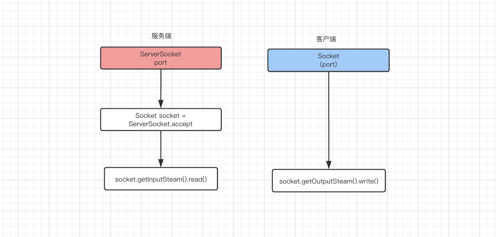
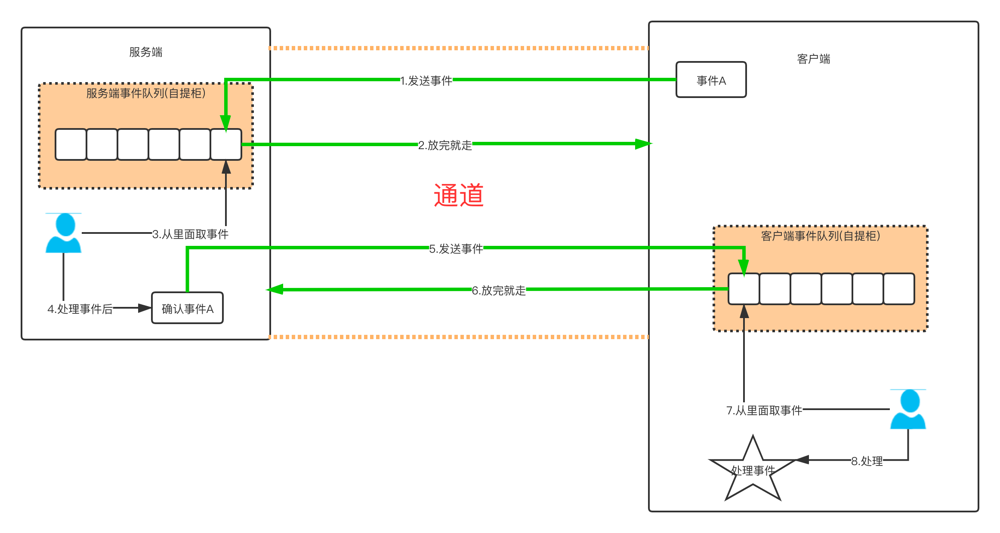
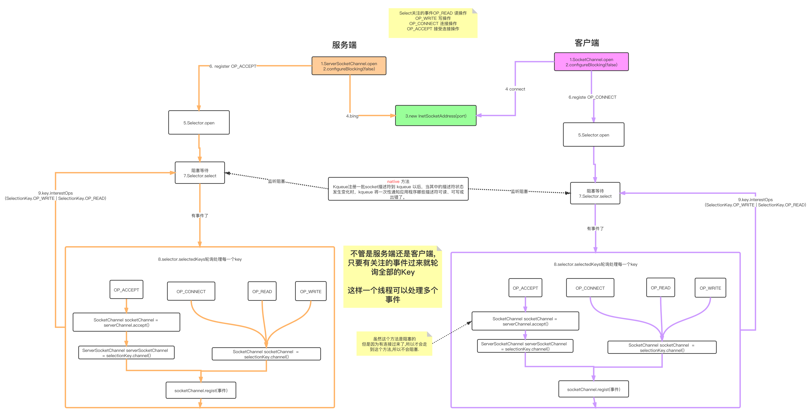

#### Java IO模型

##### 同步,异步,阻塞,非阻塞
> 这个需要举例子,另外加上代码的实现
* 背景:
  * 故事的开始,就以泡茶为例子(简单的两个步骤:烧水,选茶)(也可以用5星大厨和一堆改刀学徒来比喻.)
  * 步骤:烧水,选茶
  * 所有人物:童子们+泡茶大师
  * 人物状态:泡茶大师负责整个泡茶的过程,童子负责烧水,找茶叶,找茶具.
* 同步: 泡茶大师必须先有烧水,必须看到水质后才能准备茶叶.**选茶叶非常依赖水质和水温**
* 异步: 泡茶大师可以不用等待水质,就去准备茶叶.**选茶叶不依赖水质和水温**.
* 同步异步,讲究的**顺序性,依赖性**,按部就班.
* 阻塞: 童子A在烧水,童子B眼睛一直盯着水壶,死盯,等水好了,童子B去找茶叶.
* 非阻塞: 童子A在烧水,但是得烧一会儿,童子B一看要等待,童子B就去准备茶叶了.边烧水,边准备茶叶
  * 注意,网上很多的说:一个人边打电话,边打工作.其实在程序的世界里,**并行只能是多线程**.所以这里举例是两个童子--童子A和童子B
* 阻塞非阻塞,讲究的是**事件的执行率**,阻塞,一次只能干一个活儿,非阻塞,很多话可以一起干.
* 总结同步异步和阻塞非阻塞是两个维度的事儿,一个描述事件执行顺序(大师运筹帷幄),一个描述工作者工作状态(童子负责具体烧水,找茶叶.).

##### BIO
> 同步阻塞IO

##### NIO
> 同步非阻塞IO,一个线程可以处理多个事件,大大提高了线程利用率,减少了线程创建的成本.
> 进化版本1:使用线程池,来处理更多的请求.
> 进化版本2:就算使用线程池,但是因为事件太多了,高并发下,连接性大大降低了.是使用两个线程池-->处理连接线程池+处理读写线程池
* 同步非阻塞,就是事件顺序是一定的,但是又要一个线程忙到死.
  * 举例子就是,一个童子兼顾烧水+沏茶
    * 大师规定步骤是先烧水,然后沏茶(同步)
    * 童子们边烧水,边准备茶叶.(非阻塞),实际情况是童子A在烧水,童子B在沏茶
* 那么NIO是如何设计上面的同步非阻塞
  * 一个阻塞队列,就是泡茶大师的角色,规定了各个步骤的顺序性(同步)
  * 一堆线程分别去烧水,沏茶(非阻塞)
  * NIO的非阻塞是如何体现的呢?
    * 首先说一下BIO,快递员打电话给你,收件人叫他等一会儿,那么快递员就是阻塞状态.
    * NIO,就是快递员将快递放入自提柜,然后送别的小区去了,收件人收到短信(感知到有事件)就会自己去自提柜去取.
    * 上面的例子. 自提柜就是事件队列  快递员是客户端 收件人是服务端.
    * NIO就是:客户端有个事件队列,服务端发送事件,不必等待客户端返回,就可以返回继续干别的去了.
    * 具体就是下面的图了(简单图)
    

* 下面代码是经典的NIO实现代码的流程图.

##### AIO(NIO2)
> 异步非阻塞IO,是基于NIO模型进行封装的.