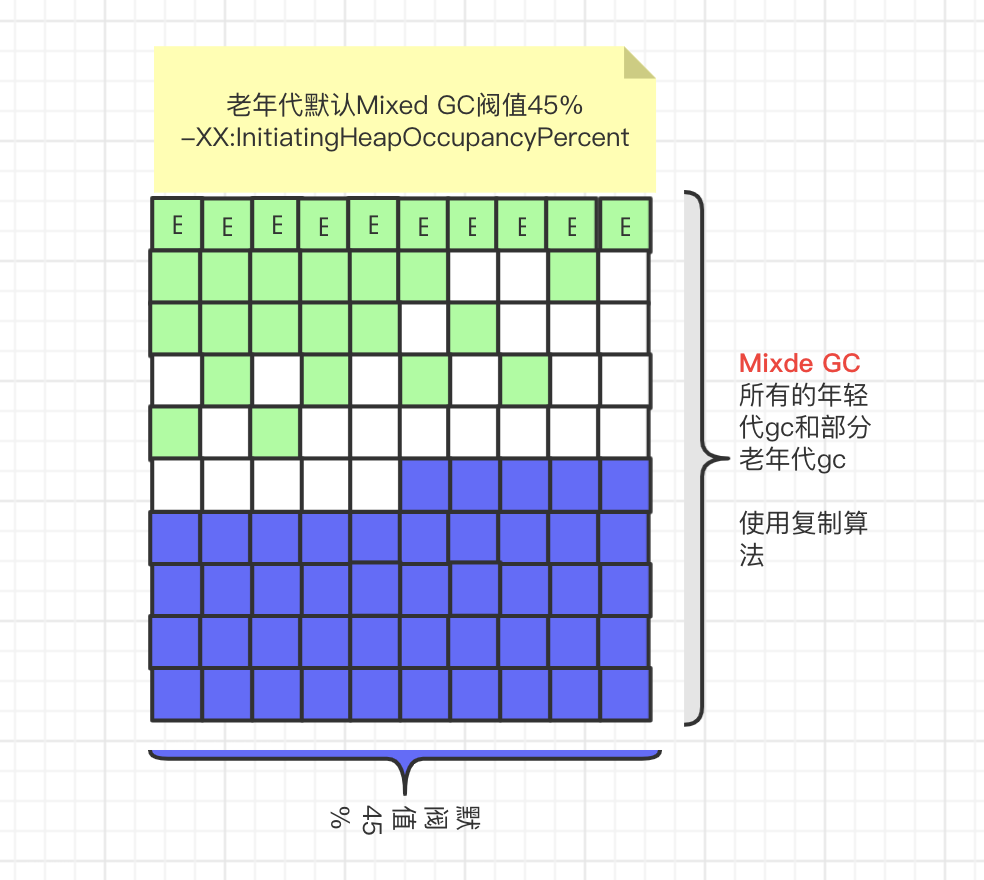

### JVM笔记

#### 类加载的过程.
* 类加载的过程,就是将`.class`文件加载到虚拟机内存中到过程.


#### JVM内存模型
> JVM 虚拟机内存模型


##### 栈内字节码的执行
> 栈内的栈帧的执行,粗略展示.


* 有关上图中的动态链接.
[动态链接](jvm栈中的动态链接.md)


##### 堆内存空间示意图
> 下面是堆的内存空间.
> 由年轻代和老年代组成,默认大小比例1:2
> 年轻代中由eden,survivor0,survivor1组成,默认大小比例8:1:1
> 老年代对象和年轻代对象直接会存在引用. 比如School对象已经在老年代,但是里面有一个对象代引用Student改成了,那么新的Student对象就会在年轻代和老年代的School互相关联着.

Young GC的过程.(图示中并没有清除垃圾,不过展示了垃圾对象在s0,s1区存活的过程.)


#### JVM运行模式
* `解释模式`,程序执行到哪一行,将哪一行解释执行为0101机器码,不会缓存
  **启动快,运行不如编译模式,占用空间小**
* `编译模式`,直接将所有到代码全部编译成0101机器码,放入缓存,Just In Time Complier,即使编译技术,即JIT.编译过程中,会对代码进行优化,比如对象逃逸分析.
  **启动慢,运行快,占用空间大**
* `混合模式`,普通程序依然使用解释模式,但是热点代码改为使用编译模式(也会执行JIT).既减少了空间,又增加了速度,默认使用这个模式.
* 对象逃逸分析.
  ```
    在jvm中使用编译模式模式下编译生成机器码的时候:
    当一个方法中的对象,不会在这个方法外使用(简单点说,就是不会被返回)
    那么这个对象的空间就会由栈来生成.减少堆空间的浪费,减少gc
  ```

####JVM垃圾回收时机
* 堆中垃圾回收情况:
  >假设年轻代总大小100M,老年代200M
  >young -> `eden 80M` `survivor0 10M` `survivor1 10M`
  1. young gc后存活的对象survivor区存放不下,即剩余对象大于10M,进入老年代.
  2. 大对象直接进入老年代,为了避免大对象在suivivor区复制的低效率.可以使用-XX:PretenureSizeThreshold指定大小,超过这个大小直接进入老年代.
  3. 长期存活的对象会进入老年代:每在survivor区存活一次,年龄加一的“顽固”对象,当达到年龄限制就会进入老年代.可以使用`-XX:MaxTenuringThreshold`来指定年龄,由于是4个bit存贮,所以`默认最大15岁（0-15）`.
  4. **动态年龄判断机制**.
        ```
        当前对象的survivor区其中一块区域(s0或s1),当一批对象中总大小超过50%当时候(可以使用-XX:TargetSurvivorRatio设置,默认50%),超过的部分会进入老年代.
        比如:
        survivor区中
        1岁对象总大小2M;
        2岁对象总大小3M;
        3对象总大小1M;
        4岁对象总大小0.5M;
        5岁对象总大小1M;
        此时总的存活对象大小2+3+1+0.5+1=6.5 > 10M * 50%
        那么超过50%部分年龄较大的对象放入老年代
        比如5岁总大小1M的对象,4岁总大小0.5M的对象,3岁总大小1M的对象提前进入老年代.
        ```
  5. **老年代的空间担保机制**.(jdk1.8以后已经默认配置了.)
  

####JVM垃圾回收算法.
* 标记-清除算法(标记后,清理对象)
  ```
  缺点:
  先标记再清理效率低;
  空间碎片;
  ```
* 复制算法(准备将两块儿大小相同的内存,每次只清理一块儿,并复制到另外一块儿.)
  ```
  缺点:
  需要预留出一半的空间,浪费空间;
  优点:
  通过gc-roots判断存活后,直接清除,不标记,速度快.
  无空间碎片.
  ```
* 标记-整理算法(标记后,整理在一起)
  ```
  优点: 
  无空间碎片.
  ```
* 分代算法(一种思想,jvm已经使用了.)
  
#### 垃圾收集器
> 垃圾收集的时候,为保证能正确清理,会暂停所有的线程.然后清理,这种现象叫“Stop The World”,简称STW
* Serial收集器,单线程收集器,GC时候“Stop The World”
  ```
  年轻代使用复制算法
  老年代使用标记-整理算法
  ```
* ParNew收集器，年轻代收集器,多线程收集器,GC时候“Stop The World”
  ```
  年轻代使用复制算法
  老年代使用标记-整理算法
  ```
* Parallel Scavenge，默认收集器。
* Parallel Old，多线程的老年代收集器。
* **CMS收集器**老年代收集器.
Concurrent Mark Sweep,同步标记清除,以获取最短的“Stop The World”的时间.
    ```
      初始标记:“STW”    GC线程标记gc-roots能直接引用的对象,速度快.
      并发标记:  应用程序正常运行和GC线程继续标记并发.(此处占用gc时间的80%时间)
      重新标记:“STW”    该阶段的任务是完成标记整个老年代的所有的存活对象(此处会产生浮动垃圾:GC线程标记上个阶段由于应用程序和GC线程并发时应用程序新产生的垃圾对象)
      并发清理:  应用程序正常运行和GC线程清理.
      -------
      优点：
      并发收集，低停顿，最耗费时间的并发标记，不会stw，所以用户无感知。
      -------
      容易产生的问题:
      CPU资源敏感，并发收集的时候，会抢占cpu资源;
      内存碎片 可以使用-XX:+UseCMSCompactAfFullCollection 让jvm执行完标记清楚后再做整理，但是会浪费一些时间
      无法清除'浮动垃圾'
      执行不确定性，如果上次full gc还没收集完，在并发阶段又再次处罚full gc，会使用Serial收集器，增加了gc时间。可以使用CMSInitiatingOccupancyFraction稍微调大full gc回收的百分比
    ```
  * CMS垃圾收集器参数调整:
    * `-XX:+UseConcMarkSweepGC` 启用CMS
    * `-XX:+UseCMSCompactAtFullCollection` Full GC后做压缩整理(减少碎片)
    * `-XX:CMSFullGCsBeforeCompaction=n`  CMS进行n次full gc后进行一次压缩。如果n=0,每次full gc后都会进行碎片压缩.
    * `-XX:CMSInitiatingOccupancyFraction=n` 当老年代内存使用达到n%,开始回收。默认92%
    * `-XX:+UseCMSInitiatingOccupancyOnly` 如果不指定, 仅在第一次FUll GC用设定的回收阈值.
    * `-XX:+CMSScavengeBeforeRemark` 在使用CMS收集器执行FUll GC之前,先执行一下Minor GC,减少年轻代中的垃圾对象.
  

* **G1收集器**类似快递柜
  
  * 主要针对配置多颗处理器以及大容量内存机器.
  * G1收集器,保留了老年代,年轻代的概念,但不再是物理隔阂,都是不连续的Region,所以忘记之前的老年代,年轻代的划分,forget it!
  * G1将java堆分成大小相等的独立区域(Region),最多有2048个Region
  * 什么时候会转入老年代与其他的是一样的,不同的是大对象的处理(Humongous)
  * 垃圾收集步骤(使用复制算法,不会产生内存碎片)
    ```
    初始标记:“STW”    GC线程标记gc-roots能直接引用的对象,速度快.
    并发标记:应用程序正常运行和GC线程继续标记并发.(此处占用gc时间的80%时间)
    重新标记:“STW”    该阶段的任务是完成标记整个老年代的所有的存活对象(此处会产生浮动垃圾:GC线程标记上个阶段由于应用程序和GC线程并发时应用程序新产生的垃圾对象)
    筛选回收:“STW”  筛选回收阶段对每个region的回收价值和成本进行排序,根据用户希望的GC停顿时间来定制回收计划.
    ```
  * G1有三种GC方式
    * young gc: 计算每个region区中回收的时间,如果远小于-XX:MaxGCPauseMilllis(默认200毫秒),则增加年轻代egion区域,当年轻代的所有region区域的回收时间接近-XX:MaxGCPauseMilllis,进行young gc
  
    * mixed gc:当老年代占比达到-XX:InitiatingHeapOccupancyPercent参数设置的阀值,年轻代全部gc,老年代部分gc
  
    * full gc:“stop the world”,采用`单线程`进行标记,清理和压缩整理,空闲一部分Region来使用Mixed GC.这个过程非常耗时.
  

  * G1垃圾器最特别是是,可以**指定**`gc时间`(默认200毫秒).当到达指定时间后回收不完,也会停止回收.在`并发标记`的阶段,会标记每个评估,垃圾回收的价值,每个region垃圾回收的耗时,回收耗时最小的部分,耗时多的放在后面.
  * G1使用复制算法.
  
  * G1中,有个比较特别的单位:每个region垃圾回收耗时.
  * G1收集器参数设置
      * -XX:UseG1GC
      * -XX:G1HeapRegionSize 分区大小(1M~32M,必须是2的幂数),默认2048个region
      * -XX:MaxGCPauseMilllis 停顿秒数(默认200毫秒)
      * -XX:G1NewSizePercent 新生代内存初始空间(默认5%)
      * -XX:MaxG1NewSizePercent 新生代最大占比
      * -XX:TargetSurviviorRatio 区的填充容量(默认50%),就是上面说的那个`态年龄判断机制`
      * `-XX:InitiatingHeapOccupancyPercent` 老年代占用空间达到整个堆内存的阀值(默认45%),达到这个阀值则执行Mixed GC
      * -XX:G1HeapWastePercent (默认5%)当mixed gc回收出超过5%的region空间出来,立刻停止mixed gc,意味着本次回收结束了.
      * -XX:G1MixedGCLiveThresholdPercent region中存活对象低于这个百分比(默认85%),当每个region中存活对象大于85%,则跳过这个region,此次不回收.
      * -XX:G1MixedGCCountTarget 在一次回收过程中指定做几次筛选回收.(默认8次),在最后的gc阶段`筛选回收`,可以分8次回收,减少`筛选回收`停顿的时间.
  * G1使用场景
    1. 50%以上的堆被存活引用
    2. 对象分配和晋升的速度变化比较大
    3. 垃圾回收时间特别长,超过1秒
    4. 8GB内存以上
    5. 停顿时间是500ms以内.(kafka这种高并发消息系统非常适合G1)
  * 
* Full GC也会回收方法区中的垃圾回收,必须全部满足下面3个条件才会被回收.
  1. 该类的所有实例在堆中都被回收
  2. 加载该类的ClassLoader被回收
  3. 该类对应的Class对象没有在任何地方被引用,即无法在任何地方通过反射获取该类的方法.
* 安全点,可以触发gc的位置(保证线程运行,不会丢失程序计算器的位置.)
  1. 方法返回前
  2. 调用方法之后
  3. 抛出异常的位置
  4. 循环的末尾
* 安全区域,在一段代码中,引用关系不会发生变化.


#### 调优
* 调优的原则是(每秒产生多少垃圾对象)
  * 尽量减少full gc.希望在年轻代中通过minor gc就清除掉.
  * 希望大对象尽量少在年轻代中增加岁数后才到老年代.所以可以`设置大对象参数`的阀值
  * 保证老年代分配担保机制成功.
* 亿级流量电商丁订单JVM参数设置.
  * **分析的思路很重要**.
    1. 假设平均用户平均点击二,三十次.
    2. 日活跃用户= 1亿/20 = 500万
    3. 付费转化率10% = 50万单
    4. 正常集中在3-4个小时的订单-> 每秒几十单
    5. 大促可能每秒1000单
    6. 将系统进行水平分布式架构(分成3个机器)
    7. 每个机器300单/秒
    8. 假设每个对象1kb,每秒30kb(可以使用JOL查看对象的大小.)
    9. 涉及到其他优惠卷等等 估算20倍. 6000kb = 6M
    10. 如何还有订单的增删改查等等,操作数*10 = 60M 
    11. 最终每个服务器 ->每秒生成60M垃圾对象.
    12. 如果以每个服务器4g内存空间,那么年轻代中的内存比例就是1.2g:0.15g:0.15g,根据动态对象年龄机制.第一秒0岁的60M垃圾,存在S区,第二秒0岁的60M垃圾变成了1岁了,新的0岁和1岁加起来超过了50%,则1岁的60M垃圾就会进入老年代. 所以调整动态对象年龄机制的比例或者调大S区的内存大小.
  * 下面是分析流程图.

  * JVM调优工具
    * jmap -histo pid > xxx.txt 查看实例个数和占用内存大小
      * num 序号
      * instances 实例数量
      * bytes 占用空间大小
      * class name 类名称 
        ```
          [C is a char[]
          [S is a short[]
          [I is a int[]
          [B is a byte[]
          [[I is a int[][]
        ```
    * jmap -heap pid 查看堆信息
    * jmap -dump:format=b,file=xxx.hprob pid 下载快照文件.
      ```
        一般引用程序启动的时候,配置一个参数 -XX:+HeapDumpOnOutOfMemoryError -XX:HeapDumpPath=yourpath
        当发生OOM时候,dump快照文件.
      ```
    * jstack pid 查看堆栈信息,也可以用来找死锁.
    * jinfo -flags pid 查看jvm运行参数.
    * jinfo -sysprops pid 系统程序级别的参数.
    * `jstat -gc pid 毫秒数 次数` 每`毫秒数`打印 堆内存各部分的使用量 共打印`次数`
      ```
        S0C s0大小
        S1C s1大小
        S0U s0使用
        S1U s1使用
        EC eden区大小
        EU eden区使用
        OC old区大小
        OU old区使用
        MC 元空间大小
        MU 元空间使用
        CCSC 压缩类空间大小
        CCSU 压缩类空间使用大小
        YGC  系统启动以来young gc总次数
        YGCT 系统启动以来young gc总时间
        FGC 系统启动以来Full gc总次数
        FGCT 系统启动以来Full gc总时间
        CGC 多线程总的垃圾回收数
        CGCT 多线程总的垃圾回收时间
        GCT 垃圾回收消耗的总时间
      ```
    * jstat -gccapacity pid 查看堆内存统计
  * JVM预估
    * 频繁full gc 查看思路 
    1. `jstat -gc pid 1000 5` 查看5秒内gc情况
    2. 或查看gc日志,估算gc触发的频率
    3. 估算出每秒产生多少对象
    4. 估算young gc的次数
    5. 估算full gc的次数
    6. 思考频繁进入老年代的原因
    7. 考虑是否是 年轻代过小
    8. 考虑是否 `动态年龄判断机制` 
    9. 考虑是否有大对象(使用jmap 查看对象实例个数. 查看jstack 是否有死锁)
  * GC日志查看,使用GCeasy网站帮助分析.
    ```
    ParNew GC日志
      [GC (Allocation Failure) [PSYoungGen 65535K->3856K(76288K)]65535K->3856K(76288K)0.0051565 secs][Times:user=0.00 sys=0.00, real=0.01 secs]
      参数分析
      gc原因:Allocation Failure,分配失败,就是空间满了.
      65535K->3856K(76288K) == 清理前已使用->清理后已使用(总大小)
      ---------
      [Full GC (Metadata GC Threshold) [PSYoungGen 6224K->0K(142824K)] [ParOldGen 112K->6060K(89600K)]63364K->6060K(231424K) [Metaspace 20496K->20496K(1067008K)] 0.0304379 secs][Times:user=0.13 sys=0.02, real=0.03 secs]
      gc原因:Metadata GC Threshold,元空间满了.
    CMS日志
      [CMS-concurrent-mark-start]
      [CMS-concurrent-mark: 0.007/0.011 secs][Times:user=0.00 sys=0.00, real=0.01 secs]
      [CMS-concurrent-preclean-start]
      [CMS-concurrent-preclean: 0.001/0.001 secs][Times:user=0.00 sys=0.00, real=0.00 secs]
      [GC (CMS Final Remark) [YG occupancy 5976K(78655K)] [Resan(parallel) ,0.0021077 secs][weakrefs processing ,0.0000317 secs][class unloading ,0.0042186 secs][scrub symbol table ,0.0043216 secs][scrub string table ,0.0004296 secs][1 CMS-remark 3313K(174784K),0.0121439 secs][Times:user=0.09 sys=0.02, real=0.01 secs]
      [CMS-concurrent-sweep-start]
      [CMS-concurrent-sweep: 0.003/0.003 secs][Times:user=0.00 sys=0.00, real=0.01 secs]
      [CMS-concurrent-reset-start]
      [CMS-concurrent-reset: 0.033/0.033 secs][Times:user=0.09 sys=0.05, real=0.03 secs]
      上面的gc过程清晰的展示出了CMS gc的过程 `初始标记` `并发标记` `重新标记` `并发清理`
      可以看出,耗时最长的是并发标记.
    G1日志,思路参照CMS日志
    ```