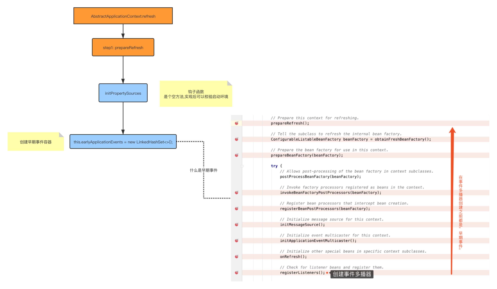
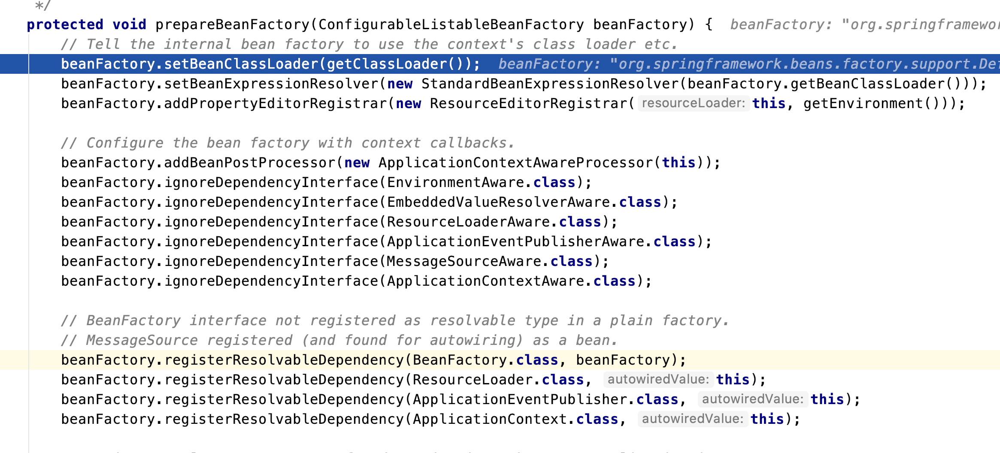
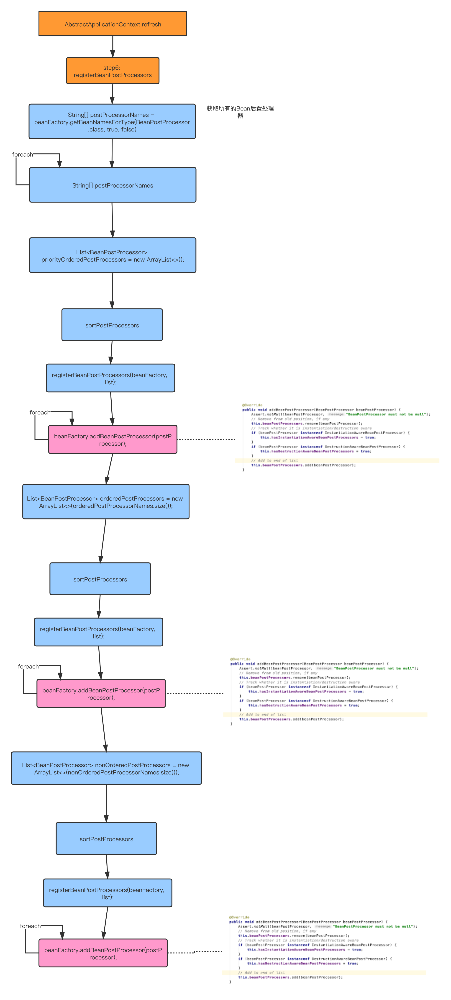

### AnnotationConfigApplicationContext容器

#### 启动之前的准备
> 本部分讲解的是启动之前的步骤

```
public AnnotationConfigApplicationContext(Class<?>... componentClasses) {
    this(); // 第一部分
    register(componentClasses); // 第二部分
    refresh(); // 重中之重
}
```


```
    `第一步` 
        new AnnotatedBeanDefinitionReader(),向容器中创建默认的处理器
            internalConfigurationAnnotationProcessor // 向BeanDefinitionMap容器中添加ConfigurationClassPostProcessor配置类处理器
            internalAutowiredAnnotationProcessor // 向BeanDefinitionMap容器中添加AutowiredAnnotationBeanPostProcessor自动注入处理器 
            internalEventListenerProcessor // 向BeanDefinitionMap容器中添加EventListenerMethodProcessor事件监听处理器
            internalCommonAnnotationProcessor // 向BeanDefinitionMap容器中添加CommonAnnotationBeanPostProcessor通用注解处理器
            internalEventListenerFactory // 向BeanDefinitionMap容器中添加向BeanDefinitionMap容器中添加CommonAnnotationBeanPostProcessor事件监听工厂 
        new ClassPathBeanDefinitionScanner()
            注册默认的过滤器.这将隐式的注册所有的@Component,@Repository,@Controller
    `第二步`
        注入用户自己定义的配置类到容器中去.
            比如:@Configuration Mybatis等等
    `第三步`
        单独讲解
```

#### onfresh 12 步骤重点解析
> onfresh 12 步骤的解析
##### 1 prepareRefresh
> 这个是比较简单的,就是对环境进行校验.

图示说明



##### 2 obtainFreshBeanFactory();
> 刷新工厂,内容非常简单,通过CAS获取id
> 设置序列ID->this.beanFactory.setSerializationId(getId())
> 这里的工厂是org.springframework.beans.factory.support.DefaultListableBeanFactory


##### 3 prepareBeanFactory
> 为容器(DefaultListableBeanFactory)准备大量的组件，工厂赋能，增加各种各样的组件功能。
图示说明



##### 4 postProcessBeanFactory
> 后置处理器,使用子类去实现该接口
> 空方法,钩子函数
 

##### 5 invokeBeanFactoryPostProcessors
> 调用我们的bean工厂的后置处理器
1. 无论如何,先调用**BeanFactoryRegistryPostProcessors** Invoke BeanDefinitionRegistryPostProcessors first, if any.先调用注册后置处理器。这一步是找到自己的注册组件，比如Mybatis会找到MapperScanner
   1. 调用实现**PriorityOrdered**的BeanFactoryPostProcessors
      1. 在`第一步`中,默认的工厂(DefaultListableBeanFactory)中的BeanDefinitonMap容器已经有了内置的后置处理器的BeanDefinition, 通过beanFactory.getBean获取内部后置处理器(注册机)实例
      2. 调用后置处理器invokeBeanDefinitionRegistryPostProcessors
      3. 在上面的this()步骤中,创建了一个默认的实现了BeanDefinitionRegistryPostProcessor接口的类ConfigurationClassPostProcessor,调用postProcessBeanDefinitionRegistry
      4. 创建配置类解析器ConfigurationClassParser parser = new ConfigurationClassParser(...);
      5. parser.parse,解析器开始解析,将@Configuration注解,解析为将ConfigurationClass[^1]
      6. 经过一些调用栈,终于到了doProcessConfigurationClass方法上,开始解析
      7. 解析注解
         1. @PropertySource
         2. @ComponentScan
            1. 创建类路径BeanDefinition扫描器 ClassPathBeanDefinitionScanner scanner = new ClassPathBeanDefinitionScanner
            2. 注册默认的过滤器.这将隐式的注册所有的@Component,@Repository,@Controller
            3. 扫描器加属性
            4. 扫描器根据包名获取候候选BeanDefinition
            5. 循环获取所有的路径,根据ASM字节码编辑器获取元数据
            6. 将获取的元数据中包含的Bean信息,放入BeanDefinition
            7. 将BeanDefinition解析为BeanDefinitionHolder(门面类)
            8. 对于有可能发生的扫描的BeanDefinition嵌套使用@ComponentScan,所以递归解析.
            9. 将解析的内容放入Map<ConfigurationClass, ConfigurationClass>--configurationClasses中
         3. @Import
            1. 将解析的内容放入Map<ConfigurationClass, ConfigurationClass>--configurationClasses中
         4. @ImportResource
            1. 将解析的内容放入Map<ConfigurationClass, ConfigurationClass>--configurationClasses中
         5. @Bean 解析为BeanMethod
            1. 将解析的内容放入Map<ConfigurationClass, ConfigurationClass>--configurationClasses中
      8. 当前配置累读取器,加载BeanDefiniton(ConfigurationClassBeanDefinitionReader::
      loadBeanDefinitions)
         1. 根据上面解析出来的各种不同类型的configurationClasses,不同处理.
         2.  最终将configurationClasses读取到BeanDefinitionMap中去.
   3.  重复上面的步骤,调用实现**Ordered**的BeanFactoryPostProcessors
   4.  重复上面的步骤,调用所有的BeanFactoryPostProcessors(mybatis)会用这个个.
2. invoke**BeanFactoryPostProcessors**,再调用工厂后置处理器。
   1. 内置的ConfigurationClassPostProcessor处理类会找到@Configration的配置类，目的是为了“增强”
   2. 将找到的配置类通过Cglib动态代理生成增强的配置类。
3. 重复上面的步骤，最后会调用到EventListnerFactory的后置处理器

图示说明


##### 6 registerBeanPostProcessors
> 调用我们的bean的后置处理器，这个是Bean的后置处理器，上面是工厂的后置处理器，会发现其步骤与上面极其类似，都是找优先级的注解，排序，调用。
> 将所有的Bean的后置处理器找到，放入List\<BeanPostProcessor\> beanPostProcessors = new CopyOnWriteArrayList<>();



##### 7 initMessageSource
> 初始化国际化资源处理器
> 此方法没有特别的绕,很简单.

##### 8 initApplicationEventMulticaster
> 创建事件多播器
* 主要就是创建了一个 new SimpleApplicationEventMulticaster(beanFactory)的多播放器.

##### 9 onRefresh
> 同样的也是子类实现的(springboot也是从这个方法进行启动tomcat的)
* 此方法是空方法,等待用户来实现.
* SpringBoot的Tomcat就是在这里启动的,具体请详见[springboot](springboot.md)

##### 10 registerListeners
> 把我们的事件监听器注册到多播器上
1. 获取多播器 getApplicationEventMulticaster().multicastEvent(earlyEvent);
2. 调用监听器 doInvokeListener
3. 方法回调,调用实现了ApplicationListener接口的实现类中的Override方法.
    比如:(ApplicationListener listener, ApplicationEvent event) listener.onApplicationEvent(event);


##### 11 finishBeanFactoryInitialization
> 实例化我们剩余的单实例bean
> Spring很多内置的Bean实例一般都是在第五步就会创建了一部分,但是还有一部分是业务代码,事务代码,AOP等等,这些BeanDefinition都会在这11步来完成实例化.

```
代码就是
获取所有的BeanDefinition
List<String> beanNames = new ArrayList<>(this.beanDefinitionNames);
foreach 
getBean
```

##### 12 finishRefresh
> 完成刷新.
* 包含了以下内容
  1. 清空资源缓存
  2. 初始化生命周期后置处理器
  3. 获取生命周期后置器然后onRefresh() // 猜测spring cloud在这里实现的.
  4. 使用之前创建的时间多播器发布事件. // spring 定时任务
  5. 存活bean视图注册到容器.

#### 第4步骤:发布事件的例子

* Spring定时任务,就是在这里实现的.
 * ScheduledAnnotationBeanPostProcessor实现了ApplicationListener接口,事件发布的时候会触发onApplicationEvent方法
 * 这个后置处理器包含的ScheduledTaskRegistrar,通过实现了InitializingBean接口,被调用afterPropertiesSet方法
     ```
     public void afterPropertiesSet() {
         // 最重要的全在这里了.
         scheduleTasks();
     }
     ```
 * 然后获取TriggerTask/CronTask/IntervalTask类型的定时任务,在这里会调用一个`scheduleTriggerTask`的方法,这个是充电方法
     ```
     // 定时任务执行的核心.
     protected void scheduleTasks() {
         if (this.taskScheduler == null) {
             this.localExecutor = Executors.newSingleThreadScheduledExecutor();
             this.taskScheduler = new ConcurrentTaskScheduler(this.localExecutor);
         }
         if (this.triggerTasks != null) {
             for (TriggerTask task : this.triggerTasks) {
                 addScheduledTask(scheduleTriggerTask(task));
             }
         }
         if (this.cronTasks != null) {
             for (CronTask task : this.cronTasks) {
                 addScheduledTask(scheduleCronTask(task));
             }
         }
         if (this.fixedRateTasks != null) {
             for (IntervalTask task : this.fixedRateTasks) {
                 addScheduledTask(scheduleFixedRateTask(task));
             }
         }
         if (this.fixedDelayTasks != null) {
             for (IntervalTask task : this.fixedDelayTasks) {
                 addScheduledTask(scheduleFixedDelayTask(task));
             }
         }
     }
     ```
 * scheduleTriggerTask方法,就是将定时任务放入`taskScheduler`中,由jdk中的定时线程池来执行任务.
     ```
     public ScheduledTask scheduleTriggerTask(TriggerTask task) {
         ScheduledTask scheduledTask = this.unresolvedTasks.remove(task);
         boolean newTask = false;
         if (scheduledTask == null) {
             scheduledTask = new ScheduledTask(task);
             newTask = true;
         }
         if (this.taskScheduler != null) {
             scheduledTask.future = this.taskScheduler.schedule(task.getRunnable(), task.getTrigger());
         }
         else {
             addTriggerTask(task);
             this.unresolvedTasks.put(task, scheduledTask);
         }
         return (newTask ? scheduledTask : null);
     }
     ```


[^1]: 这个类可以通过getImportBeanDefinitionRegistrars方法获取@Import注解的注解类,比如SpringAOP使用@Import(AspectJAutoProxyRegistrar.class),然后将其解析.