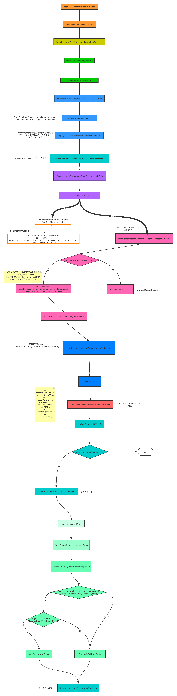

## 源码解读

[TOC]
### Bean加载
>加载步骤如下:
1. doGetBean
    1. getSingleton() 从工厂中获取,三级缓存[^1]
    2. getObjectForBeanInstance() // 直接获取
        1. 正确性验证
        2. getObjectFromFactoryBean() 从工厂获取
            1. doGetObjectFromFactoryBean
                1. factory.getBean()
                2. postProcessObjectFromFactoryBean() // 后置处理器
                    1. applyBeanPostProcessorsAfterInstantiation()
    3. getSingleton() <B>重载</B>
        1. beforeSingletonCreation() 记录加载状态[^2]
        2. singletonFactory.getObject()
        3. afterSingletonCreation() 删除记录的状态
    4. createBean()
        1. prepareMethodOverrides() 验证以及准备覆盖的方法:spring配置中的lookup-method和replace-method
        2. resolveBeforeInstatition() 给BeanPostProcessors一个机会来代替真正的实例
            1. applyBeanPostProcessorsBeforeInstantiation() 前置处理,将AbstractBeanDefinition通过<b>cglib,其他处理方式等</b>包装成包装类`BeanWapper`
            2. applyBeanPostProcessorsAfterInstantiation() 后置处理,不再经过普通的Bean处理
        3. doCreateBean
            1. factoryBeanInstanceCache.remove() 如果从单例获取,清空缓存
            2. createBeanInstance() 将BeanDefinitionBean转化为BeanWapper
                1. instantiateUsingFactoryMethod() 使用工厂方法初始化`策略`
                2. autowireConstructor()
                3. instantiateBean()
            3. applyMergedBeanDefinitionPostProcessors()
            4. 逻辑判断,是否允许提早曝光,以用来<B>允许</B>循环依赖处理
            5. populateBean() // 填充Bean:填充时,有依赖关系Bean时间,通过填充实例化依赖的Bean,并将PropertyValues设置到BeanWrapper之中
                1. autowireByName() 获取通过名称注入的属性
                2. autowireByType() 获取通过类型注入的属性
                3. applyPropertyValue() 将上述获取的属性填充到BeanWapper中
               

>过程中思考使用的设计模式

* Spring之中使用大量的模版模式,最简单最直接的设计模式,并设计了BeanPostProcess回调方法
* 由BeanWapper和Definition联合创建实例的过程是工厂模式
* registerCustomEditor方法中,通过属性解析器的设置(Array解析器解析Array,File解析器file等等)有点像命令模式,使用者和调用者分开.
* 在调用postProcessorAfter(Before)Initialization方法的时候,会循环调用BeanPostDefinition的实现类(在启动的时候CopyOnWriteArrayList集合中已经添加了对应的后置处理器了)来不停的填充属性,是一种变种的装饰者模式.(个人理解是装饰者,但是也像一个过滤器)

> 过程中代码的设计思路

* 使用了`短路`思想,干扰各种创建过程中的过程.

>图示创建过程

---
### AOP
> 由于很多业务的重复性,所以面向对象编程OOP编程了面向接口编程AOP,而Spring中很多组件都是由SPI[^3]接口实现的.

###### AOP代理对象的生成缓存
> 下面这份流程图是AOP代理对象的生成缓存

###### AOP代理对象的方法增强
> 下面这份流程图是AOP代理对象的生成缓存

[^1]:Bean之间互相依赖,死循环的解决方案:Spring Bean 容器创建单例时,首先会根据无参构造函数创建Bean,并暴露一个ObjectFactory(循环依赖验证,是否循环依赖),并将当前Bean的标识符放到当前创建的Bean池.
[^2]:主要作用是<b>用来在无参构造方法创建依赖Bean之前,从工厂中获取已经创建好的Bean,解决循环依赖</b>  
[^3]:有关SPI详情,请见[SPI](../Java%20Core.md)
