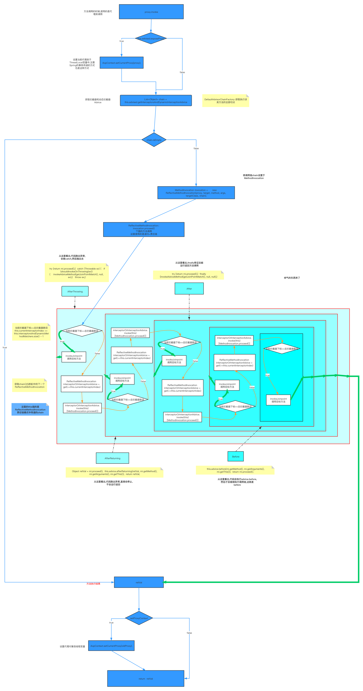

## 源码解读

[TOC]
### Bean加载
>加载步骤如下:
1. doGetBean
    1. getSingleton() 从工厂中获取,三级缓存[^1]
    2. getObjectForBeanInstance() // 直接获取
        1. 正确性验证
        2. getObjectFromFactoryBean() 从工厂获取
            1. doGetObjectFromFactoryBean
                1. factory.getBean()
                2. postProcessObjectFromFactoryBean() // 后置处理器
                    1. applyBeanPostProcessorsAfterInstantiation()
    3. getSingleton() <B>重载</B>
        1. beforeSingletonCreation() 记录加载状态[^2]
        2. singletonFactory.getObject()
        3. afterSingletonCreation() 删除记录的状态
    4. createBean()
        1. prepareMethodOverrides() 验证以及准备覆盖的方法:spring配置中的lookup-method和replace-method
        2. resolveBeforeInstatition() 给BeanPostProcessors一个机会来代替真正的实例
            1. applyBeanPostProcessorsBeforeInstantiation() 前置处理,将AbstractBeanDefinition通过<b>cglib,其他处理方式等</b>包装成包装类`BeanWapper`
            2. applyBeanPostProcessorsAfterInstantiation() 后置处理,不再经过普通的Bean处理
        3. doCreateBean
            1. factoryBeanInstanceCache.remove() 如果从单例获取,清空缓存
            2. createBeanInstance() 将BeanDefinitionBean转化为BeanWapper
                1. instantiateUsingFactoryMethod() 使用工厂方法初始化`策略`
                2. autowireConstructor()
                3. instantiateBean()
            3. applyMergedBeanDefinitionPostProcessors()
            4. 逻辑判断,是否允许提早曝光,以用来<B>允许</B>循环依赖处理
            5. populateBean() // 填充Bean:填充时,有依赖关系Bean时间,通过填充实例化依赖的Bean,并将PropertyValues设置到BeanWrapper之中
                1. autowireByName() 获取通过名称注入的属性
                2. autowireByType() 获取通过类型注入的属性
                3. applyPropertyValue() 将上述获取的属性填充到BeanWapper中
               

>过程中思考使用的设计模式

* Spring之中使用大量的模版模式,最简单最直接的设计模式,并设计了BeanPostProcess回调方法
* 由BeanWapper和Definition联合创建实例的过程是工厂模式
* registerCustomEditor方法中,通过属性解析器的设置(Array解析器解析Array,File解析器file等等)有点像命令模式,使用者和调用者分开.
* 在调用postProcessorAfter(Before)Initialization方法的时候,会循环调用BeanPostDefinition的实现类(在启动的时候CopyOnWriteArrayList集合中已经添加了对应的后置处理器了)来不停的填充属性,是一种变种的装饰者模式.(个人理解是装饰者,但是也像一个过滤器)

> 过程中代码的设计思路

* 使用了`短路`思想,干扰各种创建过程中的过程.

>图示创建过程


### Spring 解决循环依赖
> Spring使用了3级缓存来解决循环依赖
* 循环依赖只能使用单例和Setter方式单例(默认方式)
  1. 构造器参数循环依赖,不行.
    ```
        因为顺序
        1.createBeanInstant// 通过反射获取bean实例
        2.addSingletonFactory // 将创建好的Bean实例放入singletFactory缓存中.
        3.populateBean// 填充发现依赖.
        原因:走不到第二步
        在第一步的时候使用反射的时候,如果是构造器的话,不会加入缓存,而是会继续反射获取,走不到第二步(加入缓存).
    ```
  2. Setter方式原型，prototype(多例)不行(只允许单例->mbd.isSingleton())
    ```
        boolean earlySingletonExposure = (mbd.isSingleton() && this.allowCircularReferences &&
                isSingletonCurrentlyInCreation(beanName));
        if (earlySingletonExposure) {
            if (logger.isTraceEnabled()) {
                logger.trace("Eagerly caching bean '" + beanName +
                        "' to allow for resolving potential circular references");
            }
            addSingletonFactory(beanName, () -> getEarlyBeanReference(beanName, mbd, bean));
        }
    ```
* 2级缓存也可以解决,为何要3级缓存呢?
    ```
    为啥使用earlySingletObjects?
    singletFactories是单例工厂(mybatis是典型实现),非常消耗性能.
    如果是单线程的情况下earlySingletObject确实是多余的步骤.
    但是请注意在getSingleton方法中,是使用synchronized的,说明容器启动的时候是多线程的.
    那么每个线程都从singletFactories里getObject显然是非常消耗性能的.
    所以一旦有一个singletFactories创建好实例后,放入earlySingletObjects缓存,其他线程获取的时候,就不需要再去获取,提高了性能.
    ```


---
### AOP
> 由于很多业务的重复性,所以面向对象编程OOP编程了面向接口编程AOP,而Spring中很多组件都是由SPI[^3]接口实现的.

###### AOP代理对象的生成缓存
> 下面这份流程图是AOP代理对象的生成缓存
> 由第五步解析@EnableAspectJAutoProxy注解,将默认代理对象BeanDefinitionMap中
> 再第十一步,将所有第BeanDefinitionMap全部实例化.

* 注意,生成AOP代理对象组件的时候,同时也将事务相关的组件也生成了


###### AOP代理对象的方法增强
> 下面这份流程图是AOP代理对象的生成缓存

* 注意,代理对象生成的时候,使用的是递归加责任链模式来生成的代理对象.



---

### Spring Transaction事务
* Spring事务三大接口
  1. PlatformTransactionManager 事务管理器
  2. TransactionDefinition 事务的一些基础信息，如超时时间、隔离级别、传播属性等
  3. TransactionStatus 事务的一些状态信息，如是否一个新的事务、是否已被标记为回滚

###### Spring事务-组件生成
> Spring生成代理对象过程与AOP及其相像,又有些不同


###### Spring事务-代理对象
> Spring生成代理对象过程与AOP完全不同,除了前面的使用责任链+递归调用的方式是一样进入的
> 但是后面的proceed方法完全不同,事务切点只有一个(不像AOP可以后很多After,Before,AfterReturning...),所以责任链+递归只会走一次
* Spring事务有很多种情况,各个级别之间相互套用情况不同,具体要结合下图具体看代码.
  1. PROPAGATION_REQUIRED
  2. PROPAGATION_SUPPORTS 
  3. PROPAGATION_MANDATORY
  4. PROPAGATION_REQUIRES_NEW
  5. PROPAGATION_NOT_SUPPORTED
  6. PROPAGATION_NEVER
  7. PROPAGATION_NESTED
    ```
    isExistingTransaction(transaction)判断是否存在事务
    ---
    一般第一个事务在判断是否存在事务都是False(除非第一个没有事务)走图中粉色图框左边的部分
    但是方法中嵌套的第二个事务在判断的时候就是True,走图中粉色图框右边的部分
    ```
* 当事务和AOP在一起的话,两者都是默认的话,先执行事务,后执行AOP,为啥,因为在找到findCandidate方法的时候,先找的事务,后找的AOP


---
### Spring Mybatis整合
> Spring整个Mybatis中生成mapper中主要就是依靠`ImportBeanDefinitionRegistrar`接口和通过干预BeanDefinition来影响最终生成的Bean
1. 通过**Import注解**引入的实现了**ImportBeanDefinitionRegistrar**接口的MapperScannerRegistrar类,在启动的时候,会将实现类转换成BeanDefinition
2. **MapperScannerRegistrar实例化**加入Spring容器
3. 调用实现了BeanDefinitionRegistryPostProcessor接口的类(MapperScannerConfigurer)

> 流程图如下   


[^1]:Bean之间互相依赖,死循环的解决方案:Spring Bean 容器创建单例时,首先会根据无参构造函数创建Bean,并暴露一个ObjectFactory(循环依赖验证,是否循环依赖),并将当前Bean的标识符放到当前创建的Bean池.
[^2]:主要作用是<b>用来在无参构造方法创建依赖Bean之前,从工厂中获取已经创建好的Bean,解决循环依赖</b>  
[^3]:有关SPI详情,请见[SPI](../Java%20Core.md)
