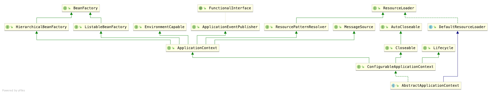
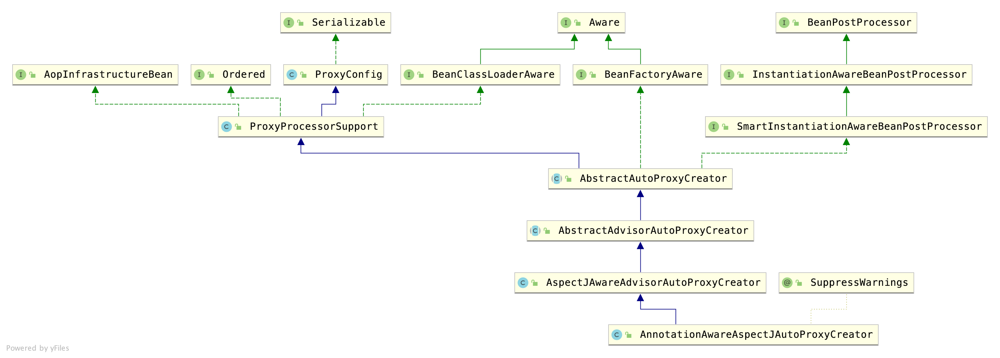

### Spring中重要的概念

### IOC容器
> 关于IOC容器(这个是控制反转)
> &nbsp;&nbsp;&nbsp;&nbsp;搞笑一点的讲,以前自己的老婆各种调教终于是学会了各种花活儿出师了;IOC容器就是洗浴中心,有各种各样的花活儿妹子,只要给钱,我就丢给你一个调教好的出师妹子.
> &nbsp;&nbsp;&nbsp;&nbsp;正经一点讲就是,以前都是自己创建对象,new来new去的,现在有一个IOC容器(就是BeanFactory)按照你的要求根据BeanDefinition给你创建一个你想要的对象.
> &nbsp;&nbsp;&nbsp;&nbsp;如果创建对象的过程中,包含了其他很多对象,便会实例化其中的对象(这个是依赖注入)

#### Bean定义(就是画室中的模特)
>BeanDefinition 这个不是真正的Bean,是bean的定义的接口,提供了很多有用的方法(简直就是bean的get,set方法单独提出来了),比如:
```
作用域常量:单例SCOPE_SINGLETON,原型SCOPE_PROTOTYPE
角色提示说明常量: 0,1,2
设置父类BeanDefinition
设置BeanDefinition中的Bean Class Name
设置延迟加载
设置dependsOn数组(加载依赖)
设置注入候选人
设置主要注入候选人
设置Bean的工厂名称
设置bean工厂方法,这个方法被用来调用构造函数
获取构造方法参数值
获取可变参数值
设置init方法名称(5.1)
设置destroy方法名称(5.1)
设置角色(5.1)
设置描述(人类可读的描述 5.1)
判断是不是单例
判断是不是原型
判断是不是抽象
```


#### Bean工厂(画室)
>DefaultListableBeanFactory 默认的是实现了BeanDefinition的工厂.
>AbstractAutowireCapableBeanFactory这个工厂实现了大部分功能.
```
重要属性:
// 这个叫合并的Bean定义,不是冲突的意思,是一种整合,名称映射Bean定义.
/** Map from bean name to merged RootBeanDefinition. */
private final Map<String, RootBeanDefinition> mergedBeanDefinitions = new ConcurrentHashMap<>(256);
```


#### BeanWapper(画板)
>Bean的制作者,携带着PropertyValues,使用反射方法获取对象实例的.


#### PropertyValues(颜料)
> 多个属性值,填充的时候使用此类
```
系统再加载的时候会添加一些默认的属性
比如List
File
Environment
```


#### BeanPostProcessor定义(后置处理器)
> 后置处理,可以在Bean实例化前后,初始化前后对Bean进行干预修改.其中最重要对两个接口是BeanPostProcessor和InstantiationAwareBeanPostProcessor.


* InstantiationAwareBeanPostProcessor的默认实现类图


#### Aware(词义:醒着,唤醒)
> 实现此类接口的,按照实现类BeanNameAware,BeanFactoryAware,BeanClassLoaderAware,可以取得一些相对应的资源来设置对应的属性,是一种钩子函数方法.
> 比如BeanFactoryAware的方法void setBeanFactory(BeanFactory beanFactory)可以设置工厂.


#### ApplicationContext
> 是BeanFactory多扩展,比其多了很多功能.包括国际化,访问资源,AOP,消息(ApplicationEventPublisher)等等.常用的两个类是ClassPathXmlApplacationContext和AnnotationConfigApplacationContext


##### AbstractApplicationContext
* 实现类默认的功能,其中最重要的就是`refresh`方法
    ```
    @Override
    public void refresh() throws BeansException, IllegalStateException {
        synchronized (this.startupShutdownMonitor) {
            // Prepare this context for refreshing.
            // 1准备刷新上下文环境
            prepareRefresh();

            // Tell the subclass to refresh the internal bean factory.
            // 2获取告诉子类初始化Bean工厂
            ConfigurableListableBeanFactory beanFactory = obtainFreshBeanFactory();

            // Prepare the bean factory for use in this context.
            // 3对bean工厂进行属性填充
            prepareBeanFactory(beanFactory);

            try {
                // Allows post-processing of the bean factory in context subclasses.
                // 4后置处理器,使用子类去实现该接口
                postProcessBeanFactory(beanFactory);

                // Invoke factory processors registered as beans in the context.
                // 5调用我们的bean工厂的后置处理器
                invokeBeanFactoryPostProcessors(beanFactory);

                // Register bean processors that intercept bean creation.
                // 6调用我们的bean的后置处理器
                registerBeanPostProcessors(beanFactory);

                // Initialize message source for this context.
                // 7初始化国际化资源处理器
                initMessageSource();

                // Initialize event multicaster for this context.
                // 8创建事件多播器
                initApplicationEventMulticaster();

                // Initialize other special beans in specific context subclasses.
                // 9同样的也是子类实现的(springboot也是从这个方法进行启动tomcat的)
                onRefresh();

                // Check for listener beans and register them.
                // 10把我们的事件监听器注册到多播器上
                registerListeners();

                // Instantiate all remaining (non-lazy-init) singletons.
                // 11实例化我们剩余的单实例bean
                finishBeanFactoryInitialization(beanFactory);

                // Last step: publish corresponding event.
                // 12最后容器刷新,发布刷新事件(spring cloud 也是从这里启动的)
                finishRefresh();
            }

            catch (BeansException ex) {
                if (logger.isWarnEnabled()) {
                    logger.warn("Exception encountered during context initialization - " +
                            "cancelling refresh attempt: " + ex);
                }

                // Destroy already created singletons to avoid dangling resources.
                destroyBeans();

                // Reset 'active' flag.
                cancelRefresh(ex);

                // Propagate exception to caller.
                throw ex;
            }

            finally {
                // Reset common introspection caches in Spring's core, since we
                // might not ever need metadata for singleton beans anymore...
                resetCommonCaches();
            }
        }
    }
    ```




#### MethodInvocation
> Spring AOP中,方法增强的切面类图


#### BeanFactoryPostProcessor(Mybatis的MapperScannerConfigurer就是使用了这个接口)
> 允许客户修改ApplicationContext容器中的BeanDefinition和通过Context容器中优先级较高bean工厂改变属性值的`工厂钩子`
> 对于系统管理员自定义配置文件非常有用,它实现了一种开箱即用的解决方法.
> BeanFactoryPostProcessor可以影响和修改BeanDefinition,但不会影响Bean实例.可能会使不成熟的bean实例,违背容器原则引起不可预期的副作用.如果Bean实例确定要干预影响,考虑实现BeanPostProcessor接口.

简单来讲,BeanFactoryPostProcessor可以影响生成的BeanDefinition,从而影响BeanFactory生成Bean实例.

#### ImportBeanDefinitionRegistrar
> 通过实现这个接口,可以向spring容器中加入BeanDefinition(无需使用@Component注解)以便可以向Spring容器中添加Bean实例.


#### BeanDefinitionRegistry(Bean定义登记处)
> 仅仅是用来存放BeanDefinition的登记处,实际上在默认的实现类(DefaultListableBeanFactory)中,就是:(Bean定义Map)
> private final Map《String, BeanDefinition》 beanDefinitionMap = new ConcurrentHashMap《》(256);
> 那么这个接口的作用就是拥有权限向里面beanDefinitionMap注册BeanDefinition,或者获取BeanDefinition

* 官方文档是这么说的:The standard BeanFactory interfaces only cover access to a fully configured factory instance.

#### BeanDefinitionHolder
> 我认为是门面模式的包装类,通过一个name和aliases持有一个BeanDefinition


#### MetadataReader(接口)
> Simple facade for accessing class metadata as read by an ASM {@link org.springframework.asm.ClassReader}.
> 简单的门面能通过ASM以只读的方式获取类中的元数据.

#### ASM(Spring core包org.springframework.asm)
> 有关ASM相关技术,请跳转连接.[ASM](../ASM.md)


#### AnnotationAwareAspectJAutoProxyCreator
> AOP默认的创建者.


