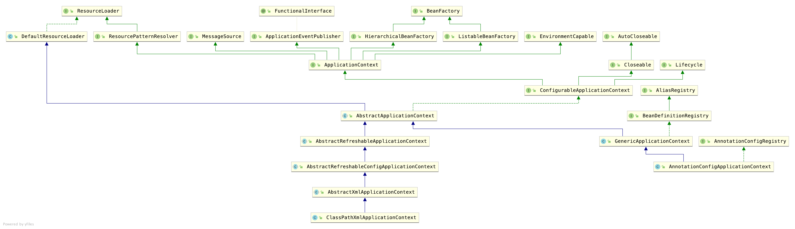

### Spring中重要的概念

### IOC容器
> 关于IOC容器(这个是控制反转)
> &nbsp;&nbsp;&nbsp;&nbsp;搞笑一点的讲,以前自己的老婆各种调教终于是学会了各种花活儿出师了;IOC容器就是洗浴中心,有各种各样的花活儿妹子,只要给钱,我就丢给你一个调教好的出师妹子.
> &nbsp;&nbsp;&nbsp;&nbsp;正经一点讲就是,以前都是自己创建对象,new来new去的,现在有一个IOC容器(就是BeanFactory)按照你的要求根据BeanDefinition给你创建一个你想要的对象.
> &nbsp;&nbsp;&nbsp;&nbsp;如果创建对象的过程中,包含了其他很多对象,便会实例化其中的对象(这个是依赖注入)

#### Bean定义(就是画室中的模特)
>BeanDefinition 这个不是真正的Bean,是bean的定义的接口,提供了很多有用的方法(简直就是bean的get,set方法单独提出来了),比如:
```
作用域常量:单例SCOPE_SINGLETON,原型SCOPE_PROTOTYPE
角色提示说明常量: 0,1,2
设置父类BeanDefinition
设置BeanDefinition中的Bean Class Name
设置延迟加载
设置dependsOn数组(加载依赖)
设置注入候选人
设置主要注入候选人
设置Bean的工厂名称
设置bean工厂方法,这个方法被用来调用构造函数
获取构造方法参数值
获取可变参数值
设置init方法名称(5.1)
设置destroy方法名称(5.1)
设置角色(5.1)
设置描述(人类可读的描述 5.1)
判断是不是单例
判断是不是原型
判断是不是抽象
```


#### Bean工厂(画室)
>DefaultListableBeanFactory 默认的是实现了BeanDefinition的工厂.
>AbstractAutowireCapableBeanFactory这个工厂实现了大部分功能.
```
重要属性:
// 这个叫合并的Bean定义,不是冲突的意思,是一种整合,名称映射Bean定义.
/** Map from bean name to merged RootBeanDefinition. */
private final Map<String, RootBeanDefinition> mergedBeanDefinitions = new ConcurrentHashMap<>(256);
```


#### BeanWapper(画板)
>Bean的制作者,携带着PropertyValues,使用反射方法获取对象实例的.


#### PropertyValues(颜料)
> 多个属性值,填充的时候使用此类
```
系统再加载的时候会添加一些默认的属性
比如List
File
Environment
```


#### BeanPostProcessor定义(后置处理器)
> 后置处理,可以在Bean实例化前后,初始化前后对Bean进行干预修改.其中最重要对两个接口是BeanPostProcessor和InstantiationAwareBeanPostProcessor.


* InstantiationAwareBeanPostProcessor的默认实现类图


#### Aware(词义:醒着,唤醒)
> 实现此类接口的,按照实现类BeanNameAware,BeanFactoryAware,BeanClassLoaderAware,可以取得一些相对应的资源来设置对应的属性,是一种钩子函数方法.


#### ApplicationContext
> 是BeanFactory多扩展,比其多了很多功能.包括国际化,访问资源,AOP,消息(ApplicationEventPublisher)等等.




#### MethodInvocation
> Spring AOP中,方法增强的切面类图

