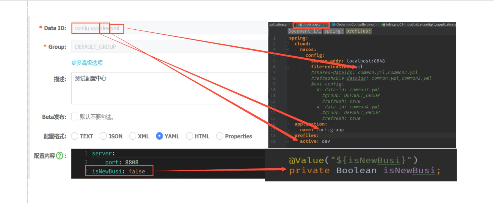

### 注册中心
> 管理微服务的中心
> 包含功能:心跳维护,服务通信.

#### 前篇
##### 一致性算法
* Raft
  * http://thesecretlivesofdata.com/raft/

#### Nacos
> 官方URL,简单使用
https://nacos.io/en-us/docs/quick-start.html
* 服务注册发现
* 配置中心
  * 配置过程与spring bus很类似,支持配置回滚
    * 添加bootstrap.yml(配置文件优先级较高)
    * 如下图,这样可以实时动态修改配置文件的值.
    
    * 自动刷新,要在配置类上加上**RefreshScope**注解

#### Ribbon 客户端负载均衡
> 类似服务管理,负载均衡器
> 其核心重点是自己手写负载均衡的方式.(包括同集群调用,同版本调用.)
* 可以自己写自定义的实现方式.
* 金丝雀发布/灰度发布
Ribbon源码看下?
question:
当我服务启动的过程中,使用Ribbon调用另外的服务资源的时候,常用的想到的initlazing,但是实际上ribbon还没有初始化好,
而且使用方式,是,在restTemplate中有一个list保存了loadBalanceInterpretor接口,通过调用链的方式,调用的
如果此时在实例化bean的时候,想使用ribbon,实际上组件还没加好,是使用不了的.

#### Feign 客户端负载均衡
> 使用Feign与传统的api依赖的不同
* 使用Feign与传统的api依赖的不同
  * 传统发api依赖,需要依赖数据源等一些列冗余的配置
  * 将远程调用接口,抽象出来,通过使用Feign远程调用(此时被服务被注册中心监控管理,相当于Http远程调用,只不过内部网络的,各个服务是被管理状态的.)
* Header请求头,传递.
  * 通过实现feign.RequestInterceptor接口的拦截器方法,将header中的参数传递.
* Feign优化方案
  1. httpclient 开启连接池
  2. loggerLevle basic 日志级别关闭 

#### Eurake

#### Zookeeper
