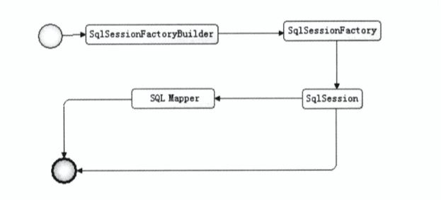
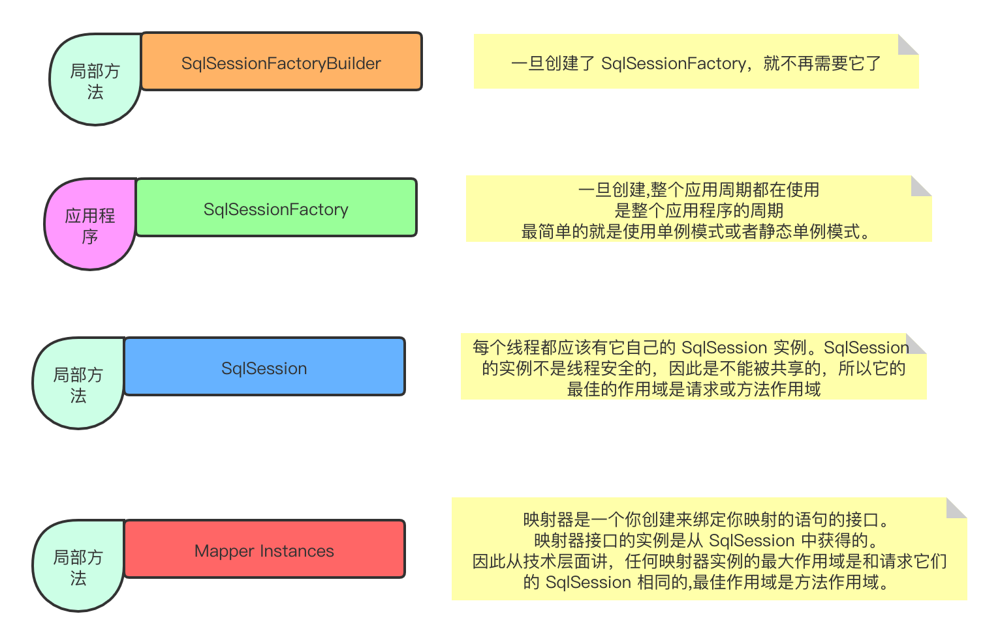
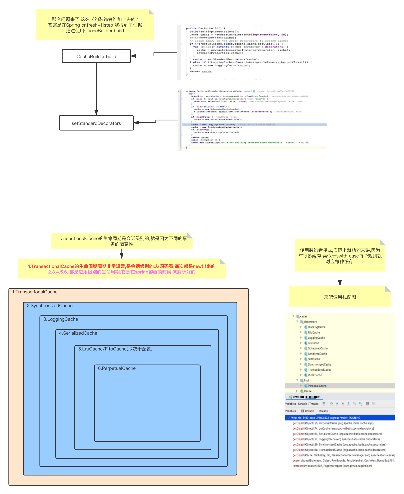
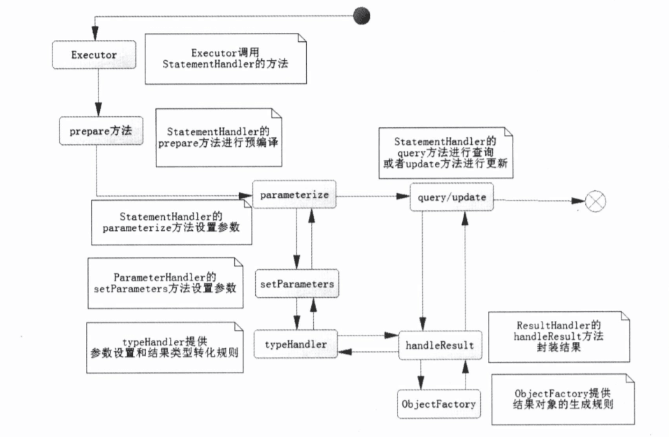
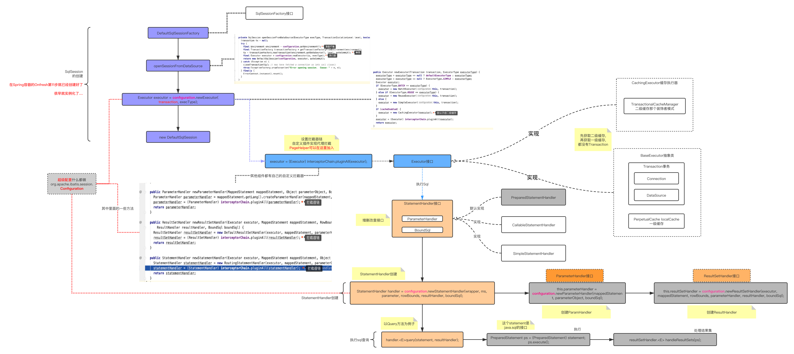
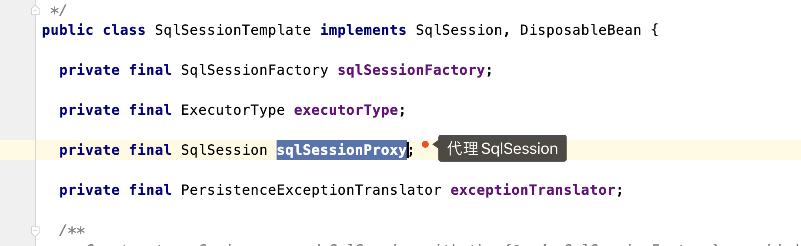
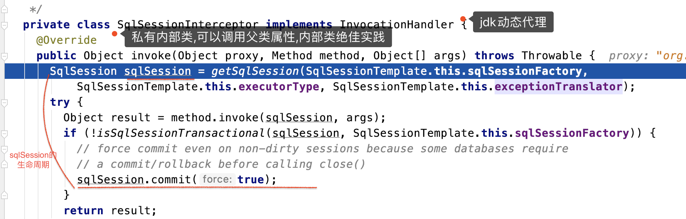
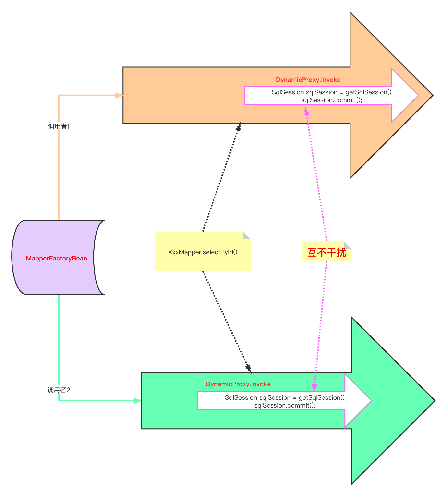

## Mybatis
* Mybaties使用流程图：
    
    * `org.apache.ibatis.session.Configuration`去管理Xml中配置文件或JavaBean配置用来生成SqlSessionFactory(接口)，SqlSessionFactory的实现类有两个：
      * SqlSessionManager
      * DefaultSqlSessionFactory（默认使用这个）
    * SqlSessionFacotry[^1]由SqlSessionFactoryBuilder()[^2].bulid(configuration)创建出来的
    * SqlSession[^3] 使用的是门面模式，其主要用途是：
      * 获取映射器Mapper
      * 直接通过命名去执行SQL返回结果（select，insert，delete，upate）
    * Mapper[^4]映射器，由java接口和XML文件（注解）共同组成
    * 各个组件的生命周期
  

* 一级缓存和二级缓存
  1. 一级缓存(**默认自带的,针对每次会话的**)
     1. 一级缓存,其实是一次Session会话里的**本地Map《Object,Object》**,所以**同一次会话**(同一次请求,同一个方法内,不存在并发问题),**通过key获取的缓存是同一个对象**,一旦这个对象执行update,就会清空这次会话的所有缓存.
  2. 二级缓存(**为了解决不同会话之前的共有的缓存**)
     1. 解决了不同会话共享缓存的问题.
     2. 使用了装饰者模式.(我感觉很像过滤器模式,但是不负责handler,而是负责获取,可能区别于数据流向吧...,另外装饰器模式,是对方法的增强.)
     3. TransactionalCache的生命周期是`会话级别`的.保证了事务的隔离性.
      

* Mybatis中的Configuration其作用类似BeanDefinition,是静态解析的文件结构.
  * SessionFactory通过Configuration来创建Session.

* 配置
  * TypeHandler类型处理器[^5]，作用：JavaType <==> JdbcType
    * 可以自定义实现：特殊处理java中的类型（如枚举）对应到数据库类型，需要使用注解@MappedTypes和@MappedJdbcTypes
  * ObjectFactory，返回结果对象，使用反射获取，默认使用DefaultObjectFactory 
  
* SqlSession下的四大对象
  * Executor是Sql执行器（`有关SQL的来源，是由XML或者注解中获取的，如果是XML获取的对应的就是MappedStatement对象`）
  * StatementHandler，使用数据库的语句来执行，是核心
  * ParameterHandler，参数处理
  * ResultHandler是进行最后的数据集封装和返回
    下面是SqlSession内部运行图
    

  * 不装了摊牌了,我画的图
    

* Spring-Mybatis
> Spring将Mybatis整合的时候,有一点不同
> 基本上一级缓存是失效的,如何让一级缓存生效,使用事物.

* 注意点
  1. Mybatis中的SqlSessionFactory每次获取的都是局部变量的,而Spring整合将会生成一个SqlSessionTemplate(线程安全的)
  2. **MapperFactoryBean**创建的SqlSessionTemplate为啥是线程安全的? 因为这里使用了代理.
     1. 使用了代理
    
     2. 通过内部类代理方法,生成SqlSession,下图可以看到SqlSession的生命周期非常短,这又与直接使用SqlSession相同了.
    
     3. 精辟的总结:**使用代理每次都创建一个新的对象,并且都是用完就干掉,这种思想相当于另外单独开一个线程.父线程是同样的,子线程之间互补影响.**请看下图,是不是很像线程模型.
    
  3. SqlSessionTemplate给我的感觉就是一个Wrapper,自己包装了一层,可以按照自己的逻辑进行操作,要说非要template好像也说得过去.Wrapper从名字上来讲,其实并没有完全可以用,template是一个功能完善,各方面多可以使用的.
  
    
[^1]: SqlSessionFactory的生命周期是整个Mybaties的生命周期，并且是`单例`的
[^2]: SqlSessionFactoryBuilder的生命周期是：一旦生成SqlSessionFactory就会结束
[^3]: 类似Jdbc中的Connection，默认一级缓存的情况下单次请求获得的结果放入缓存，在规定的时间内下次请求从缓存中取，线程不安全，生命周期是：一次数据库请求，并控制实务，每次使用后应当立即关闭
[^4]: 是一个接口，作用是发送SQL,最大生命周期与SqlSession一样
[^5]: TypeHandler,程序的数据类型对应数据库的数据类型