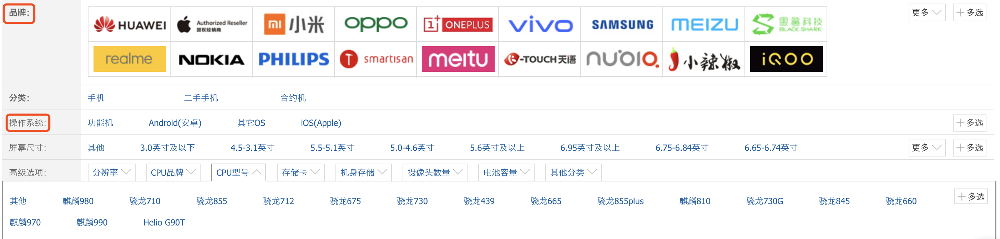
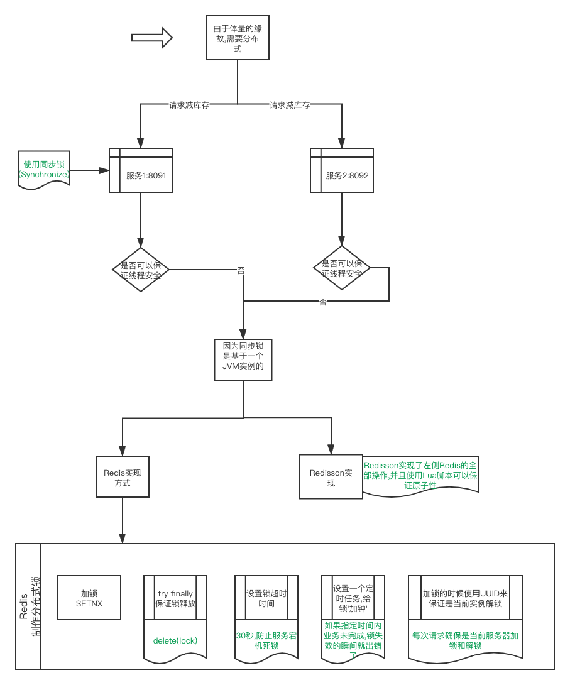

##Redis 
> Redis作为一个可基于内存亦可持久化的日志型、Key-Value数据库.
> redis-cli -h 127.0.0.1 -p 6379 -a pwd 快速连接

#### Redis五种数据类型
##### String
* 应用场景
  * 单值缓存
  ```
    SET key value
    GET key
  ```
  * 对象缓存
  ```
    SET user:1 value(Json格式数据) // 实际上此种方式并不是很好
    MSET user:1:name wangs  user:1:age 18
    MGET user:1:name  user:1:age
  ```
  * 分布式锁
  ```
    SETNX product:1001 true // 返回1代表了成功
    SETNX product:1001 true // 返回0代表了失败
    DEL product:1001
  ```
##### Hash
* 应用场景
  * 对象缓存
  ```
    HMSET user {userId}:name wangs  {userId}:age 18 // 对比上面的批量MSET,此种方式更为优秀
    HMSET user 1:name wangs  1:age 18
    HMGET user 1:name 1:age
  ```
  * 电商购物车
  ```
    以用户Id为key
    以商品Id为fieldId
    以数量为value
        <----->Then<----->
    购物车操作[key = cart:1001(用户1001的购物车), filed=10088(商品id是10088), value=1(值)]
    添加商品->hset cart:1001 10088 1
    增加数量->hincrby cart:1001 10088 1
    商品总数->hlen cart:1001
    删除商品->hdel cart:1001 10011
    获取购物车内所有产品->hgetall cart:1001
  ```
  * 优缺点
    * 优点
      * 同类数据归类整合存贮,方便数据管理
      * 相比string操作,内存和cpu更小
      * 相比string存贮更节空间
    * 缺点
      * 过期功能不能设置在field上
      * Redis集群架构下不适合大规模使用
##### List
> 实际上List其实类似于Java中LinkedList的实现方式,它是有方向的,比如addFirst和addLast,getFirst和getLast.
> List是有正数索引和负数索引的,正数0,1,2,3,...(正数索引从最小是0) 负数...,-4,-3,-2,-1(负数索引从最大是-1)
* 常用操作
  ```
    LPUSH key value [v1,v2...] // 将一个或多个value放入key列表的表头(最左边,addFirst)
    RPUSH key value [v1,v2...] // 将一个或多个value放入key列表的表头(最右边,addLast)
    LPOP key // 移除并返回头元素,getFirst
    RPOP key // 移除并返回尾元素,getLast
    LRANGE key start stop // 取出start 到 stop区间内的数值.
    BLPOP key [k1,k2,...] timeout // 从key列表表头弹出一个元素,若列表中没有元素,则阻塞等待timeout秒,如果timeout=0,一直阻塞等待.
    BRPOP key [k1,k2,...] timeout // 从key列表表尾弹出一个元素,若列表中没有元素,则阻塞等待timeout秒,如果timeout=0,一直阻塞等待.
  ```

* 常用数据结构
  ```
    Stack(栈) = LPUSH + LPOP -> FILO
    Queue(队列) = LPUSH + RPOP
    Blocking MQ(阻塞队列) = LPUSH + BRPOP
  ```
* 应用场景
  * 微博消息和公众号消息流
  ```
    比如我关注了张三和李四.(这种适合小粉丝用户,主动推送的方式,如果粉丝非常多,则变成主动拉去的方式)
    张三发一条微博
    LPUSH msg:{我的id} 消息ID1
    李四发一条微博
    LPUSH msg:{我的id} 消息ID2
    查看最新消息
    LRANGE msg:{我的id} 0 5 获取5条最新的消息.
  ```
##### Set
* 常用操作
  ```
    SADD key member [m1,m2,....] //往集合key中存入元素,元素存在则忽略
    SREM key member [m1,m2,....] //从集合key中删除元素
    SMEMBERS key  //获取key中所有的元素(members)
    SCARD key //获取key中所有元素的个数
    SMEMBER key member //判断member元素是否存在于key中
    SRANDMEMBER key [count] //从key集合中随机获取几个元素,但是不删除
    SPOP key [count] //从key集合中随机获取几个元素,删除元素,适用于抽奖
  ```
* 集合操作
  ```
    SINTER set1,set2,set3 交集
    SUNION set1,set2,set3 并集
    SDIFF set1,set2,set3 差集
  ```
* 应用场景
  * 抽奖
  ```
    点击参与抽奖加入集合
    SADD key {userId}
    查看参与抽奖的所有用户
    SMEMBERS key
    抽取count名中奖者
    SRANDMEMBER key [count] / SPOP key [count] // 前者是不删除,后者删除
  ```
  * 微信,微博点赞,收藏,标签
  ```
    点赞
    SADD like:{消息Id} {用户名Id}
    取消点赞
    SREM like:{消息Id} {用户名Id}
    检查用户是否点过赞
    SISMEMBER like:{消息Id} {用户名Id}
    获取点赞的用户列表
    SMEMBERS like:{消息Id}
    获取点赞用户数
    SCARD like:{消息Id}
  ```
  * 集合操作应用的场景
  ```
    我关注的人 mySet->{a,b,c,you,him}
    你关注的人 yourSet->{b,d,f,me}
    他关注的人 hisSet->{a,b,c,d,e,f,me,you}
        <----->Then<----->
    我和你共同关注的人
    SINTER mySet yourSet
    我关注的人也关注他
    SISMEMBER yourSet him
    我可能认识的人
    SDIFF yourSet himSet
  ```
  * 结合操作实现电商商品筛选(这种方式避免了多个数据库的)
  ```
    下面是筛选条件
    SADD brand:huawei P30    // 品牌
    SADD brand:xiaomi mi-6x  // 品牌
    SADD brand:iPhone iphone9  // 品牌
    SADD os:android P30 mi-6x  // 操作系统
    SADD cpu:brand:inter P30 mi-6x // cpu
    SADD ram:8G P30 mi-6x iphone9 // 内存

    // 高级选项
    SINTER os:android cpu:brand:inter ram:8G ->{P30 mi-6x}
  ```
    

#### Redis其他应用
##### 分布式锁
* 回顾一下,分布式锁为什么需要?

* Redis集群搭建(只有3.0版本以后才支持)
  * 第一步 在/usr/local下创建文件夹 redis-cluster,然后在其下面创建6个文件夹.
    ```
    1. mkdir -p /user/local/redis-cluster
    2. mkdir 8001,mkdir 8002,mkdir 8003,mkdir 8004,mkdir 8005,mkdir 8006
    ```
  * 第二步 把之前的redis.conf配置文件copy到8001下,修改如下内容
    ```
    1. daemonize yes (守护线程启动,就是后台启动)
    2. port 8081(分别对每个机器对端口号进行配置)
    3. bind 192.168.1.10(必须要绑定当前机器的ip,这里方便redis集群定位机器,不绑定可能会出现循环查找集群节点机器的情况)
    4. dir /user/local/redis-cluster/8001(指定数据文件存放位置,必须要指定不同的目录位置,不然会丢失数据)
    5. cluster-enable yes(启动集群模式)
    6. cluster-config-file nodes-8001.conf(这里800x最好和port对应上)
    7. cluster-node-timeout 5000 (5秒超时)
    8. appendonly yes(打开AOF持久化)
    ```
  * 第三步 把修改后的配置文件,分别copy到各个文件夹下,注意每个文件要修改第2,4,6项的端口号,可以批量修改
    ```
    * %s/源字符串/目的字符串/g
    ```
  * 第四步 由于redis集群需要使用ruby命令,所以我们需要安装ruby
    ```
    1. yum install ruby
    2. yum install rubygems
    3. gem install redis --version(安装redis 和 ruby的接口)
    ```
  * 第五步 分别启动6个redis实例,然后检查是否启动成功
    ```
    1. /user/local/redis/bin/redis-server /usr/local/redis-cluster/800*/redis.conf
    2. ps -ef|grep redis
    ```
  * 第六步 在redis3的安装目录下执行redis-trib.rb命令创建整个redis集群
    ```
    1. cd /user/local/redis3/src
    2. ./redis-trib.rb create --replicas 1 192.168.10:8001 192.168.10:8002 192.168.10:8003 192.168.10:8004 192.168.10:8005 192.168.10:8006 (注意 --replicas 1 ,这个 ‘1’ 是master/slave的比值,因为我们每个节点只有1个主节点和从节点,所以比值是1,如果是1个主和2个从,那么就是0.5; 规定的前面的都是主节点8001,8002,8003,后面的都是从节点8004,8005,8006)
    ```
  * 第七步 验证集群
    ```
    1. 连接任意一个客户端即可: ./redis-cli -c -h -p(-c表示集群模式,指定ip地址和端口号) 如:/user/local/redis/bin/redis-cli -c -h 192.168.1.10 -p 800*
    2. 进行验证: cluster info (查看集群信息),cluster nodes (查看节点列表)
    3. 进行数据验证操作
    4. 关闭集群需要逐个进行关闭,使用命令
    ```