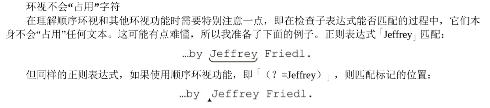
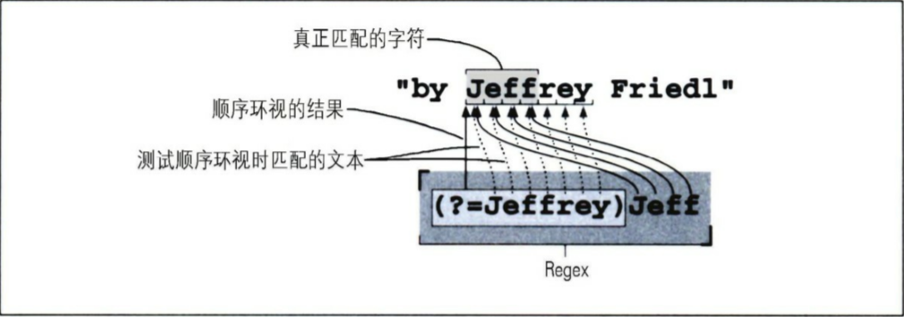
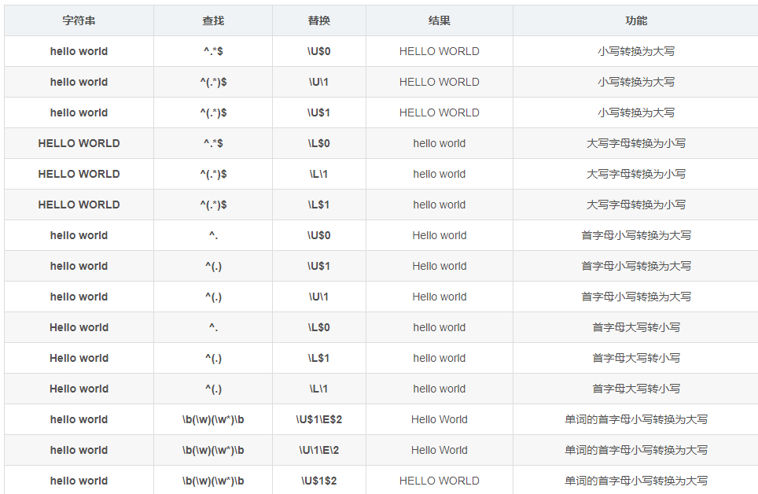

## Regular-Expression  

### 第一章
* `^` 代表行首
* `$` 代表行末
* `[]`代表字符组,表示可以是里面任意的字符,字符组内的字符都是'或'的关系,所以[abcde]代表了a或者b或者c或者d或者e,我理解的字符组,`只能代表一个字符`.
  * `-`字符组内的'-'代表了一个范围,<b>只有在字符组内,`-`才代表元字符.</b>
  * `^`,在字符组内,必须在`[`之后,它才代表<b>排除</b>,其含义是:<b>匹配一个未列出的字符</b>
* `.`代表了任意字符,但是是不在字符组内的时候.请注意在字符组内,[.-/]和[-./]不是一个含义,前者代表了'.'到'/'的字符范围,后者代表了'.','-','/'中的任意一个字符.
* `|`子表达式多选结构,'Bob|Robert'指的是Bob或者Robert,符号`|`两端分别代表了两个子表达式.
  * 注意: n[ai]me和n(a|i)me和n[a|i]me代表的含义不一样,第一个和第二个相等,第三个多了一个字符,而且字符组只能表示一个字符.像liking和liked只能使用子表达式->lik(ing|ed)
* `?`可选项,表示不是必要条件,注意<b>nam?e</b>,其中`?`作用生效的是之前紧挨的元素,此例中是<b>m?</b>,name和nam都可以匹配上,如果想匹配多个元素,可以使用<b>n(am)?e</b>,ne和name都可以匹配上.代表了<b>最多出现一次</b>
* `+`,`*`重复出现选项.
  * `*`代表了可以出现0次以及0次以上
  * `+`代表了可以出现1次以及1次以上
* `{min,max}`指定重复次数,是上面`+`和`*`重复次数的明确版本,比如apache-tomcat-8.5.31.zip ,使用[0-9]{2},可以指定'31',而[0-9]{0,2},可以指定'8','5','31'
* `()`
  * 作用一:将若干个字符组合成一个单元,收到问号,星号等量词作用
  * 作用二:
  * 副作用:增加分组
* `\`反斜杠,转义
* `(?:...)`,叫<b>非捕获型括号</b>,就是此括号用来分组文本,但是不会计入分组
* `\s`代表空白字符
* `\t`代表一个tab
* `\n`代表换行
* `\r`代表回车
* `\S`是`\s`的反义,代表除了空白以外的任意字符
* `\w`代表了[0-9a-zA-Z],就是任意字符
* `\W`代表了`\w`的反义,代表了非字符
* `\d`代表了[0-9],就是任意数字
* `\D`代表了`\d`的反义,代表了非数字
* 环视[^1],匹配<b>位置</b>=>环视不匹配字符,只匹配位置,就与`^`和`$`类似.环视会检查子表达式能否匹配，但它只寻找能够匹配的位置，而不会真正“占用”这些字符.

> 环视的个人理解:因为环视定位的是`位置`[^2],只有当`字符`和`位置`按照顺序满足,才会匹配成功,而定位位置可以使用子表达式,虽然使用的是子表达式(定位一个长串字符),但是也只是**定位`一个`位置**,**类似字符组,只定位一个字符**,所以<i>b>(?=Jeffrey)</b></i>定位的位置是Jeffrey字符中**J**前面的`位置`,如上图;同理<i>b>(?<>=Jeffrey)</b></i>定位的位置是Jeffrey字符中**y**后面的`位置`.只有当字符和位置都匹配上,才会匹配成功.比如(?=Jeffrey)Jeff,**位置**是J前面,**字符**是J,所以Jeff会被匹配上,**下图讲解的非常清楚(注意一共5个点位,全都正确匹配)**;Jeff(?=ry)也是同理,请自行体会.

  * `(?=)`顺序环视,<b>从左往右查看`文本`</b>,当前位置,<b>右边</b>的字符是...则匹配成功,<b>在当前位置右侧附件一个条件</b>.
  * `(?<=)`逆序环视,<b>从右往左查看`文本`</b>,当前位置,<b>左边</b>的字符是...则匹配成功,<b>在当前位置左侧附件一个条件</b>
  * 记忆方法,因为比顺序环视多了一个`<`,意味着,从右往左读取,是逆序的.

### Vs code 超级好用的功能配合正则
1. 先输入正则表达式，在搜索框
2. 在正则表达式的输入框里，按'alt' + 'enter' 即可通过vs code软件选中所有正则匹配的内容，
3. 可复制等一系列操作了

### 函数
#### 大小写
1. \U 将匹配项转为大写(Upper)
2. \L 将匹配项转为小写(Lower)
3. \E 终止转换,转换从\U或\L开始到\E结束之间的字母大小写类型.(End)
例子

[^1]:正则表达式,正确匹配有两个条件.①字符;②位置.
[^2]:什么叫位置?最简单也是最粗暴的理解就是:当我们用电脑的纯文本编译器输入文字的时候,**插入符号**(也叫光标,来源是I-Beam,所以显示类似'I'形状)就是**位置**

