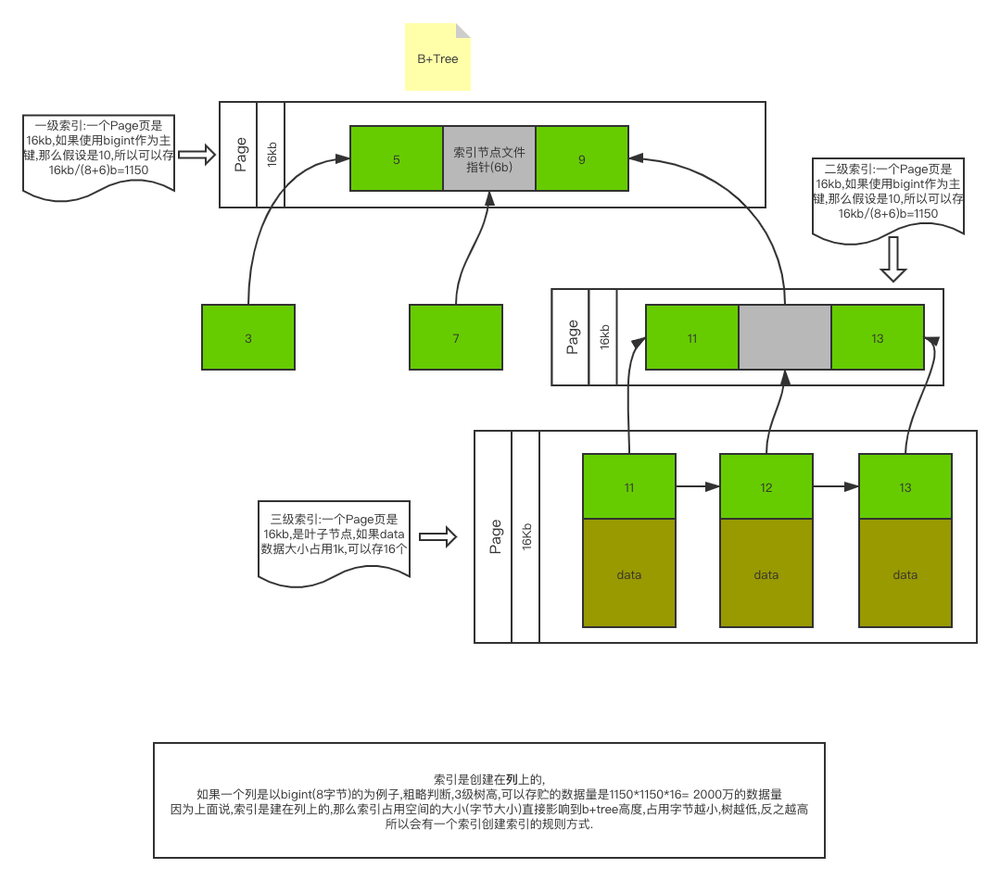
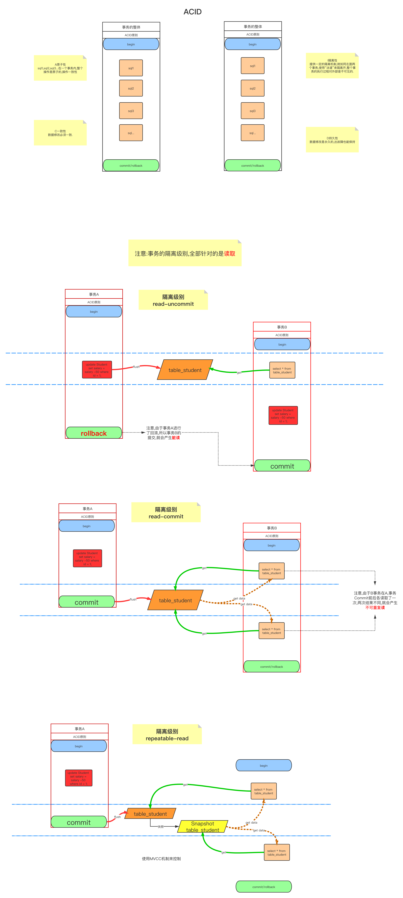

## SQL语法基础

* CASE WHEN
* ORDER BY 可以跟多列，多列排序是根据顺序的
* SUM 求和
* GROUP BY 分组 （可以与聚合函数一起使用）
* MIN和MAX
* AVG
* COUNT
* LIMIT 分页
* UNION ALL 相同列出现多次， UNION相同列出现一次
* INTERSECT 交集  EXCEPT 差集 
* REPLACE

## 规模正规的公司SQL细节
* 为保证数据的唯一性，建立唯一索引UNIQUE INDEX,但是一般写成UNIQUE KEY
* 数据库的值要填写默认的值
* 同一部分业务逻辑的字段尽量放在一起，时间类字段尽量放在后面，查询的时候便于查询
* 时间戳类型，一般是成对儿出现，add_time和update_time,update——time要加上ON UPDATE CURRENT_TIMESTAMP
```
  下面是经过多次检查通过的，以后尽量规范
  CREATE TABLE `boss`.`boss_area_city`  (
    `id` bigint(20) NOT NULL COMMENT '主键',
    `city_code` int(11) NOT NULL DEFAULT 0 COMMENT '城市编码',
    `open_status` tinyint(1) NOT NULL DEFAULT 0 COMMENT '开放状态 1开发 0 关闭',
    `admin_id` bigint(20) NOT NULL DEFAULT 0 COMMENT '操作人id',
    `add_time` datetime(0) NOT NULL DEFAULT CURRENT_TIMESTAMP COMMENT '创建时间',
    `update_time` timestamp(0) NOT NULL DEFAULT CURRENT_TIMESTAMP ON UPDATE CURRENT_TIMESTAMP(0) COMMENT '更新时间',
    PRIMARY KEY (`id`),
    UNIQUE KEY `uniq_citycode`(`city_code`) USING BTREE
  ) ENGINE = InnoDB CHARACTER SET = utf8mb4 COMMENT = 'BOSS地区城市开放表';
```

## 磁盘基础知识与MySql
* 扇区,扇区是磁盘中最小的存贮单位.一般是512b大小.
* 块/簇,windows系统之中叫簇;Linux中叫块(block),每个块/簇都可以包括2、4、8、16、32、64…2的n次方个扇区
* MySql类似,只不过是16kb是最小单位称为`页`,连续的页称为`区`,整个ibd(实际上就是一个表)称为一个`段`
* mysql中information_scheme包含了mysql中全局数据信息,其中的tables表包含了引擎,库名,表名等一系列的信息.


## SQL索引
* 索引是什么?简单来讲就是书的目录,实际上是指排好序的数据机构(二叉树,B-Tree,Hash,红黑树)
* 索引的存储结构是kv结构的
  * k代表了索引代表的值
  * v是磁盘那条数据结构的地址.
* 索引类型
  ```
  * B树(二叉树,B-Tree,红黑树)
  * Hash
  * GIS(地理位置索引)
  * Full Text(myisam支持的char,varchar,text数据类型,代替Like %% 效率低下的问题.)
  ```
* 二叉树不能做索引的原因:
  ```
  因为边缘数字(最左,最右)是最大数值log以2为底n底对数,而中间又是最小的1,是不平衡树.
  ```
* B+Tree,不仅可以提供平衡的树高度,而且支持`范围查询`(<>,<,>,<=,=>)

* 存储引擎是最终落实到表上的(Innodb,Myisam等),是指的是这个表在磁盘上的存贮方式.
  ```
  * 比如Myisam存贮引擎会有3个文件,分别是frm,MYD和MYI,第一个是表结构,第二个存贮引擎结构(Myisam Data),第三个是存贮数据(Myisam Index);
  * Innodb,会有两个frm和ibd文件,第一个是表结构,第二个是索引加数据的存贮文件.
  ```
* 索引可以存贮的数据量大小
  * `SHOW GLOBAL STATUS LIKE 'innodb_page_size'`会显示出当前搜索引擎page页大小,mysql默认是16kb(16384b)
  * 下面图解是解释了索引最大存贮数据量的计算方式以及对树高对影响
  
* 聚集索引和非聚集索引(辅助索引)`(数据与索引存贮在一起的就是聚集索引,数据指针与索引一起存贮的结构就叫做非聚集索引.)`
  ```
  * 聚集索引是硬盘上存贮的有序的数据页(Page 16Ksize),因此会很快,直接关系到磁盘空间地址的,并且唯一,非Null
  * 那到底什么是聚集索引?
    B+tree叶子节点是世界存贮数据的,但是myisam是叶子节点存的是MYI和MYD连个文件,MYI是索引,MYD是数据,数据和索引不聚合在一起,所以myisam即使是主键也不是聚集索引.
    但是innodb不同,innodb主键的B+tree叶子节点是存贮的完整的单条行的数据,数据和索引在一起,所以被称为聚集索引.
  * 辅助索引,叶子节点存储的是主键的值.数据一致性,减少空间.
  ```
* 使用DESC或者EXPLAIN查看SQL的执行计划时候,会有`id`这个列,这个**列**
  `数字越大越先执行`
  `同样的数字从上往下执行`.
* **使用DESC或者EXPLAIN查看SQL的执行计划时候,会有几个关键`列`**
  ```
  * type(从上至下,越来越好)
    * all 未执行索引.
    * index 查询全部索引中的数据 (不加条件直接查询索引列 select index_id from table;) 
    * range 检索指定范围的行，查找一个范围内的数据，where后面是一个范围查询 （between,in,or,> < >=); 
    * ref 非唯一性索引：对于每个索引键的查询，返回匹配的所有行（可以是0，或多)
    * eq_ref 一般是where condi = param 常见于唯一索引和主键索引
    * const 只是理想类型，基本达不到
    * system 只是理想类型，基本达不到
  * key 执行索引 会显示索引名字
  * key_len 执行索引的长度(如果是联合索引,可以根据key_len执行的长度,判断执行了几个索引条件),如果是联合索引可以帮助查看具体执行了哪些索引字段
    * 计算公式
    * 字符串 
      * char(n) n字节长度
      * varchar(n) 2字节存贮字符串长度,如果是utf-8 则长度是3n+2
    * 数值类型
      * tinyint  1字节
      * smallint 2字节
      * int 4字节
      * bigint 8字节
    * 时间类型
      * date 3字节
      * timestamp 4字节
      * dateime 8字节
    * 如果字段允许为Null,则需要1字节记录是否为Null.
  * rows 行数(这个是估计值,对比真实的数据比较相近,但不是真实的数据)
  * ref
    * const(常量)
    * file_name(字段名)
  * extra (额外的)
    * using index : 查询的列是索引了列,覆盖索引(Select关键字后的字段是索引字段.)
    * using where : 查询的列,不是索引列
    * using index condition : 查询的列不完全是索引了列,where条件是前导列(联合索引的第一个就是前导列)范围查找.
    * using temporary: 使用临时表.这种情况一般要优化.
      * 使用distinct去重的时候,如果去重列是索引列,则是using index,否则就是using temporary.(优化原则,字段加索引.)
    * filesort,filesort是非常耗时的,所以常用的优化手段是:将排序列与查询条件列做连个索引,并且条件列放在联合索引的后面,比如index(condiA, orderB)
    * Select talbes optimized away: 使用某些聚合函数(max,min)来访问存在索引的某个字段.
    * Using temporary 这个也是需要进行优化的。
    * Using join buffer 循环嵌套。
    * ...
  ```
* **filesort文件排序原理详解**
  ```
  使用sort buffer排序(默认大小1M)
  *单路排序: 一次性取出满足条件行所有的字段,然后放在sort buffer中进行排序,使用trace工具可以看到sort_mode信息里是<sort_key,additional_fields>或者<sort_key,packed_additional_fields>
  *双路排序(又叫回表排序): 是先根据条件取出相应的`排序字段`和`可以直接定位行数据的行id`,然后在sort buffer中进行排序,排序完后需要再次取回其他需要的字段;trace工具可以看到sort_mode信息里是<sort_key,rowid>
  *Mysql可以通过比较系统变量max_length_for_sort_data(默认是1024字节)来和需要查询的字段总长度来比较选择使用那种排序.
  max_length_for_sort_data > 查询的总字段长度  单路排序
  max_length_for_sort_data < 查询的总字段长度  双路排序
  ```
* Innodb推荐使用数字,因为数字的排序要比UUID的排序简单,占用空间少.
* Innodb推荐自增主键,因为B+Tree是排序树(Balance Tree),叶子节点是经过排序的,使用自增新增的数据会放在后面,不会分叉,可以提高索引的插入速度.
* 联合索引,`最左法则`.如果搜索条件没有第一个条件,则无法使用联合索引.
  ```
  * 原因是因为,B+Tree是平衡树,是排序树,缺少了第一个条件,第二个条件无法排序,缺少了第一个条件,相当于前面的条件没有,就会全表扫面.
  * 如果有(a,bc,)三个列组成的联合作引,搜索条件有
      a 走索引 a
      c 全表扫描
      b 全表扫描
      ab 走索引 ab
      ac 走索引 a
      bc 全表扫描 
      abc 走索引
  ```


## SQL索引优化
### 普通查询
* 使用union all 来代替 IN 或者 OR 是因为将 range 变为 ref,从而加快速度.
* 如果有`order by` 或者 `group by` 或者 `distinct`时,那么会额外的使用filesort进行排序浪费性能,最好的方式是使用`联合索引`,将排序字段作为联合索引的后面
  ```
    如: select * from table1 where a = '' order by b; 
    那么建立索引就要使用 
    alter table table1 add key 'combineIndex'('a','b');
  ```
* group by和order by的优化条件是一毛一样的.
  ```
  本质上是先排序后分组,遵照索引创建顺序的最左前缀法则.
  对于group by的优化,如果不需要排序可以添加order by null禁止排序.* 注意此方法对sqlserver不起作用,因为sqlserver已经默认不排序了.
  ```
* group by having , having后面的条件是不会走索引的.所以优化是,尽量将条件写在`where`里.
* 联合索引如果有范围索引（between,in,or,> < >=),只会走range索引,后面的索引条件不会走,所以range索引条件放在最后面执行.
* 查询条件上进行运算是不会走索引的,另外`使用函数`也是不走索引的.
  ```
    比如:
    select * from table1 where id - 1 = 9;
  ```
* NOT IN 对于辅助索引是不执行的,但是对于聚集索引依然执行.
* 索引不能使用范围查询后面的列(> = <等等)
* 尽量使用`覆盖索引`(Select 列都是索引列)
  ```
    优化:
    select index_row where index_row = xxx
  ```
* `mysql使用不等于`(!=或者<>)会全表扫描
* `is null,is not null` 全表扫描
* `like ‘%xxx’` 不走索引(但是myisam索引引擎会走)或者使用`覆盖索引`
  ```
    优化:
    select index_row where index_row like '%xxx'
  ```
* `字符串不加单引号''`,也不会走索引,原因是mysql会默认执行一个函数,所以就不会走了.
* `少用or或者in`,不一定会走索引.
* `范围索引查询优化`,内部会有很多评估因素,时而走索引,时而不走索引.[SQL分析](Mysql分析.md)
* `查找是否存在` SELECT count(*) FROM table WHERE a = 1 AND b = 2
  ```
    优化后，可减少其他条目的统计。
    SELECT 1 FROM table WHERE a = 1 AND b = 2 LIMIT 1
  ```
### 复杂查询
* 分页查询优化
  * 原因:
  select * from table limit 10000,5 ,`没有使用索引`,`并且是查询了10005行,丢弃了10000行`,所以数据量越大,越消耗性能.
  * 优化
    * ~~如果分页是按照自增主键来的,并且没有丢失数据的情况下,可以将分页写成 id > 10000 limit 5.基本上此种优化条件不可用~~
    * 使用`覆盖索引`
    ```
    // 尽量使用`覆盖索引`(Select 列都是索引列), 自查询中的id就是索引列,所以速度大大提升.
    SELECT * FROM a INNER JOIN (SELECT id FROM WHERE name = 'xxx' LIMIT 10000,5) b ON a.id = b.id
    ```
* Join关联优化
  * 表关联的常见两种算法(假设有两个表,**表A一万条数据**,**表B一百条数据**)
    * Nested—Loop Join(针对链接有索引的链接字段)
    ```
    SELECT * FROM tableA a INNER JOIN tableB b ON a.id = b.id;
    选择数据量小的表,进行一次全表扫描,比如表b数量只有100行.
    扫描表b全表100行.
    取出表b中每行字段id,在表a中进行索引查找100次,表a进行了100行扫描
    所以总扫描次数是 表b + 表a = 100全表扫描 + 100次索引查找 = 200行.
    ```
    * Block Nested—Loop Join
    ```
    SELECT * FROM tableA a INNER JOIN tableB b ON a.name = b.name;
    表b和表a全扫描100 + 10000 = 10100次
    将表b结果放入join buffer
    表a的每一条数据与join buff中表b的数据逐行的比较
    最终次数是:100与10000进行查找,进行 `100 * 10000 + 100 + 10000 次`
    ```
  * 优化
    * 关联字段加索引,尽量使用Nested—Loop Join算法
    * 小表驱动大表,写多表链接的sql时候,明确知道哪张是小表,写成straight_join写法固定链接驱动方式,省去mysql优化器自己判断的时间.但是一般情况不要用.
    ```
      straight_join只是适用于inner_join,不适用left join 和 right join
      SELECT * FROM tableB b STRAIGHT_JOIN tableA a ON a.`name` = b.`name`;
      解释一下,表b是小表,表a是大表. 大表,小表指的是参与关联的数据量.
      小表写在前面,大表写在后面.
    ```
* In和Exsits优化
  * 优化原则:`加索引`;`小表驱动大表`(小的数据集驱动大的数据集)
  * In tableB的结果集要小于tableA的结果集
    ```
      select * from tableA where id in (select id from tableB)
      等价于:
      for(select id from tableB){
        select * from tableA where tableB.id = tableA.id;
      }
    ```
  * Exsits tableA的结果集要小于tableB的结果集
    ```
      select * from tableA where id in (select id from tableB)
      等价于:
      for(select id from tableA){
        select * from tableB where tableB.id = tableA.id;
      }
    ```
* Count(*)
  * Count(1);// 也是扫的非聚集索引,但是因为不会进行解码解析,所以要小于Count(name)
  * Count(id);// 扫描聚集索引, `一般认为聚集索引存贮的数据比较多,Count的时候其实不如Count非聚集索引快`
  * Count(name);// 扫描非聚集索引; Count尽量不要count非主键,因为Null会被忽略.
  * Count(*)
  * 结论优到劣 count(1)>count(name)==count(*)>count(id)
  * MySql5.7版本推荐使用count(*)
  * 优化方案
    ```
    1.如果是mysaim存储引擎,极快(但是不支持事务就...)
    2.如果只是要一个估算值,使用 show table status like 'table_name' 极快.
    3.将总数维护到Redis里(incr或decr).但是有可能不准,很难保证事务一致性.
    4.增加数据库计数表.放在一个事务里操作(一个数据库内的,不是分布式事务,容易很多.)
    ```
## MySQL锁和事务隔离级别.
### 锁
* 从性能上分为乐观锁和悲观锁
  ```
  * 乐观锁: 表中加一个字段version,查询出来,跟新的时候,where条件判断版本号是否一致.
  * 悲观锁:
    * 读锁:共享锁,针对同一份数据,多个读操作可以同时进行而不会互相影响 read 🔒 write
    * 写锁:排它锁,当前操作没有完成,阻断其他所有的写锁和读锁. write 🔒 read & write
  * 从数据操作粒度分: 表锁和行锁.
  ```
  * 表锁,每次锁住整张表.开销小,加锁快;粒度大;不会出现死锁,发生锁冲突大概率最高,并发度低;
  * 行锁,锁一行,开销大,枷锁慢,`会出现死锁`,发生锁冲突度概率最低,并发度最高.
    InnoDB与MyISAM最大度**两点不同**
    `支持事务`
    `支持行级锁`
### 事务
> Sql的查询,都必须是走事务的,比喻来讲,事务是管道,必须有管道才能查询数据,获取数据流.
* 并发执行会出现度问题.
  * 更新丢失
  * 脏读:事务A读取了事务B修改但未commit的数据.
  * 不可重复读:事务A读取了事务B`修改`的数据.
  * 幻读:事务A读取了事务B`新增`的数据.
* 隔离级别
  * read uncommit
  * read commit
  * repeatable read
  * serializable


## 数据库分库
* 数据库分片,修改scheme.xml文件.
* 如果有关联表操作,那么分片的表有两种方式:全局表或者ER分片(父子分片)
### 分库分表工具
* sharding，客户端，jar包级别
* mycat，中间件，需要单独部署
### 分库分表的时机
* 停机分库分表
  * 后台临时程序，刷数据到对应的表刷新
* 不停机双写方案
  * 修改入库代码，同时写老库和新库
  * 对数据库的里数据进行比较，比较更新时间，如果老库要比分库数据要新，就直接覆盖
  * 检查数据是不是一摸一样
### 分库分表全局Id
* 单独搞一个库，全局的生成自增主键Id。缺点的并发量很低。
* uuid，太长了，不适合做主key。
* 系统当前时间，但高并发并不合适
* snowflake算法，twitter开源分布式id算法（系统时间，服务id+机房id+业务主键）

### MySql读写分离
* 读写分离
* 实现读写分离
* 主从复制原理
  * 主库bin.log，从库拉取bin.log,从库IO线程把差量给到relay.log，放入cache缓存，SQL线程读取缓存，刷数据，此过程是`串行化`的
  * 从库拉取时间，以及sql线程从缓存的刷数据是单线程的，比较耗费的时间。
* 如何解决主从同步延迟问题
  * 主库的写并发量还是要看，
    * 当写并发到1000/s，从库有几毫秒的延迟，
    * 2000/s，会有几十毫秒。
    * 4000/s,6000/s,8000/s主库要挂了，会有几秒的延迟
  * 主库宕机，但是从库还未同步，所以会丢失数据
    * mysql有一个机制就是，半同步复制，就是从库将binlog日志写入后，从库同步日志写入到自己本地的relaylog后，返回一个ack，主库才会认为写入成功，保证数据不会丢失。
  * 如何解决主从延迟？
    * 一个主库，拆分主库，降低写并发【根本的方式】
    * 可以打开mysql并行复制，但是并行复制，并`不能解决`，可以降低概率
    * `查询代码，产生的问题。【插入，查询，更新】，改为【插入】`代码可以避免
    * 直连主库，但是不推荐，丧失读写分离的意义。
    * 热点数据redis缓存【自己想的，可能不完善】


### MySql5.7安装
* https://blog.csdn.net/cool_summer_moon/article/details/106090136