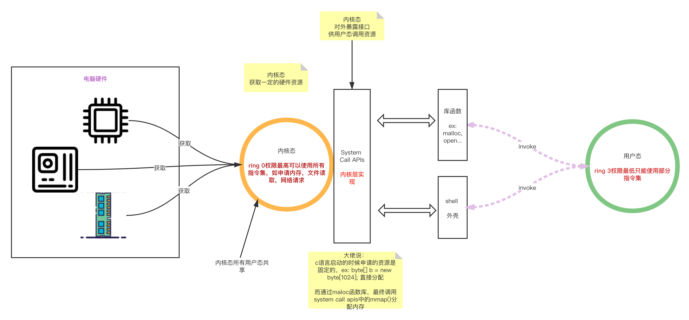

## Unix操作系统
> 记录一下操作系统的常用知识。

#### 根目录 (/) 的意义与内容
目录名称 | 全名 |  含义  
-|-|-
/bin | binary | 系统有很多放置执行文件的目录，但/bin 比较特殊。因为/bin 放置的是在单维护模式下还能够被操作的指令。 在/bin 底下的挃令可以被 root 不一般账号所使用，主要有：cat, chmod, chown, date, mv, mkdir, cp, bash 等等常用的指令。|
/boot| boot | 这个目录主要在放置开机会使用到的档案，包括 Linux 核心档案以及开机选单不开机所需配置文件等等。 Linux kernel 常用的档名为：vmlinuz，如果使用的是 grub 这个开机管理程序， 则还会存在/boot/grub/这个目录喔！|
/dev | device | 在Linux系统上,任何装置与接口设备都是以档案的型态存在二这个目录当中的。你只要透过存取这个目录底下的某个档案，就等二存取某个装。 比要重要的档案有/dev/null, /dev/zero, /dev/tty, /dev/lp*, /dev/hd*, /dev/sd*等等 |
/etc|etcetera|系统主要的配置文件几乎都放置在这个目录内，例如人员的账号密码文件、 各种服务的启始档等等。一般来说，这个目录下的各文件属性是可以让一般使用者查阅的，但是只有root有权力修改。FHS建议不要放置可执行文件(binary)在这个目录中喔。比较重要的档案有： /etc/inittab, /etc/init.d/, /etc/modprobe.conf, /etc/X11/,/etc/fstab, /etc/sysconfig/ 等等。另外，其下重要的目录有。/etc/init.d/：所有服务的预设启动script都是放在这里的，例如要启动或关闭iptables 的话：『 /etc/init.d/iptables start』、『/etc/init.d/iptables stop』;/etc/xinetd.d/：这就是所谓的 super daemon 管理的各项服务的配置文件目录;/etc/X11/：不 X Window 有关的各种配置文件都在这里，尤其是 xorg.conf这个 X Server 的配置文件。|
/home|home|这是系统默认的用户`家目录`(home directory)。在你新增一个一般使用者账号时， 默认的用户目录都会规范到这里来。比较重要的是，家目录的代表符号：~：代表目前这个用户的家目录
/lib|library|系统的函式库非常的多，而/lib 放置的则是在开机时会用到的函式库， 以及在/bin 戒/sbin 底下的指令会呼叫的函式库而已。什么是函式库呢？妳可以将他想成是『外挂』，某些指令必项要有这些『外挂』才能够顸利完成程序的执行之意。 尤其重要的是/lib/modules/这个目录， 因为该目录会放置核心相关的模块(驱动程序)喔！
/media|media|media 是『媒体』的英文，顾名思义，这个/media 底下放置的就是可移除的装置啦！ 包括软盘、光盘、DVD 等等装置都暂时挂载于此。常见的档名有：/media/floppy, /media/cdrom 等等。
/mnt|mount|如果妳想要暂时挂载某些额外的装置，一般建议妳可以放置到这个目彔中。 在古早时候，这个目录的用途不/media 相同啦！只是有了/media 乀后，这个目彔就用来暂时挂载用了。
/opt|option|这个是给第三方软件放置的目录。什么是第三方协力软件啊？ 丼例来说，KDE这个桌面管理系统是一个独立的计划，不过他可以安装到 Linux 系统中，因此 KDE的软件就建议放置到此目录下了。另外，如果妳想要自行安装额外的软件(非原本的distribution 提供的)，那么也能够将你的软件安装到这里来。不过，以前的 Linux 系统中，我们还是习惯放置在/usr/local 目录下呢！
/root|root|系统管理员(root)的家目录。之所以放在这里，是因为如果进入单人维护模式而仅挂载根目录时，该目录就能够拥有root的家目录，所以我们会希服root的家目录与根目录放置在同一个分割槽中。
/sbin|superuser binary|Linux 有非常多指令是用来设定系统环境的，这些指令只有 root 才能够利用来『设定』系统，其他用户最多只能用来『查询』而已。放在/sbin 底下的为开机过程中所需要的，里面包括了开机、修复、还原系统所需要的指令。至于某些服务器软件程序，一般则放置到/usr/sbin/当中。至于本机自行安装的软件所产生的系统执行文件(system binary)， 则放置到/usr/local/sbin/当中了。常见的指令包括：fdisk, fsck,ifconfig, init, mkfs 等等。
/srv|service|srv 可以规为『service』的缩写，是一些网络朋务吪劢乀后，这些朋务所需要取用的数据目录。 常见的服务例如 WWW, FTP 等等。比例来说，WWW 服务器需要的网页资料就可以放置在/srv/www/里面。
/tmp|temporary|这是让一般用户或者是正在执行的程序暂时放置档案的地方。这个目录是任何人都能够存取的，所以你需要定期的清理一下。当然，重要数据不可放置在此目录啊！ 因为FHS 甚至建议在开机时，应该要将/tmp 下的数据都删除唷！
/proc|process|这个目录本身是一个『虚拟文件系统(virtual filesystem)』它放置的数据都是在内存当中， 例如系统核心、行程信息(process)、周边装置的状态及网络状态等等。因为这个目录下的数据都是在内存当中， 所以本身不占任何硬盘空间啊！比较重要的档案例如：/proc/cpuinfo, /proc/dma, /proc/interrupts,/proc/ioports, /proc/net/* 等等。
/sys|system|这个目录其实跟/proc 非常类似，也是一个虚拟的文件系统，主要也是记录与核心相关的信息。包括目前已加载的核心模块与核心侦测到的硬件装置信息等等。这个目录同样不占硬盘容量。
/usr|Unix Software Resource|用户程序目录，所有系统默认的软件(distribution 发布者提供的软件)都会放置到/usr 底下，因此这个目录有点类似 Windows 系统的『C:\Windows\ + C:\Program files\』这两个目录的综合体，系统刚安装完毕时，这个目录会占用最多的硬盘容量
/var|variable|变量文件,如果/usr是安装时会占用较大硬盘容量的目彔，那举/var就是在系统运作后才会渐渐占用硬盘容量的目录。因为/var 目彔主要针对常态性变动档案，包括快取(cache)、登彔档(log file)以及某些软件运作所产生的档案，包括程序档案(lock file, run file)，或者例如 MySQL 数据库的档案等等

/usr目录
目录名称 | 全名 |  含义  
-|-|-
/usr/bin/||绝大部分的用户可使用指令都放在这里！请注意到他与/bin 的不同之处。(是否不开机过程有关)
/usr/include/||c/c++等程序语言的档头(header)与包含档(include)放置处，当我们以 tarball方式 (*.tar.gz 的方式安装软件)安装某些数据时，会使用到里头的讲多包含档喔！
/usr/lib||包括各应用软件的函式库、目标档案(object file)，以及不被一般使用者惯用的执行档或脚本(script)。 某些软件会提供一些特殊的指令来进行服务器的设定，这些指令也不会经常被系统管理员操作，那就会被摆放到这个目录下啦。要注意的是，如果你使用的是 X86_64 的 Linux 系统， 那可能会有/usr/lib64/目录产生喔！
/usr/local||系统管理员在本机自行安装自己下载的软件(非distribution默认提供者)，建议安装到此目录，这样会比较便二管理。举例来说，你的 distribution 提供的软件较旧，你想安装较新的软件但又不想移除旧版，此时你可以将新版软件安装二/usr/local/目录下，可不原先的旧版软件有分别啦！ 你可以自行到/usr/local 去看看，该目彔下也是具有 bin, etc, include, lib...的次目录
/usr/sbin||非系统正常运作所需要的系统指令。最常见的就是某些网络服务器软件的服务指令(daemon)
/usr/share/||放置共享文件的地方，在这个目录下放置的数据几乎是不分硬件架构均可读取的数据， 因为几乎都是文本文件嘛！在此目彔下常见的还有这些次目录：/usr/share/man：联机帮助文件；/usr/share/doc：软件杂项的文件说明；/usr/share/zoneinfo：与时区有关的时区档案
/usr/src||一般原始码建议放置到这里，src有source 的意思。至于核心原始码则建议放置到/usr/src/linux/目录下。

/var目录
目录名称 | 全名 |  含义  
-|-|-
/var/cache||应用程序本身运作过程中会产生的一些暂存档；
/var/lib||程序本身执行的过程中，需要使用到的数据文件放置的目录。在此目录下各自的软件应该要有各自的目录。 举例来说，MySQL 的数据库放置到/var/lib/mysql/而rpm 的数据库则放到/var/lib/rpm 去！
/var/lock||某些装置或者是档案资源一次只能被一个应用程序所使用，如果同时有两个程序使用该装置时， 就可能产生一些错误的状况，因此就得要将该装置上锁(lock)，以确保该装置只会给单一软件所使用。 举例来说，刻录机正在刻录一块光盘，你想一下，会不会有两个人同时在使用一个刻录机烧片？ 如果两个人同时刻录，那片子写入的是谁的资料？所以当第一个人在刻录时该刻录机就会被上锁，第二个人就得要该装置被览除锁定(就是前一个人用完了)才能够继续使用。
/var/log||重要到不行！这是登录文件放置的目录！里面比较重要的档案如/var/log/messages, /var/log/wtmp(记彔登入者的信息)等。
/var/mail||放置个人电子邮件信箱的目录，不过这个目录也被放置到/var/spool/mail/目录中！ 通常这两个目录是互为链接文件啦！
/var/run||某些程序或者是服务启动后，会将他们的PID放置在这个目录下， 至于PID的意义我们会在后续章节提到的。
/var/spool||这个目录通常放置一些队列数据，所谓的『队列』就是排队等待其他程序使用的数据啦！ 这些数据被使用后通常都会被删除。比例来说，系统收到新信会放置到/var/spool/mail/中， 但使用者收下该信件后该封信原则上就会被删除。信件如果暂时寄不出去会被放到/var/spool/mqueue/中， 等到被送出后就被删除。如果是工作排程数据(crontab)，就会被放置到/var/spool/cron/目录中！


#### 其他学习
* proc目录是虚拟化进程，程序启动过后，会产生一个进程id，比如pid=20912，就会在对应的proc下有一个20912的文件夹。

#### 配置文件
* /etc/sysctl.conf
```
    # Kernel sysctl configuration file for Red Hat Linux
    #
    # For binary values, 0 is disabled, 1 is enabled.  See sysctl(8) and
    # sysctl.conf(5) for more details.

    kernel.core_uses_pid = 1
    // 该文件指定了从一个进程发送到另一个进程的消息最大长度
    kernel.msgmax = 65536
    // 该文件指定在一个消息队列中最大的字节数 缺省设置：16384。
    kernel.msgmnb = 65536
    kernel.sem = 250 64000 32 256
    kernel.shmall = 16777216
    // 该参数定义了共享内存段 的最大尺寸
    kernel.shmmax = 68719476736
    // 该参数表示统一一次可以使用的共享内存总量（以页为单位）。默认是2097152，通常不需要修改
    kernel.shmmni = 4096
    kernel.sysrq = 0

    // 表示SYN队列的长度，默认为1024，加大队列长度为32768，可以容纳更多等待连接的网络连接数。  
    net.core.netdev_max_backlog =  32768
    // 接收套接字缓冲区大小的默认值(以字节为单位)。
    net.core.rmem_default = 8388608
    // 接收套接字缓冲区大小的最大值(以字节为单位)
    net.core.rmem_max = 16777216
    // 定义了系统中每一个端口最大的监听队列的长度（该内核参数默认值一般是128），对于负载很大的服务程序来说大大的不够。一般会将它修改为2048或者更大。
    net.core.somaxconn = 32768
    // 发送套接字缓冲区大小的默认值(以字节为单位)
    net.core.wmem_default = 8388608
    // 发送套接字缓冲区大小的最大值(以字节为单位)。
    net.core.wmem_max = 16777216
    net.ipv4.conf.default.accept_source_route = 0
    net.ipv4.conf.default.rp_filter = 1

    // 表示开启路由功能，0是关闭，1是开启
    net.ipv4.ip_forward = 0
    //　设置系统　允许系统打开的端口范围
    net.ipv4.ip_local_port_range = 39999 65000
    net.nf_conntrack_max=655360
    net.netfilter.nf_conntrack_tcp_timeout_established = 1200
    // 探测消息未获得响应时，重发该消息的间隔时间（秒）。系统默认75秒
    net.ipv4.tcp_keepalive_intvl = 60

    //在认定连接失效之前，发送多少个TCP的keepalive探测包。系统默认值是9。这个值乘以tcp_keepalive_intvl之后决定了，一个连接发送了keepalive探测包之后可以有多少时间没有回应。
    net.ipv4.tcp_keepalive_probes = 5


    // 表示当keepalive起用的时候，TCP发送keepalive消息的频度。默认是2小时，改为300秒
    net.ipv4.tcp_keepalive_time = 1800
    net.ipv4.tcp_max_orphans = 3276800
    net.ipv4.tcp_max_syn_backlog = 65536
    net.ipv4.tcp_mem = 94500000 915000000 927000000
    net.ipv4.tcp_synack_retries = 2
    // 表示开启SYN Cookies。当出现SYN等待队列溢出时，启用cookies来处理，可防范少量SYN攻击，默认为0，表示关闭
    net.ipv4.tcp_syncookies = 1

    // 表示在内核放弃建立连接之前发送SYN包的数量。
    net.ipv4.tcp_syn_retries = 2
    net.ipv4.tcp_timestamps = 0
    // 表示开启TCP连接中TIME_WAIT套接字的快速回收，默认为0，表示关闭
    net.ipv4.tcp_tw_recycle = 1
    // 表示允许重用TIME_WAIT状态的套接字用于新的TCP连接,默认为0，表示关闭
    net.ipv4.tcp_tw_reuse = 1
```

#### 内核态和用户态
`总结： 内核态和用户态，为了降低用户能直接使用内核资源，修改内核命令（打开文件，获取内存资源），保证系统不致于崩溃，所以对于程序员水平高低，用户只负责获取通过函数库或者shell获取内核资源，屏蔽实现细节，内核封装接口供外层调用的思想，有了内核态和用户态`
ioctl内核命令的设计类似JDBC这种，指定了API，get，put之类的，由不同的文件系统来实现（ext，fat32...）



#### 后台运行
1. nohup `nohup command &`
2. setsid命令
3. 将"&"也放入“()”内执行命令
4. disown
5. screen 命令
```shell 
此命令非常强大。如果非常多的命令都需要忽略 HUP 命令，screen 可以解决这一问题。screen 提供了 ANSI/VT100 的终端模拟器，使它能够在一个真实终端下运行多个全屏的伪终端。
常用命令
1. 创建一个叫“ml”的窗口并进入
screen -S ml ssh -v -R 3306:192.168.9.201:3306 127.0.0.1
2. 用 screen -list 来列出所有会话。
3. 远程detach某个session,前提是已经跳出了name窗口 `screen -d name `
4. screen -wipe 自动清理死亡窗口
```