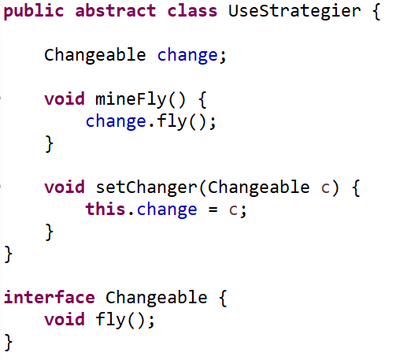
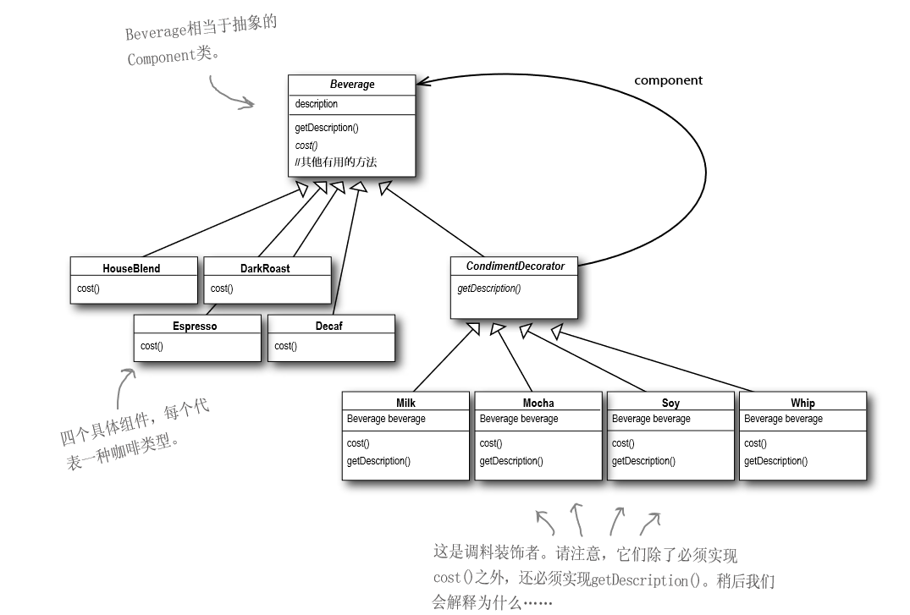
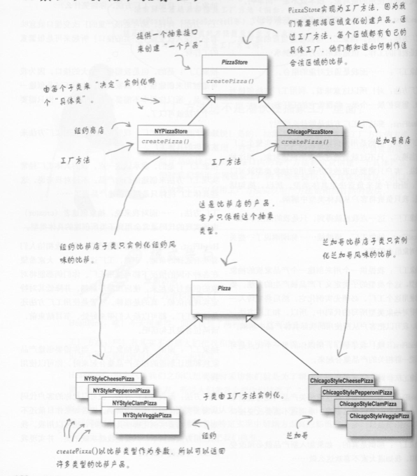
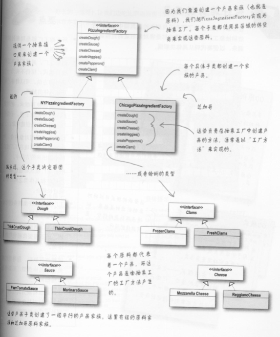

Head First设计模式
### 设计工具
> 模式不是被发明,而是被发现
> 设计是一门艺术,总有可取的地方
* 封装变化
* 多用组合,少用继承
* 针对接口编程,不针对实现编程
* 为交互对象之间的松耦合设计而努力
* 对扩展开放,对修改关闭
* 依赖倒置,要依赖抽象,而不是依赖具体的类
* 最少知道原则
  
#### 策略模式(用接口/抽象代替具体实现类)
> 针对`变化`的部分,设计为接口,并在当前类中添加setter方法,随时切换接口的另一种实现类

#### 观察者模式(对象之间一对多)
> 在对象的定义之间存在`一对多`的关系,这样一个状态改变,依赖它的其他对象收到通知,并自动更新.
* Subject(观察者),使用一个接口(java.util使用的是一个类Observerable来继承)

#### 装饰者模式(创建富有弹性的对象)
> `动态的添加`责任到对象上,是`弹性的继承`,是`动态行为`的扩展,各个装饰者都有一个共同的抽象类或接口  
> 通过一个/一批方法(行为)的增强,是原来的组件的行为具有新的特性

* 装饰者和建造者的区别
  * 装饰者的构造过程不稳定,建造者是稳定的
  * 装饰者是动态行为的<b>`横向`</b>扩展;建造者是动态行为的<b>`纵向`</b>延申
  * 装饰者针对的是组件中的某一个方法的扩展;建造者是管理当前对象的行为赋值顺序的动态变化所引起的不同结果
* 要点
  * 组件和装饰者是同一个父类继承关系,并实现同一行为
  * 装饰者的继承--增强扩展组件,`只是继承了类型,而不是继承了行为`
  * 装饰者按照顺序来装饰,最基层一定是`组件`,装饰的过程不稳定(一旦装饰顺序错误,可能会失败)
  * 装饰者模式,类似组装,类似文学中的`美丽的,性感的,高挑的亚洲女人`->亚洲女人是组件,其他形容词是`装饰者`
  * java IO 就是典型的装饰者模式()->new FilterInputStream(new BufferedInputStream(new LineNumberInputStream()))

#### 简单工厂/工厂模式/抽象工厂模式(对象创建过程抽象化)
> 工厂模式是用来封装对象的创建的

* 简单工厂,不是一种设计模式,而是一种编程习惯,在创建产品的地方,引入工厂引用,使用工厂来实例化对象 
* 工厂模式,通过定义一个抽象工厂类,工厂类中生产产品的方法定义为抽象方法,并由子类`继承实现`,实例化不同的工厂(只生产一类产品:CPU),强调的是`生产具体产品的方式`
* 抽象工厂,通过组合的方式,创建相关或依赖对象的家族,因为不关心具体产品是什么,所以从具体的产品中解耦,它强调了不同组件(产品)之间的依赖关系(不同的CPU,显卡,内存通过不同的组合生产出的商务,游戏,学生等概念产品等等),以变在不同的上下文中实现各式各样的工厂(通过不同的组合,组合出商务本厂,游戏本厂,和学生本厂)

* 简单工厂,工厂模式和抽象工厂的不同
  * 简单工厂,是一种编程习惯,是一种重构方法
  * 工厂模式潜伏在抽象工厂中,抽象工厂的方法常以工厂模式的方法实现
  * 工厂模式,主要是`继承`,强调具体产品生产的方式;
  * 抽象工厂,主要是`组合`,强调不同的对象(抽象产品)之间的组合所产生的不同的<b>概念产品</b>,侧重点不同
  * 一般来讲,抽象工厂使用工厂模式的方法实现具体的工厂;工厂模式使用简单工厂的方法作为生产产品的具体过程

#### 命令模式(通过对请求的封装,使其响应者之间解耦)
> 发出请求和执行请求解耦,被解耦对象之间是通过Command接口沟通的,如何解耦的?--通过`封装一个命令与(执行者)一组动作的关系`来参数化实现,并通过设置,将该命令设置在请求者(Invoker)众多请求(请求容器)的某一位置.

* 命令模式中有`三个角色`,
  * 真正的命令`执行者`(在命令接口的实现类中,Command接口的实现execute,undo方法内真正的执行动作的角色)
  * `命令`接口(包含execute等方法),每个命令的实现类中的execute等方法,都代表了`一组动作`
  * `Invoker`调用命令者,Invoker是一个存储着多个命令的容器,并通过setCommand方法,将命令设置在其中
* Command接口除了有execute()方法以外
  * 还要有undo()方法,来执行回退
    * 通过使用`状态`来记录,并退回
  * 宏命令,在Command接口中,定义一组命令集合,并在execute方法的视线中,逐一调用命令集合中每个命令的execute方法,实现批量命令
  * 队列请求,将实现了Command接口的运算块(实例),放入队列中,此时队列是Invoker,与运算块(命令的实现类)完全解耦,工作队列只需要知道取出命令对象,而不在乎哪个线程来执行运算块(命令的实现类),可有效的把运算限制在固定数目的线程中进行.
  * 日志请求,在命令模式中添加store/load方法,利用对象的序列化实现这些方法,将`命令`缓存在磁盘中.如:当update请求达到时,将其封装为命令接口,并调用UpdateCommandImpl实现类中的store/load方法通过序列化,将当前命令存储在磁盘中;对于高级应用而言,这些技巧可以被扩展到`事务`处理中.

#### 单例模式

#### 门面模式和适配器模式(接口方法的整理)
> 适配器模式,就是转换接口时候使用的,请求接口和响应接口类型/名称不同,通过实现目标接口的实现类,对请求接口进行封装,适配器是实现类

* 适配器特点:
  * 使用对象的组合代替
  * 适配器是一个是实现类,`一个`适配器,实现了一种接口的转换
  * 真实世界的适配器模式:Collections.sort(),每个类通过实现comparable的compareTo方法
> 门面模式,使用一个接口,封装了其他几个组件之间相互组合以及使用的依赖关系,来简化接口,Spring Dao Service等就是使用的这个模式

* 门面模式的特点:
  * 简化接口
  * 接口之间的关系是一对多的关系
  * 将客户从组件的子系统中解耦  

* 适配器,装饰者和门面模式
  * 门面是将一群对象包装起来以简化接口
  * 适配器是将一个对象包装起来转换接口
  * 门面模式是将一个对象包装起来,用来增加新的行为和责任

#### 模板模式(以及与策略模式的不同之处)
> 在一个方法中定义了一个算法的骨架,而将一些步骤延迟到子类中,可以在不改变结构的情况下,重新定义算法中的某些步骤  
> 当一个方法的流程大致相同,但是细节不同的时候,可以使用模板模式,它定义了一个算法的`步骤`

* 模板模式的特点:
  * `继承`,父类中实现了算法的骨架了,并要声明为final
  * 延迟实现,依赖子类中的算法是实现
  * 添加一个空实现的方法hook()->钩子方法,来反控制父类骨架算法中的某些步骤和细节
  * 提供了代码重用的技巧
  * 模板模式包含了:具体方法,抽象方法和钩子方法
> 钩子是一种被声明在`抽象类`中的方法,但是只有空的或者默认的实现,钩子是一种技巧    
> 钩子可以让子类能够有机会对模板方法中即将发生的步骤做出反应(因为父类的算法是final,所以使用钩子增加灵活性)

* 真实世界的适配器模式:Collections.sort(),每个类通过实现comparable的compareTo方法,来完成排序算法
* 策略模式和模板模式的区别:
  * 策略模式,定义的是<b>一群</b>算法(的切换);模板是定义了<b>一个</b>算法的大纲,细节不同,但是结构不变
  * 策略模式的每个算法的实现有`可能完全不同`;模板模式的实现`基本上相同`
  * 策略模式,`组合实现`;模板,`继承`(要依赖父类骨架算法的实现);
  * 策略模式的某个算法,可能会使用到模板模式来定义出不同的细节
  * `策略模式和模板模式的区别,非常像工厂和抽象工厂的区别`

#### 迭代器和组合
> Java的Iterator,就是java迭代器的默认实现,提供了一组方法(hasNext方法,next方法),可以顺序访问聚合对象中的各个元素  
> 组合模式,允许将对象组合成`树形结构`来表现"整体/部分"层次结构

* 组合模式:
  * 父类组件Component,包含基本的操作(add,remove,getChild,operation)
  * 其中add,remove,getChild是组合组件Composite相关的操作,因为组合组件Composite包含了一个List<Component>存贮数据,Leaf组件不支持这类方法
  * 可在toString方法中,使用迭代器Iterator来实现递归显示
  * 它以单一责任设计原则换取透明性,透明性就是Composite和Leaf可以一视同仁
* 