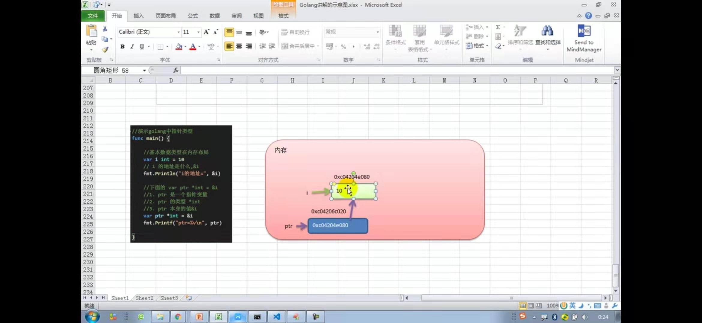
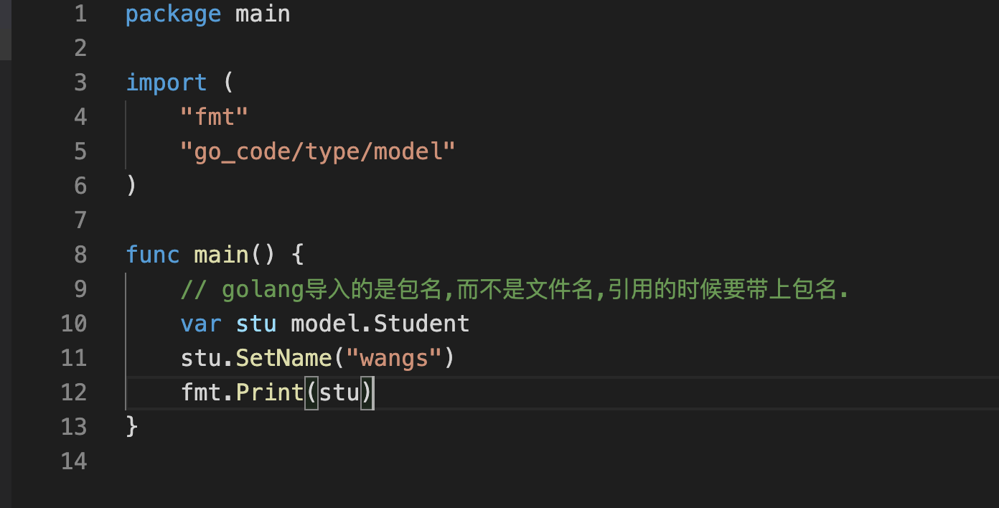
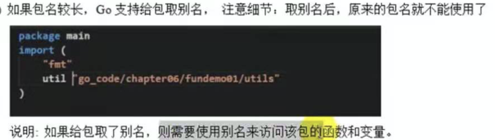

## Go语言
> 优点：流量支撑（大数据排序，推荐，搜索；缓存，容错，按条件分流，大并发能力强）；云平台，分布式。

### 基础篇
* 变量赋值
  * 局部变量
    * var i = 10 //静态变量推导
    * var i int = 10 // 指定声明
    * i := 10 // 语法糖
    * var a, b, c int // 指定都是int
    * var a, b, c // 可以全部是静态推导
  * 全局变量
    * var i
    * var a, b, c
    * var (
        x1 = 1
        y1 = 2
        z1 = 3
    )
* 函数声明
  * func 关键字
  * func 方法名（小驼峰代表了：non-static； 大驼峰代表了 static）
  * func hello(a int, b string)(boolean, int8) // 第一个是括号是入参，第二个括号是出参
* 基本类型
  * int 有符号(根据操作系统)// 等待测试
    * int8 // 别名 byte
    * int16
    * int32 // 别名 rune
    * int64
  * uint 无符号
    * uint8
    * uint16
    * unit32
    * uint64
  * byte ：int8的别名 ，实际上golang没有char类型，可以使用int8表示
  * rune ：int32的别名
  * bool 布尔
  * float32，float64
  * string[^1]// 字符串在golang中是基本类型  
    * "abc"
    * `` // 反引号，可以包含大段代码 不用<b>转义</b>
  * complex64，complex128 复数（科学计数法的）
* 基本类型默认值
  * int 0
  * bool false
  * string ""
* 类型转换
  * 与java不同的是，java是（int）i = 2； golang是int32（i）
  * 另外高位数和低位数可以互相转换，但是当高向低级别转的时候会「丢失数据」
  * 其他类型->string的时候，可以使用fmt.Sprinf()或者strconv.FormatInt/FormatFloat....
  * string->其他类型的时候[^2]，可以使用strconv.ParseInt/ParseFloat....
  * golang使用,两个变量值呼唤的时候,可以不用使用第三个变量,可以这样
    * a := 1
	    b := 2
	    a,b = b,a
* 复杂类型
  * 指针，存贮的是变量在内存中的地址
  * 声明方式 以int指针为例  var ip *int8  // 注意指针无法显示的赋值地址，暂时我还没学会
  * 为了说明指针，下图说明（指针变量也是‘值’，存贮指针的‘值’，也是有地址的。）

* 运算符
  * 与java不同的是，不支持i=i++，因为golang设计理念比较简介，减少容易产生歧义的地方。并且只支持i++，不支持++i
  * golang不支持三元运算符。
  * switch
    * case后不需要写break
    * case后面可以带多个表达式，如 case SPRING,SUMMER
    * case后使用`fallthrough`关键字，可以穿透到下一个case
  * for循环
    * for{} 与 java中到 for（;;）{} 的效果是一样的 这个是`字节`遍历
    * for range 举例子  <b>for index,val range list{}</b> 这个是`字符`遍历
  * while 和 do while  
    * golang 没有这两个，可以使用for if break 代替
* 包 import
  * 在import包时，路径从`$GOPATH目录下是src`开始
  * golang导入的是`包名`,而不是文件名.
 
  * 如果包名过长，可以起别名。

* 值传递和引用传递
  * 不管是值传递还是引用传递，传递的都是变量的copy，不同的是值传递是copy的值，引用传递copy的是地址，地址效率高，因为地址长度小，占用空间小，copy时间短。
* 函数
  * golang不支持重载（Overload）
  * golang没有static关键字，如果引用a包中的工具方法，方法名必须大驼峰（public）,与java面向对象的语言不同的是，java可以new对象之后，使用对象的方法，也可以声明方法为static，此时使用方式则与golang一致。
  * 基本语法 func 函数名 (形参列表) (返回值类型列表) {}
    * 如果返回值多个的时候，如果要忽略某个返回值使用‘_’(下划线)表示站位
    * 返回值只有一个括号可以不写(感觉是非常好用的特性)
    * 返回值列表，可以不声明变量，也可声明变量 比如（x int, y string）=>(int, string)
  * golang中函数也是一种数据类型。使用方式： var 变量名 = 函数名 如： var f = add[^3]
    * 函数可以作为形参。函数式编程。
  * init函数 在每个go文件中，都可以定义一个init函数，在golang运行都时候，会先调用init函数
    * 调用顺序  变量定义->init函数->main函数
  * 匿名函数（不是匿名类）
    * 使用方式一  var functionInterface = func(i int, ii int) int { return i + ii }  ;functionInterface(1, 2)
    * 使用凡事二  func(i int, ii int) int { return i + ii }(1, 2) // 此种方式直接就调用了.

  * 闭包 ? 本次理解,其实就是函数式编程,闭包是函数和它所引用的环境.(先理解到这里)
* 自定义类型type
  * 语法 type <b>自定义数据名</b>  <b>数据类型</b>
    * 定义结构体 type Student struct
    * 定义等价类型,类似于取别名(虽然给指定的类型命名了，但是如果要转换类型，还是必须要进行类型转换的) type name string
    * 定义接口 type Personer interface
    * 定义函数 type handler func (name string) int , 这是golang的函数,类似java8中的函数式编程,使用的时候可以具体体验
* defer函数延迟加载：函数执行完毕后会调用。
  * defer后面必须是function。
  * defer可以声明多次，并按照声明的顺序，以`栈`的方式存贮，并且入栈时，相应的值也会copy，类似函数传参
  * 与java中的finally不一样,java中，try-finally，在try区块内，即使使用return，finally也会在return之后执行，与defer差距巨大，但是作用类似，都是为了close流等操作。
* string字符串
  * 常用的工具包buildin，内置工具包
  * strings，string的工具包，包含了index，spilit，contains，equals[^4]等等。
* bulidin
  * new，创建基本类型的指针 如 var x = new(int8)
  * make,返回自身参数类型的引用，而非指针。结果依赖传递的类型。
  * len，可以传递任意类型。
* time包，时间处理工具，具体使用需要查询api，java8的time与之很像
  * time.sleep() 可以休眠，是否与java中的Thread.sleep相同.
* 异常处理
  * defer，panic，errors，recover
    * panic == excepiton
    * defer == finally
    * recover == catch  注意:recover只有在defer调用的函数中有效。
    * errors.new 可以自定义生成一个error类型的值,表示一个错误.
  * golang处理异常的方式不太一样,
    * 因为没有try区块,所以java中使用try-catch,在golang中使用的是defer function(){recover()},通过recover()来恢复线程.s
* 数组,数组存贮的是值类型.
  * 声明方式
    * var array [3]int = [3]int{1, 2, 3}
    * var array = [3]int{1, 2, 3}
    * var array = [...]int{1, 2, 3}
    * var names = [3]string{1:"tom", 2:"jack", 3:"marry"}
* 切片(动态数组)
  * 切片类似一个结构体{*type[],len,cap},包含了指针数组,长度和容量三个属性
  * 初始化三种方式
    * 数组-> var arr [5]int = [...]int{1,2,3,4,5}  var slice = arr[1,3][^5]  `这种方式,因为事先声明了数组,所以程序可见`
      * var slice = arr[0:end] 可以简写为var slice = arr[:end]
      * var slice = arr[start:len(arr)] 可以简写为var slice = arr[star:]
      * var slice = arr[0:len(arr)] 可以简写为var slice = arr[:]
    * make-> var slice []type = make([]type, 5, 10) `数组由切片底层维护么,对程序不可见`
    * 直接声明-> var slice []type = []type{param1, param2, param3}
  * 切片可以使用`append`扩容,具体用法见API.原理与java数组扩容是一样的.
  * 切片定义完,不能立即使用,需要引用到一个数组,或者make一个空间供切片使用.类似指针,刚刚创建出来是nil,需要new一块地址出来一样的.
  * copy,切片可以copy,但是不同的是,copy后的两个切片,都有自己独立的空间,修改互不影响.
  * string和slice,string本质上是一个byte数组,因此string也可以进行切片处理
    * string是不可变类型,不像普通数组,可以替换某一个值,如果要修改,重新赋值一个把.
* map数据类型
  * 语法声明 var param map[keytype]valuetype, map初始值是nil,所以如果使用必须make一下.
  * key的类型,可以是基本类型,指针,channel,还可以是只包含前几个类型的接口,结构体,数组,注意切片,map和function无法作为key,因为无法使用==来判断.
  * 删除,map没有clear方法,只能通过遍历key来删除全部元素,或者是直接赋值给一个新map,让gc帮助删除
  * map中的key存放顺序是无序的,每次遍历,取得值的顺序都是不同的.
  * map是引用类型
  * map会自动扩容,是动态增长的key-value
* 结构体,就是其他语言中的class,只不过比较简化
  * 语法 type TypeName struct{} 
  * golang的结构体,去掉来传统oop语言的继承,方法重载,构造函数和折构函数和隐藏this指针等等.
  * golang没有继承关键字,继承通过匿名字段来实现的.
  * golang面向接口编程的特点.
  * 结构体是值类型空间,没有指向地址(地址再映射空间),而是直接指向空间.直接通过xx.a这种方式获取结构体内的a变量的值.
  * 结构体`创建`的几种方式
    * var p Person  ; p.Name = "" p.Age = 0
    * var p Person = Persion{"",0}
    * var pp *Persion = new(Person),此时 (*pp).name = "wang" 等同于  p.name = "wang" 因为golang语言设置者的语法糖,会自动将p.name = "wang"变为(*p).name = "wang"
    * var pp *Person = &Persion{} (*pp).name = "wang" 同上
  * 结构体`赋值`的几种方式
    * var stu Person = Student{"wangs",18}
    * var stu Person = &Student{Name:"wangs",Age:18}
    * var stu *Person = &Student{"wangs",18}
    * var stu *Person = &Student{Name:"wangs",Age:18}
  * 嵌套匿名结构体,可以直接声明
  * golang没有构造函数,所以初始化赋值可以使用简单工厂模式来给函数赋值.
  * 结构体内所有字段的内存是连续的.
  * 结构体如果想要强制类型转换,字段名称,个数,类型必须完全一样.
  * 使用type为结构体起别名,被认为是新类型,但是也可以强制转换.
  * 结构体的每个字段可以写一个tag标记,可以用于序列化和反序列化使用.(常用于encoding/json包下)
* 面向对象编程
  * 封装
  * 继承,golang没有关键字extends,而是直接使用匿名结构体.

    * 继承的使用方式,类似于java中内部类的使用方式.

  * 多态,golang多态,指的是`接口`多态,java是`抽象类和接口`
* 方法(不是函数)
  * 方法的声明: func (receiver type) methodName(参数列表)(返回值列表)
    * receiver type 可以是结构体,也可以是其他类型(比如自定义的 type integer int)
    * receiver type如果传递的是结构体,那么结构体是值传递,若要改变原来结构体的内容,请传递指针.
  * 如果一个变量(结构体)实现了String()方法,就是java中的toString()方法.fmt.print就会按照指定的格式输出.
* 接口interface
  * 接口中的方法,要大写(代表全局可见),如果写成小写,接口就看不见了
  * golang中接口没有implements关键字
  * 如果实现了一个接口中所有的方法,则认为是实现了该接口.(怎么在IDE中找到关系呢?)
  * 接口的实现体,不仅仅是stuct,只要是自定义的 `type` 类型就都可以实现接口
  * 接口是一种引用类型.(结构体是值类型)
  * 空接口 interface{}, 表明了所有的类型都实现了空接口.作用类似java中的Object类.空接口可以赋值为任何结构体(或type类型的数据),空接口可以转换其他类型,比如t.(string)或者t.(error)或者t.(type)等等.这点很重要,我马上去试试看

  * golang中`当一个接口继承多个接口时,如果有相同当接口`,怎编译不会通过,java则没有影响

  * 方法,也可是实现接口,但是注意,必须传递方法所要求的类型.

* 断言
  * 对于接口不知道是什么类型的时候,如果想要转换成具体类型,需要使用类型断言(java 中 instanceof)

  * 断言带类型检测,如果转换失败会返回错误.上图

* 文件(os包file)
  * 文件类似java,先open,read,close.
    * Reader代表缓冲区,读写大文件的时候时候.
    * 一次性读取,ioutil包中的readFile等等.
* 命令行
  * os包中的全局切片变量Args,设置Args,代表了命令行中接受的参数.
  * 使用flag包中的方法.
    * 比如flag.StringVar(&user,"u","","mysql登陆用户名参数")方法,第一个参数接受的参数,第二个指定的名称,第三个参数默认值,第四个参数水明
* 单元测试(UnitTest)
  * 文件名称,必须以`_test.go`结尾.
  * 测试用例函数必须以`Test`开头
  * 方法内的形参,必须是`*testing.T`,比如,TestAdd(t *testing.T)
  * 运行指令 go test或者 go test -v,前者只有错误才会输出日志,后者都会输出日志.
  * 当出现错误的时候,可以使用t.Fatailf来格式化输出错误信息
  * t.Logf方法可以输出响应的日志.
  * 测试单个文件: go test -v cal_test.go cal.go
  * 测试单个方法: go test -v -test.run TestAdd
* goroutline(叫协程,协助的线程)
  * 并行:多线程在单核上运行;并发:多线程在多核上运行.
  * go主线程(与java中的模型一样,是真的底层硬件级别的内核线程)可以挂起多个协程,通过这句话的描述就知道golang的多线程是建立在主线程上,是一种逻辑线程,非常轻量.
    * 有独立的栈空间
    * 共享程序存贮空间
    * 调度由用户控制(内核线程由cpu调度.)
    * 是轻量级的`线程`
  * 使用方式 go f(args)[^6] , 其实是个语法糖,真正是这么调用的runtime.newproc(size, f, args)
  * runtime包,对于并发还是非常重要的. 比如:runtime.NumCPU()获取cpu核数的方法.
* channel(管道)
  * 定义/声明 `var 变量名 chan 数据类型`channel是引用类型,必须初始化才能写入数据,即make后才能使用,管道是有数据类型的.
    * var intChan chan int
    * var mapChan chan map[int]string
    * var perChan chan Person
    * var perChan2 chan *Person
  * 管道`var intChan chan int = make(chan int,3)`
    * 写入数据 : intChan<- 3
    * 读取数据 : num := <-intChan
  * 管道可以使用close方法关闭.`已经关闭的管道仍然是可以读取数据的,但是不能再写入.`
  * channel支持for range遍历
    * 遍历时,管道没有关闭,则会出现阻塞异常deadlock错误,不是因为管道没有关闭不能读入,而是没有关闭的管道会一直读取,当没有数据的时候就会出现deadlock
    * 遍历时,管道关闭,则遍历完成后,就会退出遍历.
    * for range管道时候,因为管道无下标,所以不会有`index`
    * 管道可以声明成只读和只写,有点就是防止误操作.
      * var chan2 chan<- int 只写int管道
      * var chan3 <-chan int 只读int管道
    * 使用select case可以解决从管道中读取数据的阻塞问题.(如果管道未关闭,一直读取会报deadlock错误,因为一直读取,使用select时候,当管道没有数据的时候,会从default中获取值,而不用关闭管道)
    * 可以在go携程中使用defer + recover ,以保证错误不会导致主函数停止.
  * 反射.
    * 基本介绍
      * `运行时`获取变量的各种信息,比如变量的类型,值
      * 如果反射是结构体变量,还可以获取到结构体本身的信息()
* IDE篇幅
  * 使用vscode编译器.
  * classpath配置ok
  * 好像只有写上注释才会给提示

[^1]: 使用“+”连接字符串，但是如果字符串过于长的时候，换行的时候，`必须将符号放在末尾`，因为golang会默认在尾部补充“;”
[^2]: 当string不能转换为其他有效当数字时候，如“hello”，则会变成默认值0
[^3]: 注意，这里带函数不能带括号，带括号代表了调用函数，不带括号才是声明函数
[^4]: 注意，区分大小写的比较是==，不区分是EqualFold
[^5]: 左闭右开区
[^6]: f,指的是函数名称,args,指的是参数
