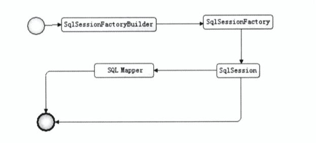
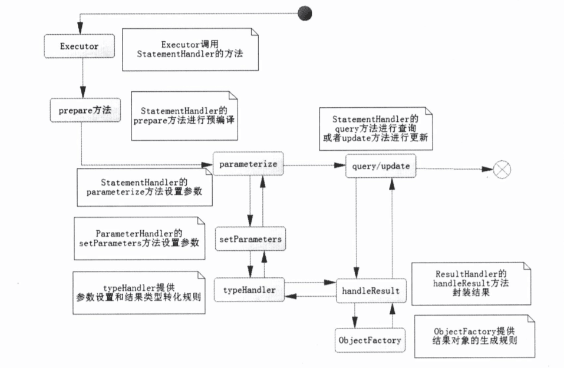

## Mybatis
* Mybaties使用流程图：
    
    * `org.apache.ibatis.session.Configuration`去管理Xml中配置文件或JavaBean配置用来生成SqlSessionFactory(接口)，SqlSessionFactory的实现类有两个：
      * SqlSessionManager
      * DefaultSqlSessionFactory（默认使用这个）
    * SqlSessionFacotry[^1]由SqlSessionFactoryBuilder()[^2].bulid(configuration)创建出来的
    * SqlSession[^3] 使用的是门面模式，其主要用途是：
      * 获取映射器Mapper
      * 直接通过命名去执行SQL返回结果（select，insert，delete，upate）
    * Mapper[^4]映射器，由java接口和XML文件（注解）共同组成

* 配置
  * TypeHandler类型处理器[^5]，作用：JavaType <==> JdbcType
    * 可以自定义实现：特殊处理java中的类型（如枚举）对应到数据库类型，需要使用注解@MappedTypes和@MappedJdbcTypes
  * ObjectFactory，返回结果对象，使用反射获取，默认使用DefaultObjectFactory 
  
* SqlSession下的四大对象
  * Executor是Sql执行器（`有关SQL的来源，是由XML或者注解中获取的，如果是XML获取的对应的就是MappedStatement对象`）
  * StatementHandler，使用数据库的语句来执行，是核心
  * ParameterHandler，参数处理
  * ResultHandler是进行最后的数据集封装和返回
    下面是SqlSession内部运行图
    
[^1]: SqlSessionFactory的生命周期是整个Mybaties的生命周期，并且是`单例`的
[^2]: SqlSessionFactoryBuilder的生命周期是：一旦生成SqlSessionFactory就会结束
[^3]: 类似Jdbc中的Connection，默认一级缓存的情况下单次请求获得的结果放入缓存，在规定的时间内下次请求从缓存中取，线程不安全，生命周期是：一次数据库请求，并控制实务，每次使用后应当立即关闭
[^4]: 是一个接口，作用是发送SQL,最大生命周期与SqlSession一样
[^5]: TypeHandler,程序的数据类型对应数据库的数据类型