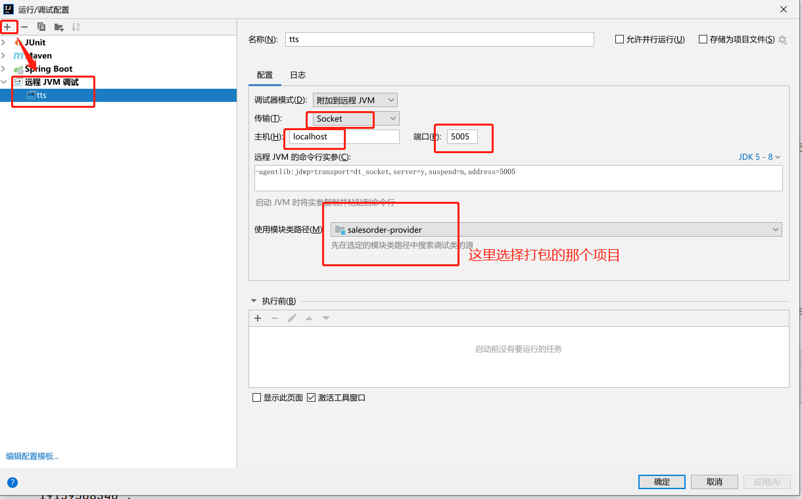
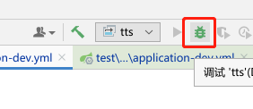

#### 使用Idea调试jar包


##### 方法步骤
1. java -Xdebug[^1] -Xrunjdwp[^2]:transport=dt_socket,address=5005,server=y,suspend=y -jar xxx.jar
```
    比如 我使用实际使用的是java -Xdebug -Xrunjdwp:transport=dt_socket,address=5005,server=y,suspend=y -jar salesorder-provider-1.0.0-SNAPSHOT.jar
    此命令是启动java的debug模式

    * transport指定了调试数据的传送方式，dt_socket是指用SOCKET模式，另有dt_shmem指用共享内存方式，其中，dt_shmem只适用于Windows平台。 
    * server参数是指是否支持在server模式的VM中. 
    * onthrow指明，当产生该类型的Exception时，JVM就会中断下来，进行调式。该参数可选。 
    * launch指明，当JVM被中断下来时，执行的可执行程序。该参数可选 
    * suspend指明，是否在调试客户端建立起来后，再执行JVM。 
    * onuncaught(=y或n)指明出现uncaught exception 后，是否中断JVM的执行. 

```
2. 在idea上添加一个远程服务调试

3. debug启动

4. 就可以正常在idea中debug启动了，类似于在jvm中java调试了

[^1]: -Xdebug是通知JVM工作在DEBUG模式下
[^2]: -Xrunjdwp是通知JVM使用(java debug wire protocol)来运行调试环境。该参数同时了一系列的调试选项
