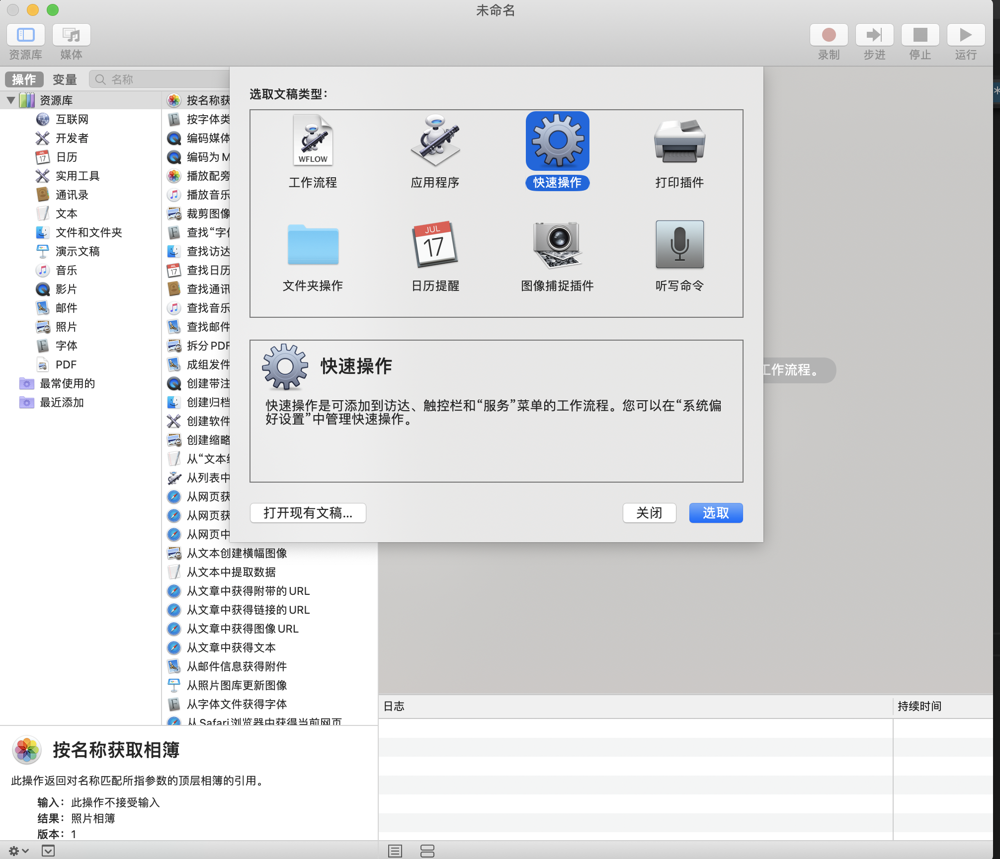

## Mac的快捷键
> Idea快捷键,请注意中英文,千万不要打开中文,否则很多快捷键会失效

### Finder下
[command] + [shift] + [.] 显示/隐藏隐藏文件

### VSCode
[option] + [shift] + [鼠标左健] 列编辑/列模式

### Idea
[option] + [鼠标左健] 列编辑/列模式
[command] + [option] + z  surround with// 超级好用

### 显示隐藏程序坞
[option] + [command] + [D] 

### 干掉系统升级提示红点
defaults write com.apple.systempreferences AttentionPrefBundleIDs 0

### 删除QuickTime Player播放记录
rm -rf  ~/Library/Containers/com.apple.QuickTimePlayerX/Data/Library/Preferences

### 查看文件夹属性
[command] + [i]

### 程序坞在主副屏幕切换
当使用 mac 连接外置屏幕的时候，把鼠标移到某一个屏幕最底下几秒钟，程序坞就会自动切换到该屏幕.

### 查看端口号
以8080为例:lsof -i tcp:8080

### 时间机器备份
打开「终端」输入以下命令，关闭系统对时光机器的限流。
sudo sysctl debug.lowpri_throttle_enabled=0
打开「终端」输入以下命令，开启系统对时光机器的限流。
sudo sysctl debug.lowpri_throttle_enabled=1

### 通过[自定编辑]->右键添加VS Code
* Step1

* Step2

* Step3

* Step4

* 添加好的工作流的文件位置是: **/Users/wangsai/Library/Services**

### 根目录创建文件
1. Mac升级10.15 Catalina，无法在根目录创建文件夹解决办法
2. 重启电脑，按住 cmd+R进入恢复模式
   1. 选择顶端的【实用工具】
   2. 输入命令csrutil disable，关闭SIP 
   3. reboot 重启
3. 重新挂载根目录： 【sudo mount -uw /】，接下来划重点：现在已经可以在根目录创建文件夹，**但是，你在根目录创建之后，一旦重启电脑，你创建的目录又是只读权限了**。
4. 所以，正确的做法是把你需要的目录软链接到根目录, 例如： sudo ln -s /Users/Suvan/data /data
5. 重新进入恢复模式，重新打开SIP： csrutil enable 

---------

## Mac启动软件

### Jmeter
cd到项目到`bin`目录下  
```
sh jmeter
```

### Redis
```
Redis cli连接
redis-cli -h 127.0.0.1 -p 6379 -a pwd 

mac上redis存贮位置
配置文件也在下面
/usr/local/Cellar/redis/5.0.7/.bottle
日志文件存放位置
/usr/local/var/db/redis/ 
```

### ZooKeeper
```
./zkCli.sh -server 127.0.0.1:2181
```

### Homebrew
**/bin/zsh -c "$(curl -fsSL https://gitee.com/cunkai/HomebrewCN/raw/master/Homebrew.sh)"**


## Mac相关设置
### 鼠标速度
defaults read -g com.apple.mouse.scaling 查看当前速度
defaults write -g com.apple.mouse.scaling 6 设置当前速度为6


### 允许任何开发者
sudo spctl --master-disable

### Java环境变量
export JAVA_HOME=/Library/Java/JavaVirtualMachines/jdk1.8.0_40.jdk/Contents/Home/ 
export PATH=$JAVA_HOME/bin:$PATH

echo 'export JAVA_HOME=/Library/Java/JavaVirtualMachines/jdk1.8.0_40.jdk/Contents/Home/' >> ~/.bash_profile source ~/.bash_profile