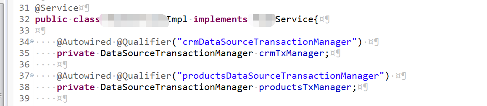
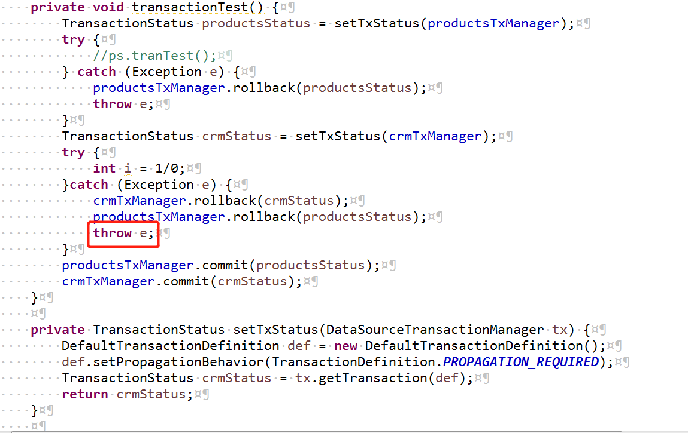

## 多数据源配置事务配置
>在单一的数据源中，可以使用@Transactional注解来代理接口织入事务，但是如果一个业务方法中，包含了至少两部分数据源的更新，又要保证数据更新一致性，由于事务配置是在数据源上的，一个数据源只有一个事务。
> 解决方式：使用编程式事务

* 步骤一：配置事务数据源

**坑点**:一定要配置正确的数据源；
	配置好数据源后，eclipse需要clean一下项目，idea用小锤子building一下。

* 步骤二：在要使用的Service层、Controller层声明事务管理器
* 
**坑点**:@Autowired和@Qualifier注解一起使用，并指明对应的数据源

* 步骤三：步骤三：手动事务使用
* 
**坑点**:在图上红圈的位置，就是发生异常后，捕捉到后一定要抛出异常或者return以结束请求，否则会出现重复的commit，导致报错。