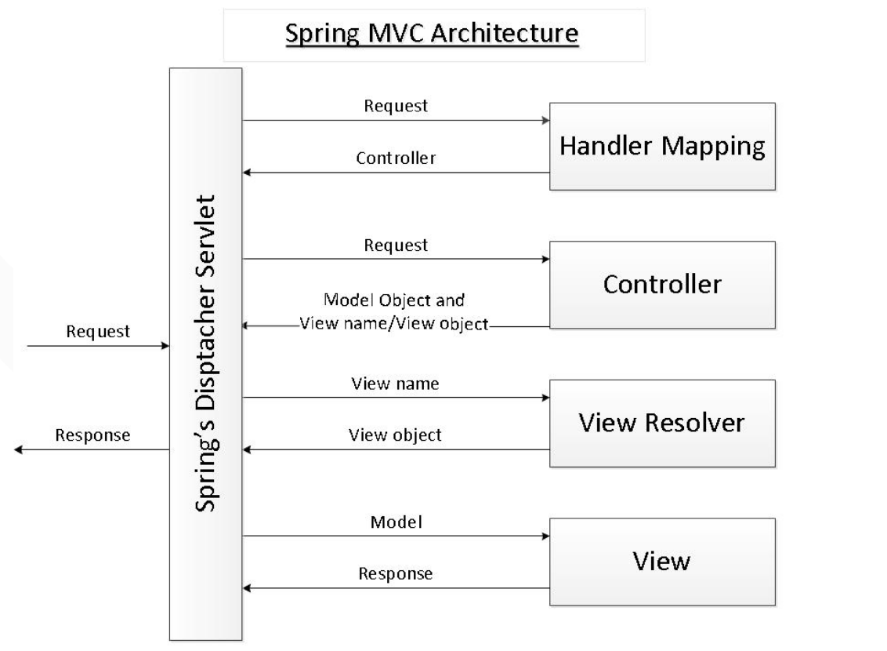
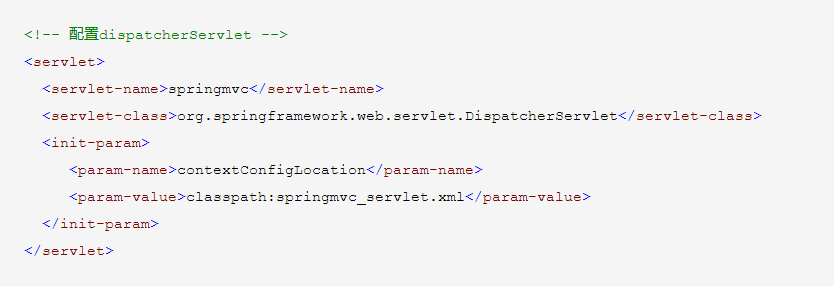
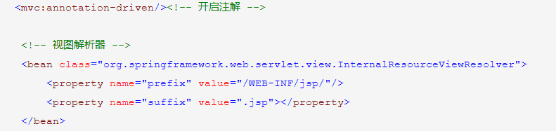

Spring Boot
================
### Spring 
* Spring IOC
* Spring 如何解决循环依赖
* Spring 不同版本的特性（spring 4 @Condition）
  * 1.0 创建了ioc 和 aop （xml注入）
  * 2.X 增加了注解注入
  * 3.X 增加了profile mvc更好的支持
  * 4.X 全面支持jdk1.8，Restful添加，Condition
  * 5.X webflux 测试增强
### Spring+SpringMVC 与 SpringBoot
* SpringMVC dispatcherServlet
  * MVC核心`DispatcherServlet`
  
  * MVC配置图 
  
  
* 基于Sring 4.0 条件配置（Condition注解，只有是ConditionalOnMissingBean注解才可自定义实现）
* SpringBoot 项目搭建
  * spring 网站 https://start.spring.io/
  * spring Spring Tools Suit
* Spring 配置方式 ：
  * yml/xml ; 
  * JavaConfig（使用@Configuration）
* SpringBoot其他的配置
  * springboot内置了300多个微调属性，同时可以使用度多种方式进行配置（等级由高到低）
    * 命令行：java -jar boot.jar --server.port:8080
    * java：comp/env
    * JVM系统属性
    * 操作系统环境变量System.getProperties()
    * 随机生成的带random.*前缀的属性
    * 应用程序以`外`application.yml  /  application.properties
    * 应用程序以`内`application.yml  /  application.properties
    * @PropertySource 标注的属性
    * 默认属性
  * 日志配置
    * 在resources里放入名字为：logback.xml的文件
    * 直接使用yml添加日志
    * 可以配置其他名字的日志，在yml文件中
  * @ConfigurationProperties，读取application.properties / yml文件中的配置
  * @Profile注解，配置多套配置文件
### SpringBoot启动原理
* SpringBoot 启动原理
* @SpringBootApplication是一个复合注解

